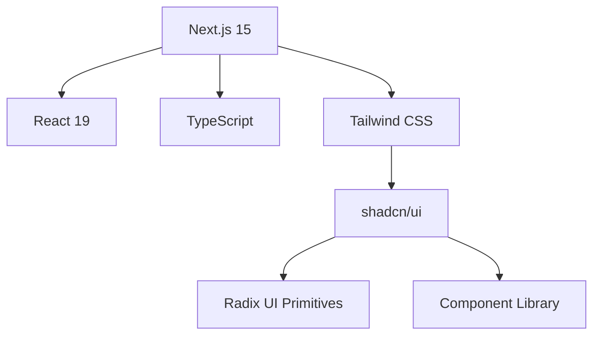
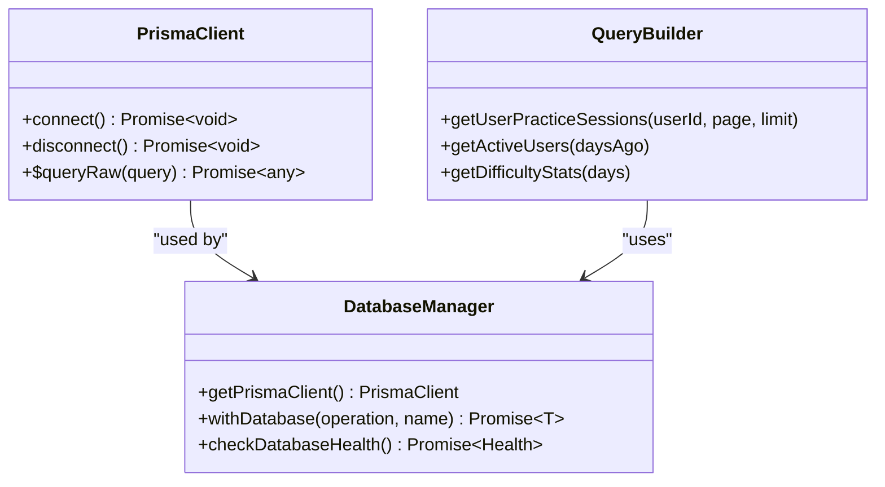
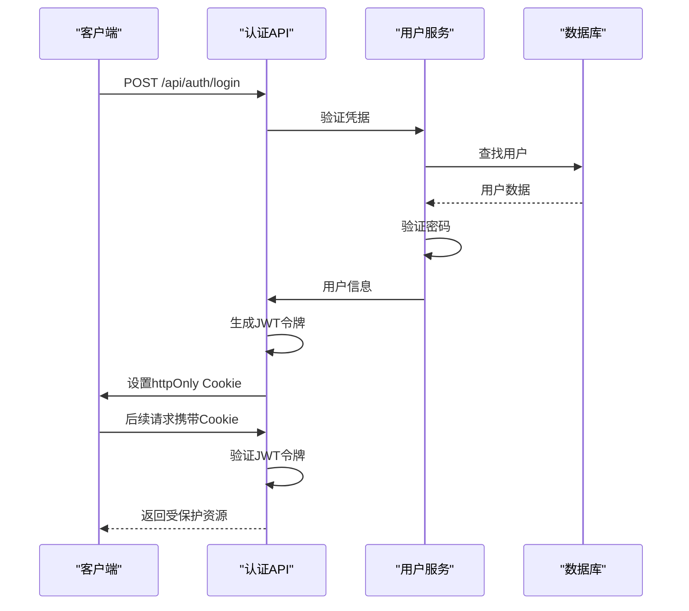
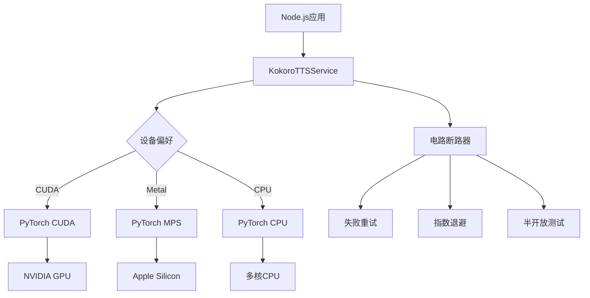
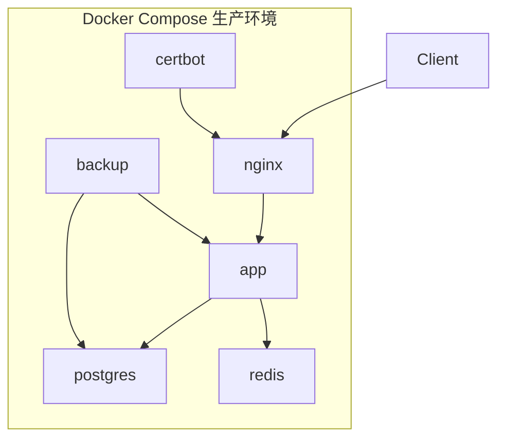

# 技术栈与依赖

<cite>
**本文档中引用的文件**  
- [package.json](file://package.json)
- [next.config.mjs](file://next.config.mjs)
- [tailwind.config.ts](file://tailwind.config.ts)
- [lib/auth.ts](file://lib/auth.ts)
- [lib/database.ts](file://lib/database.ts)
- [Dockerfile](file://Dockerfile)
- [docker-compose.yml](file://docker-compose.yml)
- [docker-compose.production.yml](file://docker-compose.production.yml)
- [docker-compose.gpu.yml](file://docker-compose.gpu.yml)
- [kokoro_local/requirements.txt](file://kokoro_local/requirements.txt)
- [lib/kokoro-service.ts](file://lib/kokoro-service.ts)
- [lib/kokoro-env.ts](file://lib/kokoro-env.ts)
- [lib/device-detection.ts](file://lib/device-detection.ts)
- [lib/ai/cerebras-service.ts](file://lib/ai/cerebras-service.ts)
- [lib/ai/route-utils.ts](file://lib/ai/route-utils.ts)
- [lib/ai/retry-strategy.ts](file://lib/ai/retry-strategy.ts)
- [lib/ai/schemas.ts](file://lib/ai/schemas.ts)
- [app/api/ai/topics/route.ts](file://app/api/ai/topics/route.ts)
- [app/api/ai/questions/route.ts](file://app/api/ai/questions/route.ts)
- [app/api/ai/transcript/route.ts](file://app/api/ai/transcript/route.ts)
- [app/api/ai/grade/route.ts](file://app/api/ai/grade/route.ts)
</cite>

## 目录
1. [项目概述](#项目概述)
2. [前端技术栈](#前端技术栈)
3. [后端与数据库](#后端与数据库)
4. [认证机制](#认证机制)
5. [TTS语音合成模块](#tts语音合成模块)
6. [关键NPM依赖项](#关键npm依赖项)
7. [环境配置要求](#环境配置要求)
8. [容器化部署支持](#容器化部署支持)
9. [AI服务架构与代理容错机制](#ai服务架构与代理容错机制)

## 项目概述

本项目是一个英语听力训练应用，采用现代化全栈技术构建。系统基于Next.js 15和React 19构建前端界面，使用TypeScript确保类型安全，并通过Tailwind CSS和shadcn/ui实现响应式设计。后端采用Prisma ORM进行数据库操作，结合JWT + httpOnly Cookies实现安全认证。Python在kokoro_local模块中用于TTS语音合成，支持GPU加速。系统提供完整的Docker容器化部署方案，支持多种数据库和生产级运维配置。

**Section sources**
- [package.json](file://package.json)
- [next.config.mjs](file://next.config.mjs)

## 前端技术栈

项目采用最新的前端技术栈，包括Next.js 15、React 19、TypeScript、Tailwind CSS和shadcn/ui组件库。Next.js 15提供了服务端渲染、静态生成和API路由等核心功能，React 19引入了新的并发特性提升用户体验。TypeScript确保代码的类型安全和可维护性。Tailwind CSS作为原子化CSS框架，配合自定义主题配置，实现了高效的样式开发。shadcn/ui组件库基于Radix UI和Tailwind CSS构建，提供了高质量的可访问性组件，如按钮、表单、对话框等，确保一致的UI体验。



**Diagram sources**
- [package.json](file://package.json)
- [tailwind.config.ts](file://tailwind.config.ts)

**Section sources**
- [package.json](file://package.json)
- [tailwind.config.ts](file://tailwind.config.ts)

## 后端与数据库

后端服务基于Next.js API路由构建，使用Prisma ORM管理数据库操作。Prisma提供类型安全的数据库访问接口，支持多种数据库后端（SQLite、PostgreSQL、MySQL）。`lib/database.ts`文件封装了Prisma客户端的初始化、连接管理和错误处理逻辑，实现了连接池、重试机制和优雅关闭。数据库迁移通过Prisma Migrate管理，确保模式变更的可追溯性。系统支持SQLite作为默认嵌入式数据库，也支持PostgreSQL和MySQL作为生产级数据库选项。



**Diagram sources**
- [lib/database.ts](file://lib/database.ts)
- [prisma/migrations](file://prisma/migrations)

**Section sources**
- [lib/database.ts](file://lib/database.ts)
- [package.json](file://package.json)

## 认证机制

系统采用JWT + httpOnly Cookies实现安全认证。`lib/auth.ts`文件包含完整的认证逻辑，包括用户注册、登录、令牌生成和验证。JWT令牌存储在httpOnly Cookie中，防止XSS攻击。认证中间件`requireAuth`和`requireAdmin`用于保护API路由，确保只有经过身份验证的用户才能访问受保护资源。密码使用bcryptjs加密存储，符合安全最佳实践。系统支持"记住我"功能，通过不同的令牌过期策略实现长期会话管理。



**Diagram sources**
- [lib/auth.ts](file://lib/auth.ts)
- [app/api/auth](file://app/api/auth)

**Section sources**
- [lib/auth.ts](file://lib/auth.ts)
- [app/api/auth](file://app/api/auth)

## TTS语音合成模块

kokoro_local模块使用Python实现TTS语音合成功能。该模块基于PyTorch和Kokoro TTS引擎，支持CPU、CUDA和Metal后端。`kokoro_local/requirements.txt`定义了Python依赖，包括kokoro、torch、torchaudio等。`lib/kokoro-service.ts`通过子进程调用Python脚本，实现Node.js与Python的集成。系统自动检测可用的硬件加速设备，优先使用GPU提升合成性能。电路断路器模式确保服务的稳定性，在故障时自动降级到CPU模式。



**Diagram sources**
- [kokoro_local/requirements.txt](file://kokoro_local/requirements.txt)
- [lib/kokoro-service.ts](file://lib/kokoro-service.ts)
- [lib/kokoro-env.ts](file://lib/kokoro-env.ts)

**Section sources**
- [kokoro_local/requirements.txt](file://kokoro_local/requirements.txt)
- [lib/kokoro-service.ts](file://lib/kokoro-service.ts)
- [lib/device-detection.ts](file://lib/device-detection.ts)

## 关键NPM依赖项

项目依赖多个关键NPM包，每个都有特定用途：
- `@cerebras/cerebras_cloud_sdk`: 集成Cerebras AI云服务，用于AI分析和内容生成
- `i18next` 和 `react-i18next`: 实现国际化支持，管理多语言文本
- `@prisma/client`: Prisma ORM客户端，提供类型安全的数据库访问
- `jsonwebtoken`: 处理JWT令牌的生成和验证
- `bcryptjs`: 安全地哈希和验证用户密码
- `zod`: 运行时类型检查和数据验证
- `lucide-react`: 提供高质量的图标组件
- `sonner`: 轻量级通知系统
- `recharts`: 数据可视化图表组件

这些依赖项通过`package.json`管理，开发依赖包括TypeScript、ESLint、Vitest等工具链。

**Section sources**
- [package.json](file://package.json)
- [lib/i18n](file://lib/i18n)
- [components/ui](file://components/ui)

## 环境配置要求

项目对运行环境有明确要求：
- **Node.js**: 版本18或更高，推荐使用LTS版本
- **Python**: 版本3.10或更高，用于TTS模块
- **系统依赖**: ffmpeg、libsndfile1、sox等音频处理库
- **GPU支持**: NVIDIA CUDA 12.1或Apple Metal，需要相应驱动
- **内存**: 推荐至少4GB RAM，GPU模式需要额外显存

环境变量通过`.env`文件或Docker配置管理，关键变量包括`DATABASE_URL`、`JWT_SECRET`、`TTS_MODE`等。`next.config.mjs`中的`serverExternalPackages`配置确保所有依赖正确打包。

**Section sources**
- [Dockerfile](file://Dockerfile)
- [next.config.mjs](file://next.config.mjs)
- [scripts](file://scripts)

## 容器化部署支持

项目提供完整的Docker容器化部署支持。`Dockerfile`采用多阶段构建，分离依赖安装和运行时环境，减小镜像体积。基础镜像使用NVIDIA CUDA 12.1，支持GPU加速。`docker-compose.yml`定义了本地开发环境，包含应用、数据库和缓存服务。`docker-compose.production.yml`提供生产级配置，包括Nginx反向代理、Let's Encrypt SSL证书、定时备份和健康检查。`docker-compose.gpu.yml`专门配置GPU资源，通过device_requests启用NVIDIA GPU支持。



**更新** Dockerfile已重构，优化了构建流程和缓存策略。新增系统依赖（如libpng-dev）并从源码编译PyTorch以支持Pascal架构（sm_61），增强了对不同GPU硬件的兼容性。

**Section sources**
- [Dockerfile](file://Dockerfile)
- [docker-compose.yml](file://docker-compose.yml)
- [docker-compose.production.yml](file://docker-compose.production.yml)
- [docker-compose.gpu.yml](file://docker-compose.gpu.yml)
- [.dockerignore](file://.dockerignore)

**Diagram sources**
- [Dockerfile](file://Dockerfile)
- [docker-compose.production.yml](file://docker-compose.production.yml)

## AI服务架构与代理容错机制

AI内容生成服务已重构为统一的结构化调用管道，提升了系统的可靠性和可维护性。核心服务位于`lib/ai`目录下，通过`invokeStructured`函数实现结构化数据调用，确保AI响应符合预定义的JSON Schema格式。`cerebras-service.ts`中的`invokeStructured`函数接受消息、模式和配置参数，通过Ark API与Cerebras AI云服务通信。

系统实现了多层容错机制：
1. **代理客户端管理**：`CerebrasClientManager`类管理代理连接，通过配置指纹检测自动重置客户端
2. **电路断路器**：`createAiRoute`在`route-utils.ts`中集成电路断路器，防止级联故障
3. **覆盖率重试策略**：`executeWithCoverageRetry`函数实现智能重试，根据焦点区域覆盖率评估结果质量
4. **速率限制**：每个AI API路由都配置了速率限制，返回标准的X-RateLimit头信息

AI API路由（如topics、questions、transcript、grade）均使用`createAiRoute`高阶函数包装，统一处理速率限制、电路断路器和错误日志。例如，`app/api/ai/questions/route.ts`中的POST处理器使用覆盖率重试策略，确保生成的问题覆盖指定的听力技能点。

```mermaid
sequenceDiagram
participant Client as "客户端"
participant API as "AI API路由"
participant RateLimit as "速率限制器"
participant CircuitBreaker as "电路断路器"
participant AI as "AI服务"
Client->>API : POST /api/ai/questions
API->>RateLimit : 检查速率限制
alt 超出限制
RateLimit-->>API : 返回429状态码
API-->>Client : 速率限制响应
else 通过限制
API->>CircuitBreaker : 检查状态
alt 断路器开启
CircuitBreaker-->>API : 拒绝请求
API-->>Client : 503服务不可用
else 断路器关闭
API->>AI : 调用invokeStructured
loop 智能重试
AI-->>API : 结构化响应
API->>API : 评估覆盖率
alt 覆盖率不足
API->>AI : 生成改进提示并重试
else 覆盖率达标
break 成功
end
end
API-->>Client : 返回生成结果
end
end
```

**Diagram sources**
- [lib/ai/cerebras-service.ts](file://lib/ai/cerebras-service.ts#L31-L60)
- [lib/ai/route-utils.ts](file://lib/ai/route-utils.ts#L72-L128)
- [app/api/ai/questions/route.ts](file://app/api/ai/questions/route.ts)

**Section sources**
- [lib/ai/cerebras-service.ts](file://lib/ai/cerebras-service.ts)
- [lib/ai/route-utils.ts](file://lib/ai/route-utils.ts)
- [lib/ai/retry-strategy.ts](file://lib/ai/retry-strategy.ts)
- [lib/ai/schemas.ts](file://lib/ai/schemas.ts)
- [app/api/ai/topics/route.ts](file://app/api/ai/topics/route.ts)
- [app/api/ai/questions/route.ts](file://app/api/ai/questions/route.ts)
- [app/api/ai/transcript/route.ts](file://app/api/ai/transcript/route.ts)
- [app/api/ai/grade/route.ts](file://app/api/ai/grade/route.ts)