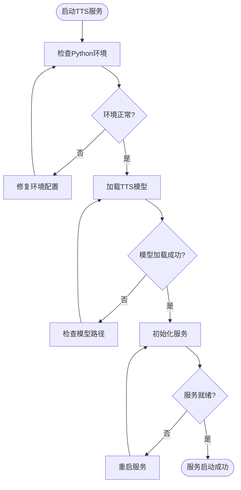
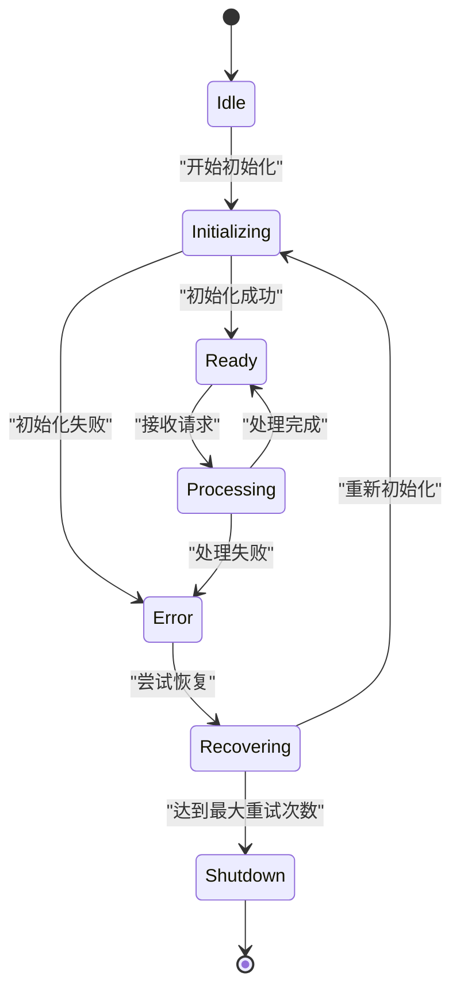
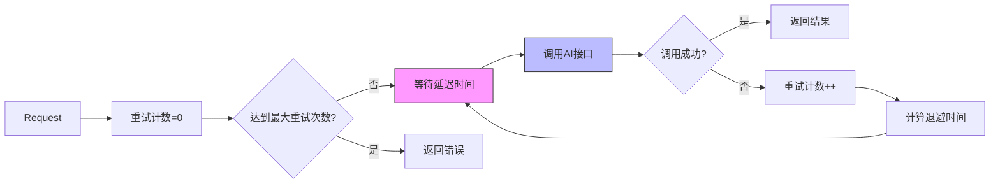
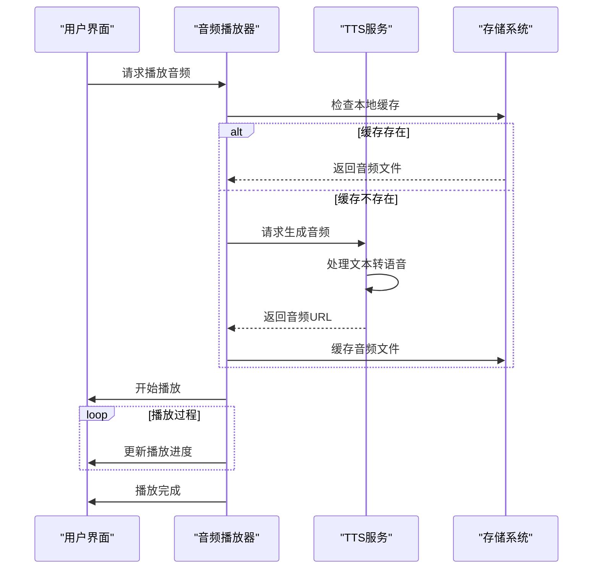
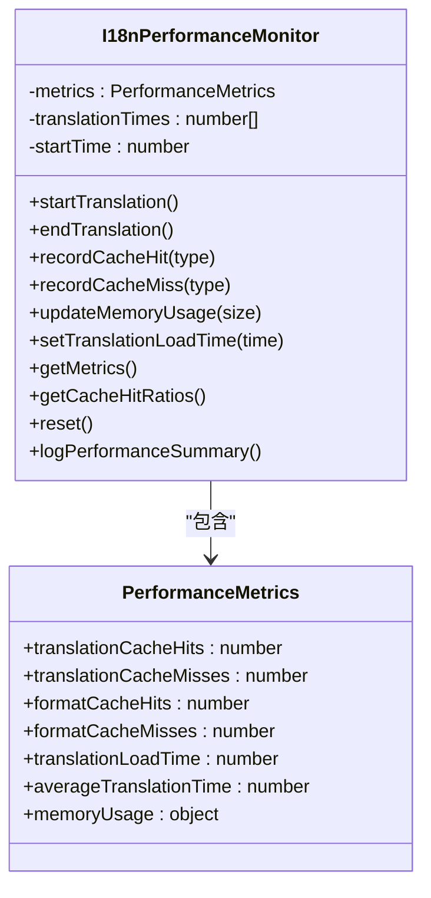
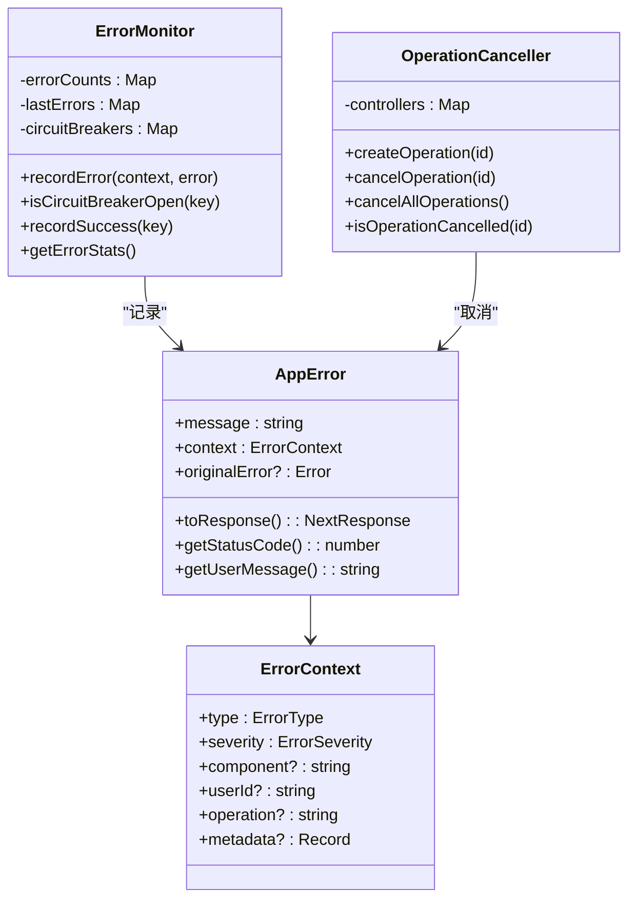
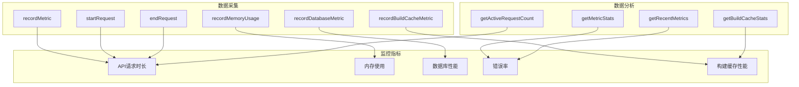

# 故障排查与调试

<cite>
**本文档引用的文件**
- [WRONG-ANSWERS-AI-TROUBLESHOOTING.md](file://documents/WRONG-ANSWERS-AI-TROUBLESHOOTING.md)
- [debug-kokoro-remote.py](file://scripts/debug-kokoro-remote.py)
- [enhanced-error-handler.ts](file://lib/enhanced-error-handler.ts)
- [metrics/route.ts](file://app/api/performance/metrics/route.ts)
- [kokoro-service-enhanced.ts](file://lib/kokoro-service-enhanced.ts)
- [tts-service.ts](file://lib/tts-service.ts)
- [i18n/performance.ts](file://lib/i18n/performance.ts)
- [bilingual-example.tsx](file://components/examples/bilingual-example.tsx)
- [CACHE_TROUBLESHOOTING.md](file://CACHE_TROUBLESHOOTING.md)
- [SPACY_MODEL_FIX.md](file://documents/SPACY_MODEL_FIX.md)
- [Dockerfile](file://Dockerfile)
</cite>

## 更新摘要
- 新增 **Docker构建缓存问题排查** 章节，涵盖多层级缓存架构、缓存失效和性能监控
- 新增 **SpaCy模型离线安装问题** 解决方案，解决TTS引擎因网络限制导致的初始化失败
- 更新 **TTS引擎故障排查** 部分，增加SpaCy模型预安装的解决方案
- 扩展 **性能监控指标** 部分，增加构建缓存性能指标
- 更新文档引用文件列表，包含新引入的缓存和模型修复文档

## 目录
1. [常见问题诊断](#常见问题诊断)
2. [TTS引擎故障排查](#tts引擎故障排查)
3. [AI接口超时处理](#ai接口超时处理)
4. [音频播放异常分析](#音频播放异常分析)
5. [双语文本显示错乱解决](#双语文本显示错乱解决)
6. [远程调试工具使用](#远程调试工具使用)
7. [错误处理机制](#错误处理机制)
8. [性能监控指标](#性能监控指标)
9. [日志分析技巧](#日志分析技巧)
10. [Docker构建缓存问题排查](#docker构建缓存问题排查)
11. [SpaCy模型离线安装问题](#spacy模型离线安装问题)

## 常见问题诊断

### TTS引擎启动失败

#### 症状：TTS服务无法启动或初始化失败

**可能原因：**
- Python环境配置问题
- GPU驱动或CUDA未正确安装
- 模型文件缺失或损坏
- 系统资源不足（内存、显存）
- 依赖库版本冲突
- SpaCy模型运行时下载失败（网络限制）

**解决方案：**

1. **检查Python环境**
   ```bash
   # 验证Python版本
   python --version
   
   # 检查关键模块
   python -c "import torch, phonemizer, espeakng_loader"
   ```

2. **验证GPU支持**
   ```bash
   # 检查CUDA可用性
   python -c "import torch; print(torch.cuda.is_available())"
   
   # 查看GPU设备信息
   nvidia-smi
   ```

3. **检查模型文件**
   ```bash
   # 验证TTS模型目录
   ls -la kokoro-main-ref/models/
   
   # 检查espeak-ng数据路径
   python -c "from espeakng_loader import get_data_path; print(get_data_path())"
   ```

4. **查看系统资源**
   ```bash
   # 检查内存使用
   free -h
   
   # 检查磁盘空间
   df -h
   ```

**Section sources**
- [debug-kokoro-remote.py](file://scripts/debug-kokoro-remote.py)
- [kokoro-service-enhanced.ts](file://lib/kokoro-service-enhanced.ts#L83-L121)

### AI接口超时

#### 症状：AI分析请求超时或响应缓慢

**可能原因：**
- Cerebras API服务不可用
- 网络连接问题
- 代理配置错误
- 请求频率超过限制
- 输入文本过长

**解决方案：**

1. **验证API连接**
   ```bash
   # 测试API密钥有效性
   curl -H "Authorization: Bearer $CEREBRAS_API_KEY" \
        https://api.cerebras.ai/v1/models
   
   # 测试网络连通性
   curl -I https://api.cerebras.ai
   ```

2. **调整并发设置**
   ```typescript
   // 减少并发请求数
   const limit = pLimit(5); // 默认为10
   
   // 批量处理分块
   const chunkSize = 20;
   ```

3. **实现重试机制**
   ```typescript
   // 使用指数退避策略
   const retryDelay = Math.min(1000 * Math.pow(2, attempt), 10000);
   ```

**Section sources**
- [WRONG-ANSWERS-AI-TROUBLESHOOTING.md](file://documents/WRONG-ANSWERS-AI-TROUBLESHOOTING.md)
- [enhanced-error-handler.ts](file://lib/enhanced-error-handler.ts#L298-L337)

### 音频播放异常

#### 症状：音频无法播放或播放中断

**可能原因：**
- 音频文件生成失败
- 文件格式不兼容
- 网络传输问题
- 浏览器缓存问题

**解决方案：**

1. **检查音频文件**
   ```bash
   # 验证音频目录
   ls -la public/audio/
   
   # 检查文件权限
   chmod -R 755 public/audio/
   ```

2. **验证文件格式**
   ```typescript
   // 支持的格式包括WAV和MP3
   export function validateAudioFormat(buffer: Buffer) {
     const format = detectAudioFormat(buffer);
     return { isValid: ['wav', 'mp3'].includes(format), format };
   }
   ```

3. **清理旧文件**
   ```bash
   # 删除7天前的音频文件
   find public/ -name "*.wav" -mtime +7 -delete
   ```

**Section sources**
- [tts-service.ts](file://lib/tts-service.ts#L49-L66)
- [audio-utils.ts](file://lib/audio-utils.ts#L239-L264)

### 双语文本显示错乱

#### 症状：中英文文本显示顺序混乱或内容缺失

**可能原因：**
- 国际化配置错误
- 缓存失效
- 组件渲染问题
- 数据格式不匹配

**解决方案：**

1. **检查国际化配置**
   ```typescript
   // 验证翻译资源
   import translations from '@/lib/i18n/translations/components.json';
   
   // 检查双语组件使用
   <BilingualText translationKey="common:buttons.generate" />
   ```

2. **清除缓存**
   ```bash
   # 清除浏览器缓存
   # 开发者工具 -> Application -> Clear site data
   ```

3. **验证数据结构**
   ```json
   {
     "en": "Generate",
     "zh": "生成"
   }
   ```

**Section sources**
- [bilingual-example.tsx](file://components/examples/bilingual-example.tsx)
- [i18n/types.ts](file://lib/i18n/types.ts#L46-L106)

## TTS引擎故障排查

### 启动流程分析



**Diagram sources**
- [debug-kokoro-remote.py](file://scripts/debug-kokoro-remote.py)
- [kokoro-service-enhanced.ts](file://lib/kokoro-service-enhanced.ts#L83-L121)

### 错误恢复机制



**Diagram sources**
- [enhanced-tts-service.ts](file://lib/enhanced-tts-service.ts#L424-L467)
- [kokoro-service-gpu.ts](file://lib/kokoro-service-gpu.ts#L280-L318)

## AI接口超时处理

### 超时重试策略



**Diagram sources**
- [enhanced-error-handler.ts](file://lib/enhanced-error-handler.ts#L270-L393)
- [rate-limiter.ts](file://lib/rate-limiter.ts#L215-L276)

## 音频播放异常分析

### 音频生命周期



**Diagram sources**
- [tts-service.ts](file://lib/tts-service.ts#L68-L98)
- [optimized-audio-player.tsx](file://components/optimized-audio-player.tsx#L299-L325)

## 双语文本显示错乱解决

### 国际化性能监控



**Diagram sources**
- [i18n/performance.ts](file://lib/i18n/performance.ts#L17-L136)
- [enablePerformanceLogging](file://lib/i18n/performance.ts#L142-L149)

## 远程调试工具使用

### debug-kokoro-remote.py使用指南

该脚本用于排查misaki/espeak兼容性问题，提供全面的环境检查功能。

**主要功能：**
- Python版本检查
- 关键模块导入测试
- EspeakWrapper方法验证
- misaki.espeak特定配置测试
- Kokoro导入和实例化测试
- CUDA可用性检测

**使用方法：**
```bash
python scripts/debug-kokoro-remote.py
```

**输出示例：**
```
=== Kokoro TTS 远程调试 ===
Python版本: 3.10.12 (main, Nov 20 2023, 15:14:05) [GCC 11.4.0]
✓ torch - 导入成功
✓ phonemizer - 导入成功
✓ espeakng_loader - 导入成功
✓ misaki - 导入成功
✓ misaki.espeak - 导入成功
✓ EspeakWrapper可用方法: [set_library, set_data_path, __init__, ...]
✓ 有set_data_path方法: True
✓ espeakng库路径: /usr/lib/x86_64-linux-gnu/libespeak-ng.so.1
✓ espeakng数据路径: /usr/share/espeak-ng-data
✓ EspeakWrapper配置成功
=== 测试Kokoro导入 ===
✓ KPipeline导入成功
✓ KPipeline创建成功
=== 测试CUDA ===
✓ CUDA可用: True
✓ CUDA设备数量: 1
✓ 当前CUDA设备: 0
✓ 设备名称: NVIDIA GeForce RTX 3090
```

**Section sources**
- [debug-kokoro-remote.py](file://scripts/debug-kokoro-remote.py)

## 错误处理机制

### 增强型错误处理器



**Diagram sources**
- [enhanced-error-handler.ts](file://lib/enhanced-error-handler.ts#L270-L393)
- [ErrorMonitor](file://lib/enhanced-error-handler.ts#L147-L270)

### 错误类型分类

| 错误类型 | HTTP状态码 | 用户提示 | 严重程度 |
|---------|----------|--------|--------|
| VALIDATION | 400 | 输入数据有误，请检查后重试 | 低 |
| DATABASE | 500 | 数据访问失败，请稍后重试 | 高 |
| TTS_SERVICE | 503 | 语音服务暂时不可用，请稍后重试 | 高 |
| AI_SERVICE | 503 | AI服务暂时不可用，请稍后重试 | 高 |
| NETWORK | 500 | 网络连接异常，请检查网络后重试 | 中 |
| RATE_LIMIT | 429 | 操作过于频繁，请稍后重试 | 中 |
| RESOURCE | 500 | 系统资源不足，请稍后重试 | 高 |

**Section sources**
- [enhanced-error-handler.ts](file://lib/enhanced-error-handler.ts#L298-L337)

## 性能监控指标

### performance/metrics API

该API提供系统性能监控数据，可用于实时监控系统负载。

**端点：** `/api/performance/metrics`

**返回数据结构：**
```json
{
  "success": true,
  "detailed": {
    "performanceHistory": [
      {
        "latest": 95,
        "trend": "improving",
        "reliability": "high"
      }
    ],
    "resourceUtilization": {
      "cpu": 45.2,
      "memory": 67.8,
      "disk": 32.1
    },
    "errorRates": {
      "tts": 0.02,
      "ai": 0.05,
      "database": 0.01
    }
  }
}
```

**关键指标：**
- `api_request_duration`: API请求持续时间
- `memory_rss`: 内存常驻集大小
- `memory_heap_used`: 堆内存使用量
- `database_operation_duration`: 数据库操作持续时间
- `build_cache_hit_rate`: 构建缓存命中率
- `build_cache_restore_time`: 构建缓存恢复时间



**Diagram sources**
- [metrics/route.ts](file://app/api/performance/metrics/route.ts#L75-L82)
- [monitoring.ts](file://lib/monitoring.ts#L270-L393)
- [CACHE_TROUBLESHOOTING.md](file://CACHE_TROUBLESHOOTING.md)

## 日志分析技巧

### 关键日志模式

**TTS服务相关日志：**
- `🚀 Initializing Kokoro TTS service...` - 服务开始初始化
- `✅ Kokoro TTS service initialized successfully` - 服务初始化成功
- `🔥 TTS service process error:` - TTS进程错误
- `🔄 Restarting TTS service` - 服务重启尝试
- `❌ Max restart attempts reached` - 达到最大重启次数

**AI服务相关日志：**
- `Network connectivity issues with Cerebras API` - 网络连接问题
- `Rate limiting exceeded for AI service` - 超出速率限制
- `AI analysis generation failed` - AI分析生成失败

**数据库相关日志：**
- `SQLITE_BUSY database is locked` - 数据库锁定
- `Database migration applied successfully` - 数据库迁移成功
- `Slow query detected: SELECT * FROM ...` - 检测到慢查询

### 日志级别说明

| 日志级别 | 颜色标识 | 适用场景 |
|---------|--------|--------|
| 🚨 CRITICAL | 红色 | 系统崩溃、服务不可用 |
| 🔴 HIGH | 红色 | 严重错误、数据丢失风险 |
| 🟡 MEDIUM | 黄色 | 可恢复错误、警告 |
| 🔵 LOW | 蓝色 | 信息性消息、调试信息 |

**Section sources**
- [enhanced-error-handler.ts](file://lib/enhanced-error-handler.ts#L200-L260)
- [WRONG-ANSWERS-AI-TROUBLESHOOTING.md](file://documents/WRONG-ANSWERS-AI-TROUBLESHOOTING.md)

## Docker构建缓存问题排查

### 2024年缓存架构差异

#### 新的多层级系统
1. **本地缓存 (`type=local`)**: 主要缓存，位于 `/tmp/.buildx-cache`，速度最快
2. **GHA缓存 (`type=gha`)**: GitHub Actions原生缓存，作为二级缓存
3. **注册表缓存 (`type=registry`)**: 持久化备份缓存

#### 关键依赖
- **缓存移动步骤**: 确保正确处理缓存目录
- **BuildKit配置**: 增强了并行性和网络优化
- **动作环境变量**: 禁用构建摘要以提高性能

### 常见问题与解决方案

#### 1. 缓存未恢复（构建耗时20分钟以上）

**症状：**
- 构建每次都从头开始
- 构建输出中没有"CACHED"消息
- 所有Docker层都被重新构建而不是复用

**诊断方法：**
```bash
# 检查缓存目录是否存在
ls -la /tmp/.buildx-cache

# 验证缓存键是否匹配预期模式
echo "预期键: ubuntu-latest-buildx-$(git rev-parse HEAD)"

# 检查GitHub Actions缓存状态
# 在工作流日志中查找:
# "Cache restored from key: ubuntu-latest-buildx-"
```

**解决方案：**

1. **验证缓存键生成：**
   ```yaml
   # 检查缓存键步骤是否生成正确的键
   - name: 调试缓存键
     run: |
       echo "操作系统: ${{ runner.os }}"
       echo "SHA: ${{ github.sha }}"
       echo "缓存键应为: ${{ runner.os }}-buildx-${{ github.sha }}"
   ```

2. **检查缓存移动步骤：**
   在工作流日志中查找以下日志：
   ```
   正在移动Docker缓存以正确处理目录...
   缓存移动成功完成
   ```

3. **验证BuildKit设置：**
   增强的BuildKit配置应显示以下功能：
   ```
   Buildx: Docker Buildx + BuildKit
   最大并行度: 4
   网络: host
   ```

#### 2. 缓存损坏问题

**症状：**
- 构建在缓存恢复期间失败
- "failed to solve: failed to read cache" 错误
- 构建行为不一致

**解决方案：**

1. **快速修复 - 手动重建：**
   使用 `rebuild-cache=true` 参数触发工作流

2. **手动清除注册表缓存：**
   ```bash
   # 删除所有缓存标签（需要GHCR访问权限）
   docker rmi ghcr.io/arthurlee116/english-listening-trainer:cache-base
   docker rmi ghcr.io/arthurlee116/english-listening-trainer:cache-python-deps
   docker rmi ghcr.io/arthurlee116/english-listening-trainer:cache-node-deps
   docker rmi ghcr.io/arthurlee116/english-listening-trainer:cache-builder
   ```

3. **清除GitHub Actions缓存：**
   - 进入仓库设置 → Actions → Caches
   - 删除所有"english-listening-trainer"范围的缓存

#### 3. 缓存性能缓慢

**症状：**
- 缓存恢复耗时超过2分钟
- 尽管有缓存命中，构建速度仍比预期慢

**诊断方法：**
```bash
# 检查缓存大小
docker buildx du --verbose

# 检查缓存传输
docker buildx build --progress=plain --target=base .
```

**解决方案：**

1. **优化构建上下文：**
   - 确保正确配置了`.dockerignore`
   - 从构建上下文中排除不必要的大文件

2. **检查网络连接：**
   - 验证与GHCR的稳定连接
   - 考虑区域网络问题

3. **监控缓存压缩：**
   - 工作流使用`compression=zstd`进行最佳传输
   - 考虑使用`compression=estargz`以实现更快的拉取

#### 4. 缓存失效未生效

**症状：**
- 更新后仍使用旧依赖
- package.json更改后未安装新包

**解决方案：**

1. **验证文件哈希：**
   检查依赖文件是否被正确跟踪：
   ```bash
   # 在工作流中，检查生成的缓存键
   echo "缓存键:"
   echo "基础: $(git hash-object Dockerfile)"
   echo "Python: $(cat kokoro-local/requirements.txt | git hash-object --stdin)"
   echo "Node: $(cat package.json package-lock.json | git hash-object --stdin)"
   ```

2. **强制阶段重建：**
   - 在相关Dockerfile阶段添加注释
   - 修改应触发失效的特定文件

3. **检查文件放置：**
   - 确保`COPY`命令顺序正确
   - 依赖应在应用代码之前复制

**Section sources**
- [CACHE_TROUBLESHOOTING.md](file://CACHE_TROUBLESHOOTING.md)
- [DOCKER_CACHE_IMPROVEMENTS_2024.md](file://documents/DOCKER_CACHE_IMPROVEMENTS_2024.md)
- [CACHE_OPTIMIZATION_GUIDE.md](file://documents/CACHE_OPTIMIZATION_GUIDE.md)

## SpaCy模型离线安装问题

### 问题描述

运行Docker容器时，Kokoro TTS服务初始化失败，出现以下错误：

```
❌ Pipeline creation failed: HTTPSConnectionPool(host='raw.githubusercontent.com', port=443): 
Max retries exceeded with url: /explosion/spacy-models/master/compatibility.json 
(Caused by SSLError(SSLEOFError(8, '[SSL: UNEXPECTED_EOF_WHILE_READING] EOF occurred in violation of protocol (_ssl.c:1007)')))
```

### 根本原因

`kokoro`包依赖于`misaki`进行G2P（字素到音素）转换，而`misaki`又需要SpaCy英文模型`en_core_web_sm`。该模型未预安装在Docker镜像中，导致应用在运行时尝试下载。

在生产/受限网络环境中，此运行时下载会因以下原因失败：
- SSL/TLS连接问题
- 网络限制
- 防火墙策略
- 离线部署要求

### 解决方案

在Docker构建过程中预安装SpaCy模型，通过在Dockerfile中添加以下步骤：

```dockerfile
# 预安装SpaCy英文模型（Kokoro的misaki G2P所需）
# 这可以防止在离线/受限环境中运行时的下载尝试
RUN ${KOKORO_VENV}/bin/python -m spacy download en_core_web_sm
```

此命令：
1. 在构建时（网络可用时）下载`en_core_web_sm`模型
2. 将其安装到Python虚拟环境中
3. 使其在运行时可离线使用

### 实现细节

**修改文件**: `Dockerfile`

**位置**: 在安装Kokoro依赖后（约第152行）

**构建影响**: 
- 增加约12MB镜像大小
- 增加构建时间约10-15秒
- 构建时需要互联网访问（Docker构建的标准要求）

### 验证

在使用此修复重建Docker镜像后：

1. SpaCy模型将捆绑在镜像中
2. Kokoro TTS将在无网络访问的情况下成功初始化
3. G2P管道将离线工作
4. 不再发生运行时下载尝试

**Section sources**
- [SPACY_MODEL_FIX.md](file://documents/SPACY_MODEL_FIX.md)
- [Dockerfile](file://Dockerfile)