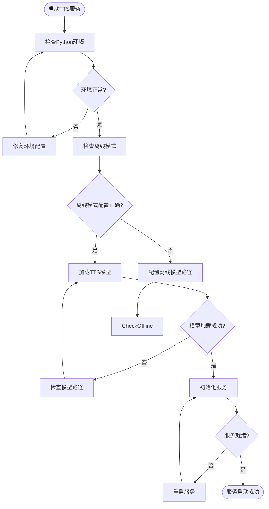
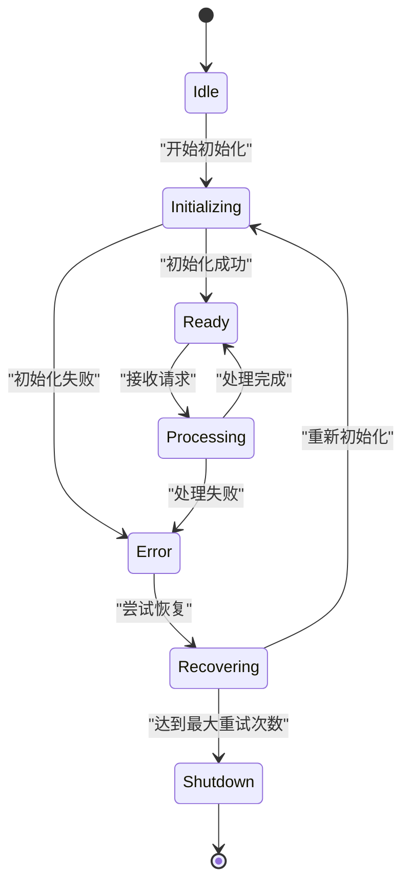
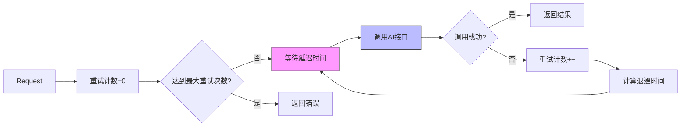
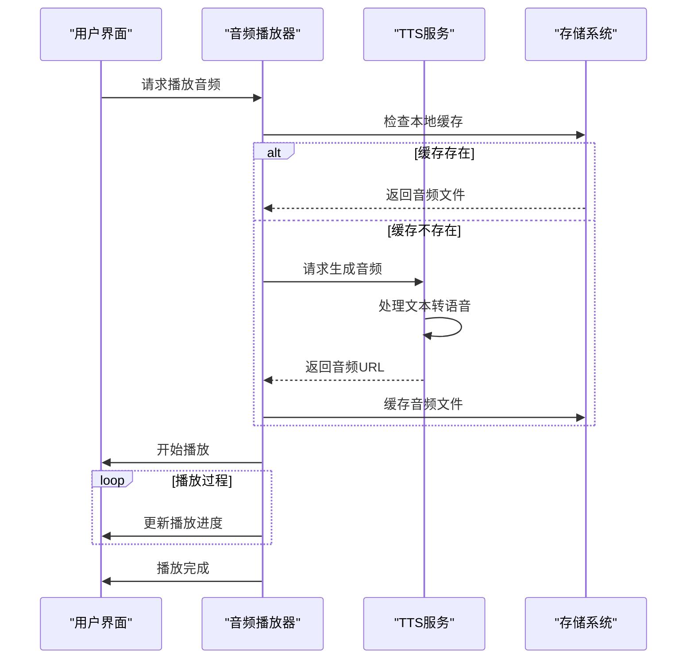
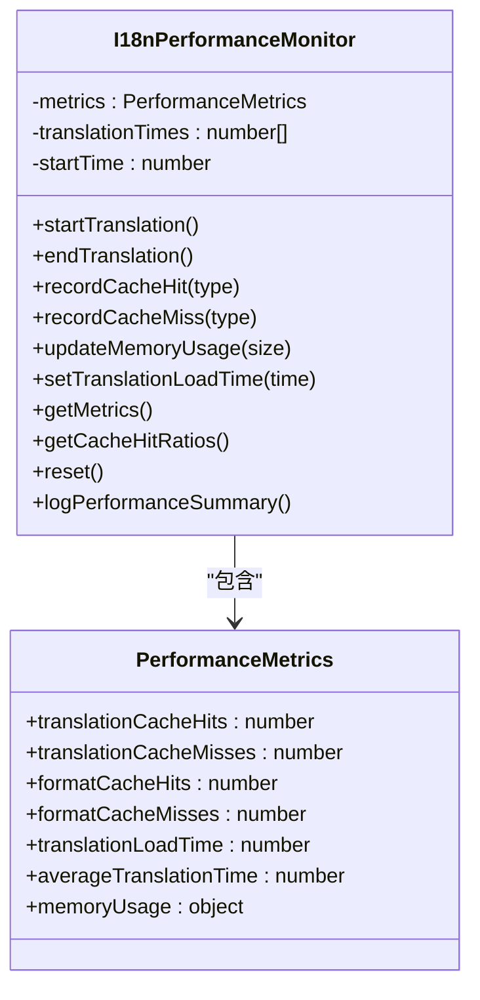
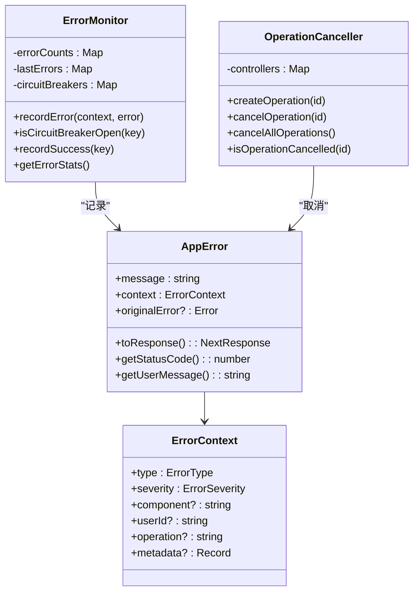
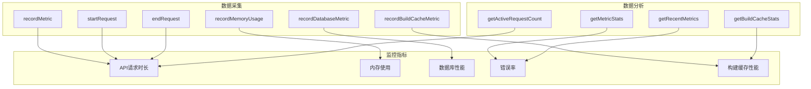
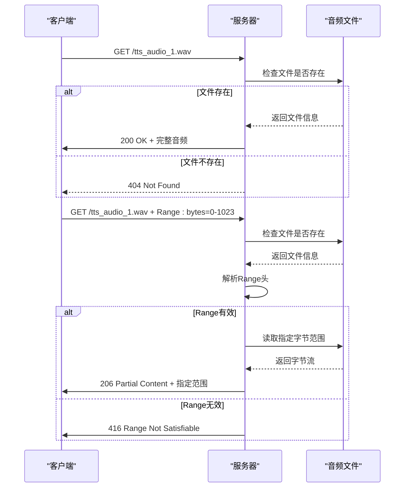

# 故障排查与调试

<cite>
**本文档引用的文件**
- [WRONG-ANSWERS-AI-TROUBLESHOOTING.md](file://documents/WRONG-ANSWERS-AI-TROUBLESHOOTING.md)
- [debug-kokoro-remote.py](file://scripts/debug-kokoro-remote.py)
- [enhanced-error-handler.ts](file://lib/enhanced-error-handler.ts)
- [metrics/route.ts](file://app/api/performance/metrics/route.ts)
- [kokoro-service-enhanced.ts](file://lib/kokoro-service-enhanced.ts)
- [tts-service.ts](file://lib/tts-service.ts)
- [i18n/performance.ts](file://lib/i18n/performance.ts)
- [bilingual-example.tsx](file://components/examples/bilingual-example.tsx)
- [CACHE_TROUBLESHOOTING.md](file://CACHE_TROUBLESHOOTING.md)
- [SPACY_MODEL_FIX.md](file://documents/SPACY_MODEL_FIX.md)
- [Dockerfile](file://Dockerfile)
- [kokoro_wrapper.py](file://kokoro_local/kokoro_wrapper.py) - *重构了TTS包装器，增强了离线模式和路径解析*
- [kokoro-env.ts](file://lib/kokoro-env.ts) - *重构了TTS包装器，增强了离线模式和路径解析*
- [cerebras-client-manager.ts](file://lib/ai/cerebras-client-manager.ts) - *新增，AI代理管理与健康检查*
- [retry-strategy.ts](file://lib/ai/retry-strategy.ts) - *新增，结构化重试策略与覆盖率评估*
- [cerebras-service.ts](file://lib/ai/cerebras-service.ts) - *新增，统一的结构化调用管道*
- [project-board.md](file://documents/project-board.md) - *已移除动态代理支持*
- [project-status.md](file://documents/project-status.md) - *已移除动态代理支持*
- [audio/[filename]/route.ts](file://app/api/audio/%5Bfilename%5D/route.ts) - *新增，支持HTTP Range请求*
- [audio-utils.ts](file://lib/audio-utils.ts) - *新增，音频元数据解析与缓存*
</cite>

## 更新摘要
- **新增** **音频播放异常分析** 章节，涵盖支持HTTP Range请求的实现细节和断点续播功能
- **更新** **音频播放异常** 部分，增加对Range请求处理和音频元数据解析的说明
- **更新** **日志分析技巧** 部分，增加与音频流处理相关的日志模式
- **新增** **音频流处理机制** 章节，详细说明Range请求解析和部分响应的实现
- **更新** 文档引用文件列表，包含新分析的`audio/[filename]/route.ts`和`audio-utils.ts`文件

## 目录
1. [常见问题诊断](#常见问题诊断)
2. [TTS引擎故障排查](#tts引擎故障排查)
3. [AI接口超时处理](#ai接口超时处理)
4. [音频播放异常分析](#音频播放异常分析)
5. [双语文本显示错乱解决](#双语文本显示错乱解决)
6. [远程调试工具使用](#远程调试工具使用)
7. [错误处理机制](#错误处理机制)
8. [性能监控指标](#性能监控指标)
9. [日志分析技巧](#日志分析技巧)
10. [TTS包装器重构影响](#tts包装器重构影响)
11. [缓存层验证脚本](#缓存层验证脚本)
12. [AI服务调用管道重构影响](#ai服务调用管道重构影响)
13. [音频流处理机制](#音频流处理机制)

## 常见问题诊断

### TTS引擎启动失败

#### 症状：TTS服务无法启动或初始化失败

**可能原因：**
- Python环境配置问题
- GPU驱动或CUDA未正确安装
- 模型文件缺失或损坏
- 系统资源不足（内存、显存）
- 依赖库版本冲突
- SpaCy模型运行时下载失败（网络限制）
- **新增**：离线模式下模型路径配置错误

**解决方案：**

1. **检查Python环境**
   ```bash
   # 验证Python版本
   python --version
   
   # 检查关键模块
   python -c "import torch, phonemizer, espeakng_loader"
   ```

2. **验证GPU支持**
   ```bash
   # 检查CUDA可用性
   python -c "import torch; print(torch.cuda.is_available())"
   
   # 查看GPU设备信息
   nvidia-smi
   ```

3. **检查模型文件**
   ```bash
   # 验证TTS模型目录
   ls -la kokoro-main-ref/models/
   
   # 检查espeak-ng数据路径
   python -c "from espeakng_loader import get_data_path; print(get_data_path())"
   
   # **新增**：检查离线模型路径
   ls -la kokoro-models/Kokoro-82M/
   ls -la ~/.cache/huggingface/hub/models--hexgrad--Kokoro-82M/
   ```

4. **查看系统资源**
   ```bash
   # 检查内存使用
   free -h
   
   # 检查磁盘空间
   df -h
   ```

**章节来源**
- [debug-kokoro-remote.py](file://scripts/debug-kokoro-remote.py)
- [kokoro-service-enhanced.ts](file://lib/kokoro-service-enhanced.ts#L83-L121)
- [kokoro_wrapper.py](file://kokoro_local/kokoro_wrapper.py#L150-L250) - *新增，离线模式初始化逻辑*

### AI接口超时

#### 症状：AI分析请求超时或响应缓慢

**可能原因：**
- Cerebras API服务不可用
- 网络连接问题
- **已移除**：代理配置错误（动态代理支持已移除）
- 请求频率超过限制
- 输入文本过长

**解决方案：**

1. **验证API连接**
   ```bash
   # 测试API密钥有效性
   curl -H "Authorization: Bearer $CEREBRAS_API_KEY" \
        https://api.cerebras.ai/v1/models
   
   # 测试网络连通性
   curl -I https://api.cerebras.ai
   ```

2. **调整并发设置**
   ```typescript
   // 减少并发请求数
   const limit = pLimit(5); // 默认为10
   
   // 批量处理分块
   const chunkSize = 20;
   ```

3. **实现重试机制**
   ```typescript
   // 使用指数退避策略
   const retryDelay = Math.min(1000 * Math.pow(2, attempt), 10000);
   ```

**章节来源**
- [WRONG-ANSWERS-AI-TROUBLESHOOTING.md](file://documents/WRONG-ANSWERS-AI-TROUBLESHOOTING.md)
- [enhanced-error-handler.ts](file://lib/enhanced-error-handler.ts#L298-L337)

### 音频播放异常

#### 症状：音频无法播放或播放中断

**可能原因：**
- 音频文件生成失败
- 文件格式不兼容
- 网络传输问题
- 浏览器缓存问题
- **新增**：不支持Range请求的客户端兼容性问题

**解决方案：**

1. **检查音频文件**
   ```bash
   # 验证音频目录
   ls -la public/audio/
   
   # 检查文件权限
   chmod -R 755 public/audio/
   ```

2. **验证文件格式**
   ```typescript
   // 支持的格式包括WAV和MP3
   export function validateAudioFormat(buffer: Buffer) {
     const format = detectAudioFormat(buffer);
     return { isValid: ['wav', 'mp3'].includes(format), format };
   }
   ```

3. **清理旧文件**
   ```bash
   # 删除7天前的音频文件
   find public/ -name "*.wav" -mtime +7 -delete
   ```

4. **检查Range请求支持**
   ```bash
   # 测试Range请求
   curl -H "Range: bytes=0-1023" http://localhost:3000/tts_audio_1.wav -v
   ```

**章节来源**
- [tts-service.ts](file://lib/tts-service.ts#L49-L66)
- [audio-utils.ts](file://lib/audio-utils.ts#L239-L264)
- [audio/[filename]/route.ts](file://app/api/audio/%5Bfilename%5D/route.ts#L67-L134) - *新增，Range请求处理*

### 双语文本显示错乱

#### 症状：中英文文本显示顺序混乱或内容缺失

**可能原因：**
- 国际化配置错误
- 缓存失效
- 组件渲染问题
- 数据格式不匹配

**解决方案：**

1. **检查国际化配置**
   ```typescript
   // 验证翻译资源
   import translations from '@/lib/i18n/translations/components.json';
   
   // 检查双语组件使用
   <BilingualText translationKey="common:buttons.generate" />
   ```

2. **清除缓存**
   ```bash
   # 清除浏览器缓存
   # 开发者工具 -> Application -> Clear site data
   ```

3. **验证数据结构**
   ```json
   {
     "en": "Generate",
     "zh": "生成"
   }
   ```

**章节来源**
- [bilingual-example.tsx](file://components/examples/bilingual-example.tsx)
- [i18n/types.ts](file://lib/i18n/types.ts#L46-L106)

## TTS引擎故障排查

### 启动流程分析



**图示来源**
- [debug-kokoro-remote.py](file://scripts/debug-kokoro-remote.py)
- [kokoro-service-enhanced.ts](file://lib/kokoro-service-enhanced.ts#L83-L121)
- [kokoro_wrapper.py](file://kokoro_local/kokoro_wrapper.py#L150-L250) - *新增，离线模式流程*

### 错误恢复机制



**图示来源**
- [enhanced-tts-service.ts](file://lib/enhanced-tts-service.ts#L424-L467)
- [kokoro-service-gpu.ts](file://lib/kokoro-service-gpu.ts#L280-L318)

## AI接口超时处理

### 超时重试策略



**图示来源**
- [enhanced-error-handler.ts](file://lib/enhanced-error-handler.ts#L270-L393)
- [rate-limiter.ts](file://lib/rate-limiter.ts#L215-L276)

## 音频播放异常分析

### 音频生命周期



**图示来源**
- [tts-service.ts](file://lib/tts-service.ts#L68-L98)
- [optimized-audio-player.tsx](file://components/optimized-audio-player.tsx#L299-L325)

## 双语文本显示错乱解决

### 国际化性能监控



**图示来源**
- [i18n/performance.ts](file://lib/i18n/performance.ts#L17-L136)
- [enablePerformanceLogging](file://lib/i18n/performance.ts#L142-L149)

## 远程调试工具使用

### debug-kokoro-remote.py使用指南

该脚本用于排查misaki/espeak兼容性问题，提供全面的环境检查功能。

**主要功能：**
- Python版本检查
- 关键模块导入测试
- EspeakWrapper方法验证
- misaki.espeak特定配置测试
- Kokoro导入和实例化测试
- CUDA可用性检测

**使用方法：**
```bash
python scripts/debug-kokoro-remote.py
```

**输出示例：**
```
=== Kokoro TTS 远程调试 ===
Python版本: 3.10.12 (main, Nov 20 2023, 15:14:05) [GCC 11.4.0]
✓ torch - 导入成功
✓ phonemizer - 导入成功
✓ espeakng_loader - 导入成功
✓ misaki - 导入成功
✓ misaki.espeak - 导入成功
✓ EspeakWrapper可用方法: [set_library, set_data_path, __init__, ...]
✓ 有set_data_path方法: True
✓ espeakng库路径: /usr/lib/x86_64-linux-gnu/libespeak-ng.so.1
✓ espeakng数据路径: /usr/share/espeak-ng-data
✓ EspeakWrapper配置成功
=== 测试Kokoro导入 ===
✓ KPipeline导入成功
✓ KPipeline创建成功
=== 测试CUDA ===
✓ CUDA可用: True
✓ CUDA设备数量: 1
✓ 当前CUDA设备: 0
✓ 设备名称: NVIDIA GeForce RTX 3090
```

**章节来源**
- [debug-kokoro-remote.py](file://scripts/debug-kokoro-remote.py)

## 错误处理机制

### 增强型错误处理器



**图示来源**
- [enhanced-error-handler.ts](file://lib/enhanced-error-handler.ts#L270-L393)
- [ErrorMonitor](file://lib/enhanced-error-handler.ts#L147-L270)

### 错误类型分类

| 错误类型 | HTTP状态码 | 用户提示 | 严重程度 |
|---------|----------|--------|--------|
| VALIDATION | 400 | 输入数据有误，请检查后重试 | 低 |
| DATABASE | 500 | 数据访问失败，请稍后重试 | 高 |
| TTS_SERVICE | 503 | 语音服务暂时不可用，请稍后重试 | 高 |
| AI_SERVICE | 503 | AI服务暂时不可用，请稍后重试 | 高 |
| NETWORK | 500 | 网络连接异常，请检查网络后重试 | 中 |
| RATE_LIMIT | 429 | 操作过于频繁，请稍后重试 | 中 |
| RESOURCE | 500 | 系统资源不足，请稍后重试 | 高 |

**章节来源**
- [enhanced-error-handler.ts](file://lib/enhanced-error-handler.ts#L298-L337)

## 性能监控指标

### performance/metrics API

该API提供系统性能监控数据，可用于实时监控系统负载。

**端点：** `/api/performance/metrics`

**返回数据结构：**
```json
{
  "success": true,
  "detailed": {
    "performanceHistory": [
      {
        "latest": 95,
        "trend": "improving",
        "reliability": "high"
      }
    ],
    "resourceUtilization": {
      "cpu": 45.2,
      "memory": 67.8,
      "disk": 32.1
    },
    "errorRates": {
      "tts": 0.02,
      "ai": 0.05,
      "database": 0.01
    }
  }
}
```

**关键指标：**
- `api_request_duration`: API请求持续时间
- `memory_rss`: 内存常驻集大小
- `memory_heap_used`: 堆内存使用量
- `database_operation_duration`: 数据库操作持续时间
- `build_cache_hit_rate`: 构建缓存命中率
- `build_cache_restore_time`: 构建缓存恢复时间



**图示来源**
- [metrics/route.ts](file://app/api/performance/metrics/route.ts#L75-L82)
- [monitoring.ts](file://lib/monitoring.ts#L270-L393)
- [CACHE_TROUBLESHOOTING.md](file://CACHE_TROUBLESHOOTING.md)

## 日志分析技巧

### 关键日志模式

**TTS服务相关日志：**
- `🚀 Initializing Kokoro TTS service...` - 服务开始初始化
- `✅ Kokoro TTS service initialized successfully` - 服务初始化成功
- `🔥 TTS service process error:` - TTS进程错误
- `🔄 Restarting TTS service` - 服务重启尝试
- `❌ Max restart attempts reached` - 达到最大重启次数
- **新增**：`❌ Kokoro model not found in offline mode.` - 离线模式下模型未找到

**AI服务相关日志：**
- `Network connectivity issues with Cerebras API` - 网络连接问题
- `Rate limiting exceeded for AI service` - 超出速率限制
- `AI analysis generation failed` - AI分析生成失败
- **新增**：`AI call attempt X failed` - AI调用重试
- **新增**：`Executing coverage retry attempt X` - 执行覆盖率重试
- **新增**：`Cerebras health check passed` - Cerebras健康检查通过

**数据库相关日志：**
- `SQLITE_BUSY database is locked` - 数据库锁定
- `Database migration applied successfully` - 数据库迁移成功
- `Slow query detected: SELECT * FROM ...` - 检测到慢查询

**音频流相关日志：**
- `Serving audio file: tts_audio_*.wav` - 开始提供音频文件
- `Partial content requested: bytes=X-Y` - 收到部分请求
- `Invalid range header: ${range}` - 无效的Range头
- `Audio file not found: ${filePath}` - 音频文件未找到
- `Error serving audio file: ${error}` - 提供音频文件时出错

### 日志级别说明

| 日志级别 | 颜色标识 | 适用场景 |
|---------|--------|--------|
| 🚨 CRITICAL | 红色 | 系统崩溃、服务不可用 |
| 🔴 HIGH | 红色 | 严重错误、数据丢失风险 |
| 🟡 MEDIUM | 黄色 | 可恢复错误、警告 |
| 🔵 LOW | 蓝色 | 信息性消息、调试信息 |

**章节来源**
- [enhanced-error-handler.ts](file://lib/enhanced-error-handler.ts#L200-L260)
- [WRONG-ANSWERS-AI-TROUBLESHOOTING.md](file://documents/WRONG-ANSWERS-AI-TROUBLESHOOTING.md)
- [audio/[filename]/route.ts](file://app/api/audio/%5Bfilename%5D/route.ts#L67-L134) - *新增，音频流日志*

## TTS包装器重构影响

### 重构概述

`kokoro_local/kokoro_wrapper.py` 文件经过重构，统一了包装器逻辑并提取了文本分块模块，增强了离线模式支持和路径解析能力。

**主要变更：**
- **离线模式强制**：通过设置 `HF_HUB_OFFLINE=1` 和 `TRANSFORMERS_OFFLINE=1` 环境变量，强制在离线模式下运行，防止运行时下载。
- **多路径模型扫描**：按优先级顺序扫描多个本地模型路径，包括环境变量指定路径、项目本地缓存、用户主目录缓存和独立模型目录。
- **自动路径复制**：如果在非标准路径找到模型，会自动将其复制到HuggingFace的标准缓存结构中。
- **设备自动检测**：根据平台和硬件自动选择最佳设备（CUDA、MPS或CPU）。
- **文本智能分块**：对于长文本，使用 `split_text_intelligently` 函数进行分块处理，避免截断。

**章节来源**
- [kokoro_wrapper.py](file://kokoro_local/kokoro_wrapper.py) - *重构了TTS包装器，增强了离线模式和路径解析*
- [kokoro-env.ts](file://lib/kokoro-env.ts) - *重构了TTS包装器，增强了离线模式和路径解析*

### 故障排查更新

由于重构，TTS引擎启动失败的排查流程需要更新：

1. **检查离线模式配置**
   ```bash
   # 检查环境变量
   echo $KOKORO_LOCAL_MODEL_PATH
   echo $HF_HUB_OFFLINE
   ```

2. **验证模型路径**
   ```bash
   # 检查所有可能的模型路径
   ls -la $KOKORO_LOCAL_MODEL_PATH
   ls -la kokoro_local/.cache/huggingface/hub/models--hexgrad--Kokoro-82M/snapshots/main
   ls -la ~/.cache/huggingface/hub/models--hexgrad--Kokoro-82M/snapshots/main
   ls -la kokoro-models/Kokoro-82M
   ```

3. **查看详细的初始化日志**
   ```bash
   # 在日志中查找模型搜索路径
   grep "Searched paths:" debug.log
   grep "Found local model at:" debug.log
   ```

**章节来源**
- [kokoro_wrapper.py](file://kokoro_local/kokoro_wrapper.py#L150-L250) - *新增，离线模式初始化逻辑*

## 缓存层验证脚本

### 历史背景

为解决远程服务器缓存预热缺失问题，曾创建 `scripts/verify-cache-layers.sh` 脚本用于验证缓存层的完整性。

**脚本功能：**
- 检查 `cache-base`、`cache-python` 和 `cache-node` 缓存层是否存在。
- 显示每个缓存层的大小和创建时间。
- 提供详细的验证报告和磁盘使用情况。

**验证逻辑：**
```bash
for layer in "${CACHE_LAYERS[@]}"; do
    echo -n "📋 检查 $layer: "
    if docker images --format "table {{.Repository}}:{{.Tag}}" | grep -q "$IMAGE_NAME:$layer"; then
        echo -e "${GREEN}✅ 已存在${NC}"
        SIZE=$(docker images --format "{{.Repository}}:{{.Tag}}\t{{.Size}}" | grep "$IMAGE_NAME:$layer" | awk '{print $2}')
        echo "   📏 大小: $SIZE"
    else
        echo -e "${RED}❌ 缺失${NC}"
        ALL_VALID=false
    fi
done
```

**现状：**
该脚本已于2025年10月13日归档，其功能被手动 `docker images` 命令检查所取代。当前部署流程改为手动从GHCR拉取缓存层并使用docker compose部署。

**章节来源**
- [verify-cache-layers.sh](file://scripts/verify-cache-layers.sh) - *已归档的缓存验证脚本*
- [remote-cache-prewarm-snapshot.md](file://documents/workflow-snapshots/remote-cache-prewarm-snapshot.md) - *历史工作流快照*

## AI服务调用管道重构影响

### 重构概述

AI服务调用管道已重构为统一的结构化调用管道，取代了旧的动态代理支持。新的管道引入了智能重试、覆盖率评估和扩写回退等高级功能。

**主要变更：**
- **统一调用管道**：所有AI API调用（如生成主题、转录、问题、评分、扩写）均通过 `invokeStructured()` 函数进行，确保一致的错误处理和监控。
- **移除动态代理**：旧的代理健康检查和动态代理选择逻辑已被移除，现在硬编码使用生产代理地址。
- **结构化响应**：利用JSON Schema确保AI返回的数据格式正确，避免解析错误。
- **智能重试策略**：引入 `executeWithCoverageRetry` 函数，根据标签覆盖率评估结果决定是否重试，确保生成内容的全面性。
- **扩写回退路径**：当生成内容长度不足时，自动触发扩写回退路径，确保满足字数要求。
- **遥测与监控**：新增 `telemetry.ts` 模块，记录每次AI调用的详细信息，包括重试次数、延迟和最终结果。

**章节来源**
- [cerebras-service.ts](file://lib/ai/cerebras-service.ts) - *新增，统一的结构化调用管道*
- [cerebras-client-manager.ts](file://lib/ai/cerebras-client-manager.ts) - *新增，AI代理管理与健康检查*
- [retry-strategy.ts](file://lib/ai/retry-strategy.ts) - *新增，结构化重试策略与覆盖率评估*
- [project-board.md](file://documents/project-board.md) - *已移除动态代理支持*
- [project-status.md](file://documents/project-status.md) - *已移除动态代理支持*

### 故障排查更新

由于AI服务调用管道的重构，AI接口超时的排查流程需要更新：

1. **检查API密钥和基础URL**
   ```bash
   # 检查环境变量
   echo $CEREBRAS_API_KEY
   echo $CEREBRAS_BASE_URL
   ```

2. **验证Cerebras服务健康状态**
   ```bash
   # 使用内置健康检查
   curl -H "Authorization: Bearer $CEREBRAS_API_KEY" \
        https://api.cerebras.ai/v1/chat/completions \
        -d '{"messages": [{"role": "user", "content": "Respond exactly with {\"status\":\"ok\"}"}], "response_format": {"type": "json_schema", "json_schema": {"name": "cerebras_health_check", "strict": true, "schema": {"type": "object", "properties": {"status": {"type": "string"}}, "required": ["status"], "additionalProperties": false}}}}'
   ```

3. **查看详细的AI调用日志**
   ```bash
   # 在日志中查找AI调用详情
   grep "Executing coverage retry" debug.log
   grep "AI call attempt" debug.log
   grep "Cerebras health check" debug.log
   ```

**章节来源**
- [cerebras-client-manager.ts](file://lib/ai/cerebras-client-manager.ts#L15-L78) - *新增，代理状态快照*
- [monitoring.ts](file://lib/monitoring.ts#L576-L626) - *新增，Cerebras健康检查实现*
- [retry-strategy.ts](file://lib/ai/retry-strategy.ts#L50-L102) - *新增，覆盖率重试执行逻辑*

## 音频流处理机制

### Range请求处理



**图示来源**
- [audio/[filename]/route.ts](file://app/api/audio/%5Bfilename%5D/route.ts#L19-L65) - *Range头解析*
- [audio/[filename]/route.ts](file://app/api/audio/%5Bfilename%5D/route.ts#L67-L134) - *部分响应处理*

### 音频元数据解析

```mermaid
classDiagram
class AudioMetadata {
+duration : number
+sampleRate : number
+channels : number
+bitsPerSample : number
}
class AudioMetadataCache {
+[fileUrl : string] : AudioMetadata & { lastValidated : number, format : string }
}
class AudioUtils {
+getWavAudioMetadata(buffer : Buffer) : AudioMetadata
+detectAudioFormat(buffer : Buffer) : 'wav' | 'mp3' | 'unknown'
+getAudioMetadataFromUrl(url : string) : Promise<AudioMetadata | null>
+validateAudioFormat(buffer : Buffer) : { isValid : boolean; format : string; confidence : number }
}
AudioUtils --> AudioMetadata : "返回"
AudioUtils --> AudioMetadataCache : "读写"
```

**图示来源**
- [audio-utils.ts](file://lib/audio-utils.ts#L22-L166) - *WAV元数据解析*
- [audio-utils.ts](file://lib/audio-utils.ts#L212-L254) - *URL元数据获取*
- [audio-utils.ts](file://lib/audio-utils.ts#L256-L275) - *格式验证*

### HTTP Range请求实现

`app/api/audio/[filename]/route.ts` 文件已更新以支持HTTP Range请求，实现音频断点续播功能。

**主要特性：**
- **Range头解析**：支持标准的`bytes=start-end`格式，包括后缀范围（`bytes=-500`）和开区间范围（`bytes=500-`）。
- **部分响应**：当收到有效的Range请求时，返回HTTP 206状态码和`Content-Range`头，仅传输请求的字节范围。
- **CORS支持**：通过OPTIONS预检请求支持跨域Range请求，允许`Range`和`Content-Type`头。
- **安全验证**：只允许访问以`tts_audio_`开头且以`.wav`结尾的文件，防止路径遍历攻击。
- **错误处理**：对无效的Range请求返回416状态码，并提供`Content-Range: bytes */fileSize`头。

**使用示例：**
```bash
# 获取文件前1024字节
curl -H "Range: bytes=0-1023" http://localhost:3000/tts_audio_1.wav -v

# 获取文件最后500字节
curl -H "Range: bytes=-500" http://localhost:3000/tts_audio_1.wav -v

# 获取从第1000字节到文件末尾
curl -H "Range: bytes=1000-" http://localhost:3000/tts_audio_1.wav -v
```

**章节来源**
- [audio/[filename]/route.ts](file://app/api/audio/%5Bfilename%5D/route.ts#L19-L65) - *Range头解析逻辑*
- [audio/[filename]/route.ts](file://app/api/audio/%5Bfilename%5D/route.ts#L67-L134) - *部分响应实现*
- [audio/[filename]/route.ts](file://app/api/audio/%5Bfilename%5D/route.ts#L137-L146) - *CORS预检支持*

### 音频元数据处理

`lib/audio-utils.ts` 文件提供了音频元数据解析和缓存功能，避免前端等待metadata事件。

**主要功能：**
- **WAV元数据解析**：通过解析WAV文件头，精确提取持续时间、采样率、声道数和位深度。
- **格式检测**：支持WAV和MP3格式检测，通过文件头签名识别。
- **元数据缓存**：在内存中缓存音频元数据5分钟，减少重复的网络请求和文件解析。
- **URL元数据获取**：通过fetch API获取远程音频文件的元数据，支持缓存。
- **格式验证**：验证音频文件格式的有效性，并提供置信度评分。

**代码示例：**
```typescript
// 获取WAV缓冲区的元数据
const metadata = getWavAudioMetadata(buffer);
console.log(`音频时长: ${metadata.duration.toFixed(2)}秒`);

// 从URL获取音频元数据（带缓存）
const metadata = await getAudioMetadataFromUrl('/tts_audio_1.wav');
if (metadata) {
  console.log(`音频时长: ${metadata.duration.toFixed(2)}秒`);
}

// 验证音频格式
const result = validateAudioFormat(buffer);
if (result.isValid) {
  console.log(`支持的格式: ${result.format}, 置信度: ${result.confidence}`);
}
```

**章节来源**
- [audio-utils.ts](file://lib/audio-utils.ts#L22-L166) - *WAV元数据解析实现*
- [audio-utils.ts](file://lib/audio-utils.ts#L212-L254) - *URL元数据获取实现*
- [audio-utils.ts](file://lib/audio-utils.ts#L256-L275) - *格式验证实现*