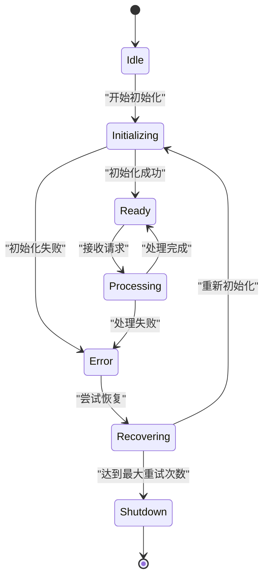
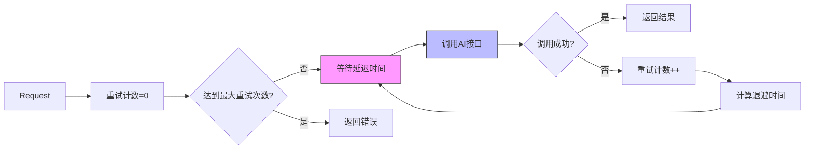
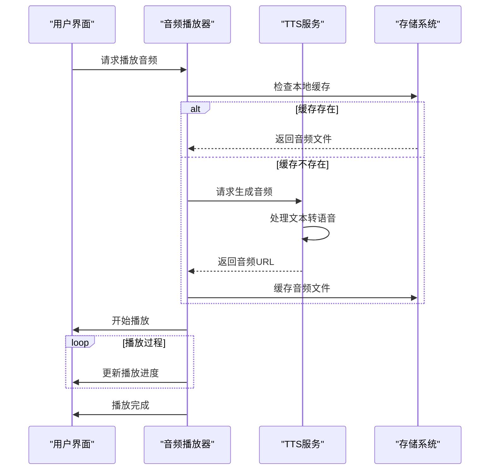
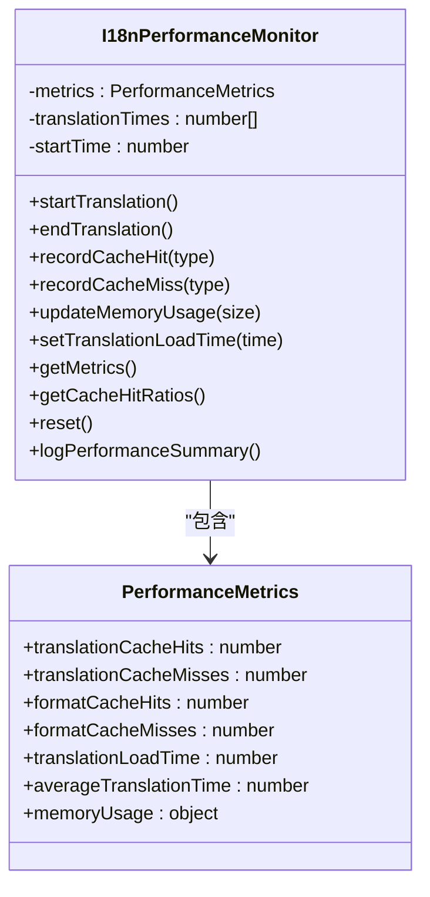
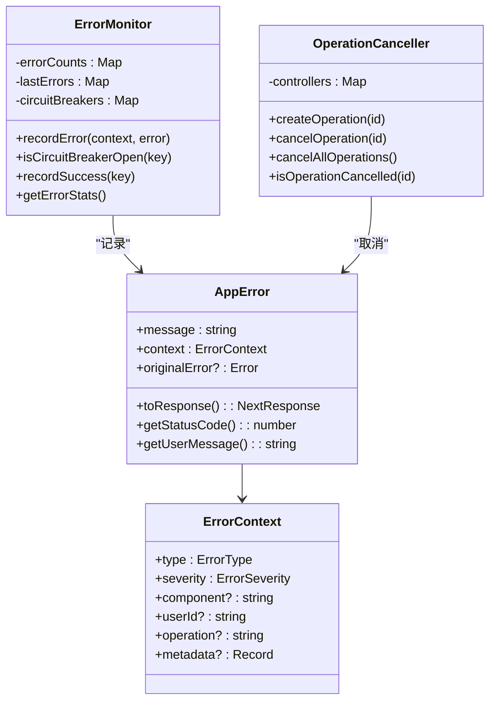
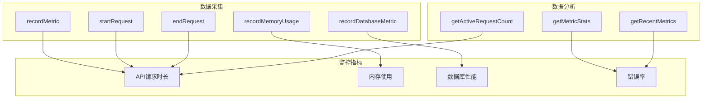

# 故障排查与调试

<cite>
**本文档引用的文件**
- [WRONG-ANSWERS-AI-TROUBLESHOOTING.md](file://documents/WRONG-ANSWERS-AI-TROUBLESHOOTING.md)
- [debug-kokoro-remote.py](file://scripts/debug-kokoro-remote.py)
- [enhanced-error-handler.ts](file://lib/enhanced-error-handler.ts)
- [metrics/route.ts](file://app/api/performance/metrics/route.ts)
- [kokoro-service-enhanced.ts](file://lib/kokoro-service-enhanced.ts)
- [tts-service.ts](file://lib/tts-service.ts)
- [i18n/performance.ts](file://lib/i18n/performance.ts)
- [bilingual-example.tsx](file://components/examples/bilingual-example.tsx)
</cite>

## 目录
1. [常见问题诊断](#常见问题诊断)
2. [TTS引擎故障排查](#tts引擎故障排查)
3. [AI接口超时处理](#ai接口超时处理)
4. [音频播放异常分析](#音频播放异常分析)
5. [双语文本显示错乱解决](#双语文本显示错乱解决)
6. [远程调试工具使用](#远程调试工具使用)
7. [错误处理机制](#错误处理机制)
8. [性能监控指标](#性能监控指标)
9. [日志分析技巧](#日志分析技巧)

## 常见问题诊断

### TTS引擎启动失败

#### 症状：TTS服务无法启动或初始化失败

**可能原因：**
- Python环境配置问题
- GPU驱动或CUDA未正确安装
- 模型文件缺失或损坏
- 系统资源不足（内存、显存）
- 依赖库版本冲突

**解决方案：**

1. **检查Python环境**
   ```bash
   # 验证Python版本
   python --version
   
   # 检查关键模块
   python -c "import torch, phonemizer, espeakng_loader"
   ```

2. **验证GPU支持**
   ```bash
   # 检查CUDA可用性
   python -c "import torch; print(torch.cuda.is_available())"
   
   # 查看GPU设备信息
   nvidia-smi
   ```

3. **检查模型文件**
   ```bash
   # 验证TTS模型目录
   ls -la kokoro-main-ref/models/
   
   # 检查espeak-ng数据路径
   python -c "from espeakng_loader import get_data_path; print(get_data_path())"
   ```

4. **查看系统资源**
   ```bash
   # 检查内存使用
   free -h
   
   # 检查磁盘空间
   df -h
   ```

**Section sources**
- [debug-kokoro-remote.py](file://scripts/debug-kokoro-remote.py)
- [kokoro-service-enhanced.ts](file://lib/kokoro-service-enhanced.ts#L83-L121)

### AI接口超时

#### 症状：AI分析请求超时或响应缓慢

**可能原因：**
- Cerebras API服务不可用
- 网络连接问题
- 代理配置错误
- 请求频率超过限制
- 输入文本过长

**解决方案：**

1. **验证API连接**
   ```bash
   # 测试API密钥有效性
   curl -H "Authorization: Bearer $CEREBRAS_API_KEY" \
        https://api.cerebras.ai/v1/models
   
   # 测试网络连通性
   curl -I https://api.cerebras.ai
   ```

2. **调整并发设置**
   ```typescript
   // 减少并发请求数
   const limit = pLimit(5); // 默认为10
   
   // 批量处理分块
   const chunkSize = 20;
   ```

3. **实现重试机制**
   ```typescript
   // 使用指数退避策略
   const retryDelay = Math.min(1000 * Math.pow(2, attempt), 10000);
   ```

**Section sources**
- [WRONG-ANSWERS-AI-TROUBLESHOOTING.md](file://documents/WRONG-ANSWERS-AI-TROUBLESHOOTING.md)
- [enhanced-error-handler.ts](file://lib/enhanced-error-handler.ts#L298-L337)

### 音频播放异常

#### 症状：音频无法播放或播放中断

**可能原因：**
- 音频文件生成失败
- 文件格式不兼容
- 网络传输问题
- 浏览器缓存问题

**解决方案：**

1. **检查音频文件**
   ```bash
   # 验证音频目录
   ls -la public/audio/
   
   # 检查文件权限
   chmod -R 755 public/audio/
   ```

2. **验证文件格式**
   ```typescript
   // 支持的格式包括WAV和MP3
   export function validateAudioFormat(buffer: Buffer) {
     const format = detectAudioFormat(buffer);
     return { isValid: ['wav', 'mp3'].includes(format), format };
   }
   ```

3. **清理旧文件**
   ```bash
   # 删除7天前的音频文件
   find public/ -name "*.wav" -mtime +7 -delete
   ```

**Section sources**
- [tts-service.ts](file://lib/tts-service.ts#L49-L66)
- [audio-utils.ts](file://lib/audio-utils.ts#L239-L264)

### 双语文本显示错乱

#### 症状：中英文文本显示顺序混乱或内容缺失

**可能原因：**
- 国际化配置错误
- 缓存失效
- 组件渲染问题
- 数据格式不匹配

**解决方案：**

1. **检查国际化配置**
   ```typescript
   // 验证翻译资源
   import translations from '@/lib/i18n/translations/components.json';
   
   // 检查双语组件使用
   <BilingualText translationKey="common:buttons.generate" />
   ```

2. **清除缓存**
   ```bash
   # 清除浏览器缓存
   # 开发者工具 -> Application -> Clear site data
   ```

3. **验证数据结构**
   ```json
   {
     "en": "Generate",
     "zh": "生成"
   }
   ```

**Section sources**
- [bilingual-example.tsx](file://components/examples/bilingual-example.tsx)
- [i18n/types.ts](file://lib/i18n/types.ts#L46-L106)

## TTS引擎故障排查

### 启动流程分析


**Diagram sources**
- [debug-kokoro-remote.py](file://scripts/debug-kokoro-remote.py)
- [kokoro-service-enhanced.ts](file://lib/kokoro-service-enhanced.ts#L83-L121)

### 错误恢复机制



**Diagram sources**
- [enhanced-tts-service.ts](file://lib/enhanced-tts-service.ts#L424-L467)
- [kokoro-service-gpu.ts](file://lib/kokoro-service-gpu.ts#L280-L318)

## AI接口超时处理

### 超时重试策略



**Diagram sources**
- [enhanced-error-handler.ts](file://lib/enhanced-error-handler.ts#L270-L393)
- [rate-limiter.ts](file://lib/rate-limiter.ts#L215-L276)

## 音频播放异常分析

### 音频生命周期



**Diagram sources**
- [tts-service.ts](file://lib/tts-service.ts#L68-L98)
- [optimized-audio-player.tsx](file://components/optimized-audio-player.tsx#L299-L325)

## 双语文本显示错乱解决

### 国际化性能监控



**Diagram sources**
- [i18n/performance.ts](file://lib/i18n/performance.ts#L17-L136)
- [enablePerformanceLogging](file://lib/i18n/performance.ts#L142-L149)

## 远程调试工具使用

### debug-kokoro-remote.py使用指南

该脚本用于排查misaki/espeak兼容性问题，提供全面的环境检查功能。

**主要功能：**
- Python版本检查
- 关键模块导入测试
- EspeakWrapper方法验证
- misaki.espeak特定配置测试
- Kokoro导入和实例化测试
- CUDA可用性检测

**使用方法：**
```bash
python scripts/debug-kokoro-remote.py
```

**输出示例：**
```
=== Kokoro TTS 远程调试 ===
Python版本: 3.10.12 (main, Nov 20 2023, 15:14:05) [GCC 11.4.0]
✓ torch - 导入成功
✓ phonemizer - 导入成功
✓ espeakng_loader - 导入成功
✓ misaki - 导入成功
✓ misaki.espeak - 导入成功
✓ EspeakWrapper可用方法: [set_library, set_data_path, __init__, ...]
✓ 有set_data_path方法: True
✓ espeakng库路径: /usr/lib/x86_64-linux-gnu/libespeak-ng.so.1
✓ espeakng数据路径: /usr/share/espeak-ng-data
✓ EspeakWrapper配置成功
=== 测试Kokoro导入 ===
✓ KPipeline导入成功
✓ KPipeline创建成功
=== 测试CUDA ===
✓ CUDA可用: True
✓ CUDA设备数量: 1
✓ 当前CUDA设备: 0
✓ 设备名称: NVIDIA GeForce RTX 3090
```

**Section sources**
- [debug-kokoro-remote.py](file://scripts/debug-kokoro-remote.py)

## 错误处理机制

### 增强型错误处理器



**Diagram sources**
- [enhanced-error-handler.ts](file://lib/enhanced-error-handler.ts#L270-L393)
- [ErrorMonitor](file://lib/enhanced-error-handler.ts#L147-L270)

### 错误类型分类

| 错误类型 | HTTP状态码 | 用户提示 | 严重程度 |
|---------|----------|--------|--------|
| VALIDATION | 400 | 输入数据有误，请检查后重试 | 低 |
| DATABASE | 500 | 数据访问失败，请稍后重试 | 高 |
| TTS_SERVICE | 503 | 语音服务暂时不可用，请稍后重试 | 高 |
| AI_SERVICE | 503 | AI服务暂时不可用，请稍后重试 | 高 |
| NETWORK | 500 | 网络连接异常，请检查网络后重试 | 中 |
| RATE_LIMIT | 429 | 操作过于频繁，请稍后重试 | 中 |
| RESOURCE | 500 | 系统资源不足，请稍后重试 | 高 |

**Section sources**
- [enhanced-error-handler.ts](file://lib/enhanced-error-handler.ts#L298-L337)

## 性能监控指标

### performance/metrics API

该API提供系统性能监控数据，可用于实时监控系统负载。

**端点：** `/api/performance/metrics`

**返回数据结构：**
```json
{
  "success": true,
  "detailed": {
    "performanceHistory": [
      {
        "latest": 95,
        "trend": "improving",
        "reliability": "high"
      }
    ],
    "resourceUtilization": {
      "cpu": 45.2,
      "memory": 67.8,
      "disk": 32.1
    },
    "errorRates": {
      "tts": 0.02,
      "ai": 0.05,
      "database": 0.01
    }
  }
}
```

**关键指标：**
- `api_request_duration`: API请求持续时间
- `memory_rss`: 内存常驻集大小
- `memory_heap_used`: 堆内存使用量
- `database_operation_duration`: 数据库操作持续时间



**Diagram sources**
- [metrics/route.ts](file://app/api/performance/metrics/route.ts#L75-L82)
- [monitoring.ts](file://lib/monitoring.ts#L270-L393)

## 日志分析技巧

### 关键日志模式

**TTS服务相关日志：**
- `🚀 Initializing Kokoro TTS service...` - 服务开始初始化
- `✅ Kokoro TTS service initialized successfully` - 服务初始化成功
- `🔥 TTS service process error:` - TTS进程错误
- `🔄 Restarting TTS service` - 服务重启尝试
- `❌ Max restart attempts reached` - 达到最大重启次数

**AI服务相关日志：**
- `Network connectivity issues with Cerebras API` - 网络连接问题
- `Rate limiting exceeded for AI service` - 超出速率限制
- `AI analysis generation failed` - AI分析生成失败

**数据库相关日志：**
- `SQLITE_BUSY database is locked` - 数据库锁定
- `Database migration applied successfully` - 数据库迁移成功
- `Slow query detected: SELECT * FROM ...` - 检测到慢查询

### 日志级别说明

| 日志级别 | 颜色标识 | 适用场景 |
|---------|--------|--------|
| 🚨 CRITICAL | 红色 | 系统崩溃、服务不可用 |
| 🔴 HIGH | 红色 | 严重错误、数据丢失风险 |
| 🟡 MEDIUM | 黄色 | 可恢复错误、警告 |
| 🔵 LOW | 蓝色 | 信息性消息、调试信息 |

**Section sources**
- [enhanced-error-handler.ts](file://lib/enhanced-error-handler.ts#L200-L260)
- [WRONG-ANSWERS-AI-TROUBLESHOOTING.md](file://documents/WRONG-ANSWERS-AI-TROUBLESHOOTING.md)