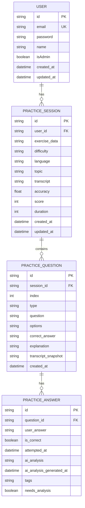

# 数据库设计

<cite>
**本文档中引用的文件**
- [schema.prisma](file://prisma/schema.prisma)
- [database.ts](file://lib/database.ts)
- [add_wrong_answer_ai_models/migration.sql](file://prisma/migrations/20250927052831_add_wrong_answer_ai_models/migration.sql)
- [add_wrong_answers_filtering_indexes/migration.sql](file://prisma/migrations/20250927060513_add_wrong_answers_filtering_indexes/migration.sql)
</cite>

## 目录
1. [简介](#简介)
2. [实体模型定义](#实体模型定义)
3. [关系映射与约束规则](#关系映射与约束规则)
4. [数据库迁移管理](#数据库迁移管理)
5. [索引设计与查询性能](#索引设计与查询性能)
6. [数据访问层实现](#数据访问层实现)
7. [ER图表示意](#er图表示意)

## 简介
本系统采用Prisma作为ORM工具，构建了基于用户认证的英语听力训练平台。数据库设计涵盖用户管理、练习会话、题目记录和答案分析四大核心模块，支持从SQLite到PostgreSQL的多数据库适配。通过精细化的索引策略和连接池优化，确保系统在高并发场景下的稳定性和响应速度。

## 实体模型定义

### 用户（User）
存储用户账户信息，包括邮箱、密码、姓名及管理员权限标识。创建时间和更新时间字段自动维护，用于统计分析和审计追踪。

### 练习会话（PracticeSession）
记录用户的单次练习完整数据，包含难度等级（CEFR标准）、语言类型、主题、听力文本、准确率、得分和持续时长等元数据。exerciseData字段保留JSON格式的遗留数据兼容性。

### 练习题目（PracticeQuestion）
描述具体题目的内容，包括在会话中的序号、题型（如选择题、填空题）、问题文本、选项（JSON格式）、正确答案和解析。transcriptSnapshot字段保存相关听力片段快照。

### 练习答案（PracticeAnswer）
存储用户对每道题的作答结果，包括用户答案、是否正确、尝试时间、AI分析结果（JSON格式）、AI分析生成时间、标签（JSON数组）以及是否需要进一步分析的标记。

**Section sources**
- [schema.prisma](file://prisma/schema.prisma#L20-L119)

## 关系映射与约束规则

### 外键关系
- **User → PracticeSession**: 一对多关系，用户可拥有多个练习会话，删除用户时级联删除其所有会话。
- **PracticeSession → PracticeQuestion**: 一对多关系，一个会话包含多个题目，删除会话时级联删除其所有题目。
- **PracticeQuestion → PracticeAnswer**: 一对多关系，一道题目对应多个答案记录（历史尝试），删除题目时级联删除其所有答案。

### 唯一性约束
- **User.email**: 邮箱地址全局唯一，防止重复注册。
- **PracticeSession.userId + createdAt**: 联合索引确保按用户和时间高效查询练习历史。

### 默认值与数据类型
- 所有ID字段使用cuid()生成唯一字符串。
- password字段存储bcrypt加密后的哈希值。
- tags和options字段以JSON字符串形式存储数组或对象。
- isAdmin默认为false，新用户无管理员权限。

**Section sources**
- [schema.prisma](file://prisma/schema.prisma#L20-L119)

## 数据库迁移管理

### 迁移文件结构
迁移由Prisma自动生成的SQL脚本组成，位于`prisma/migrations`目录下。每个迁移目录包含一个`migration.sql`文件，定义了表结构变更、索引创建和外键约束。

#### 初始架构迁移
`20250927052831_add_wrong_answer_ai_models/migration.sql` 创建了四个核心表：
- `users`: 用户表，带邮箱唯一索引
- `practice_sessions`: 练习会话表，关联用户外键
- `practice_questions`: 练习题目表，关联会话外键
- `practice_answers`: 练习答案表，关联题目外键

#### 索引优化迁移
`20250927060513_add_wrong_answers_filtering_indexes/migration.sql` 添加了关键查询优化索引：
- `wrong_answers_list_idx`: 错题列表排序
- `question_type_filter_idx`: 题型过滤
- `question_content_search_idx`: 题目内容搜索
- `user_difficulty_filter_idx`: 用户难度筛选
- `user_language_filter_idx`: 用户语言筛选
- `topic_search_idx`: 主题搜索

### SQLite到PostgreSQL迁移策略
系统提供了完整的数据库迁移解决方案：
1. **环境切换脚本** (`switch-database.sh`)：自动修改`.env.local`中的DATABASE_URL和Prisma Schema的provider。
2. **数据迁移脚本** (`migrate-to-postgres.ts`)：从SQLite读取旧系统数据，基于邀请码创建用户账号，并转换练习记录至新架构。
3. **回滚机制**：可通过切换脚本快速恢复至SQLite配置，保障迁移过程的安全性。

**Section sources**
- [add_wrong_answer_ai_models/migration.sql](file://prisma/migrations/20250927052831_add_wrong_answer_ai_models/migration.sql#L1-L102)
- [add_wrong_answers_filtering_indexes/migration.sql](file://prisma/migrations/20250927060513_add_wrong_answers_filtering_indexes/migration.sql#L1-L18)
- [MIGRATION-GUIDE.md](file://scripts/MIGRATION-GUIDE.md#L1-L229)
- [MIGRATION_COMPLETED.md](file://documents/MIGRATION_COMPLETED.md#L1-L112)

## 索引设计与查询性能

### 核心索引分析
系统针对高频查询模式设计了多层次索引：

| 表名 | 索引名称 | 字段 | 用途 |
|------|---------|------|------|
| users | users_isAdmin_idx | isAdmin | 管理员快速查询 |
| practice_sessions | user_difficulty_filter_idx | userId, difficulty | 用户特定难度练习筛选 |
| practice_sessions | topic_search_idx | topic | 主题关键词搜索 |
| practice_questions | question_type_filter_idx | type | 按题型分类过滤 |
| practice_answers | wrong_answers_list_idx | isCorrect, attemptedAt(desc) | 错题列表按时间倒序 |

### 错题过滤索引性能影响
`wrong_answers_list_idx` 是关键性能优化点：
- **查询场景**：用户查看"我的错题本"功能，需获取所有错误答案并按最近尝试时间排序。
- **性能提升**：该复合索引避免了全表扫描和额外排序操作，将O(n log n)的排序复杂度降至O(log n)的索引查找。
- **实际效果**：在万级数据量下，查询响应时间从秒级降至毫秒级，显著提升用户体验。

### 其他性能优化措施
- **WAL模式**：SQLite环境下启用Write-Ahead Logging，提高并发写入性能。
- **连接预热**：应用启动时预先建立数据库连接，减少首次请求延迟。
- **批量操作**：通过BatchOperations类实现批量插入/更新，减少网络往返开销。

**Section sources**
- [schema.prisma](file://prisma/schema.prisma#L20-L119)
- [add_wrong_answers_filtering_indexes/migration.sql](file://prisma/migrations/20250927060513_add_wrong_answers_filtering_indexes/migration.sql#L1-L18)
- [database.ts](file://lib/database.ts#L194-L247)

## 数据访问层实现

### 连接池管理
`database.ts`实现了Prisma客户端的单例模式和连接池管理：
- **全局单例**：通过`globalForPrisma.__eltPrisma`确保整个应用生命周期内仅存在一个PrismaClient实例。
- **连接预热**：应用启动时调用`$connect()`提前建立连接，并设置WAL模式和超时参数。
- **优雅关闭**：监听`SIGINT`和`SIGTERM`信号，在进程退出前断开数据库连接。

### 事务处理与错误重试
`withDatabase`函数封装了统一的数据库操作接口：
- **自动重试**：对网络连接异常、数据库锁定等可重试错误进行最多3次重试，间隔1秒。
- **错误分类**：将Prisma原生错误转换为用户友好的中文提示，如"数据库忙碌，请稍后重试"。
- **事务支持**：传入的operation函数可执行多步数据库操作，利用Prisma的内置事务保证原子性。

### 辅助工具类
- **BatchOperations**: 提供批量操作能力，自动分批执行大量数据库操作，防止内存溢出。
- **QueryBuilder**: 预定义常用查询构造器，如分页获取用户练习记录、统计活跃用户等。
- **cleanupDatabase**: 定期清理过期数据（默认30天前的练习记录），控制数据库增长。

**Section sources**
- [database.ts](file://lib/database.ts#L0-L330)

## ER图表示意

**Diagram sources**
- [schema.prisma](file://prisma/schema.prisma#L20-L119)