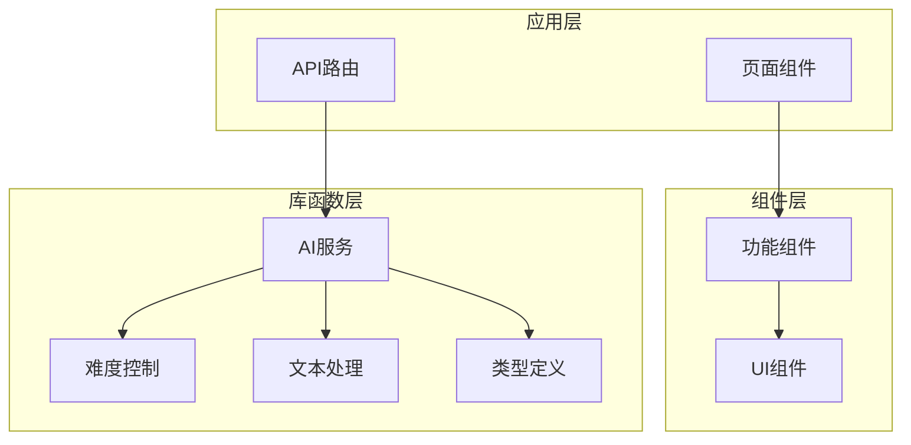
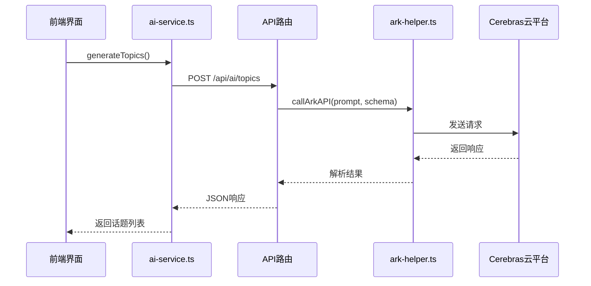
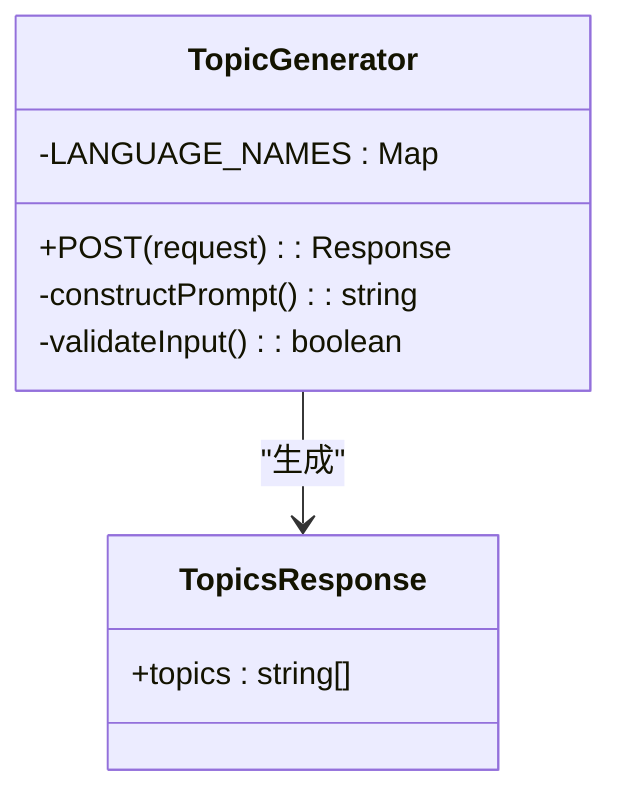
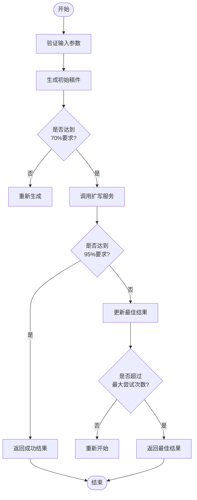
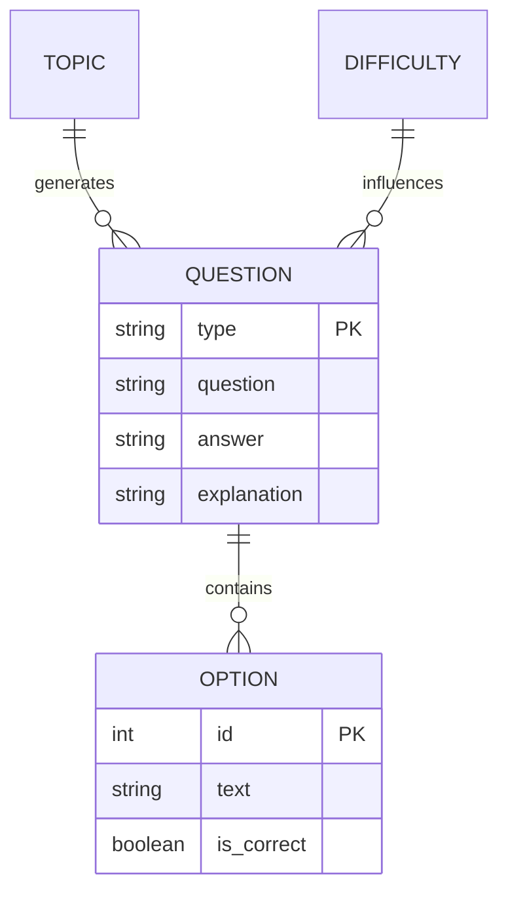
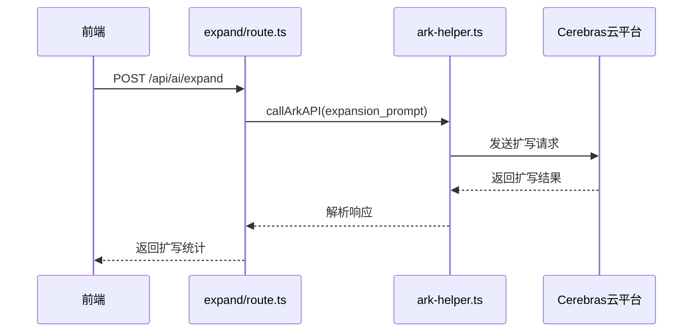
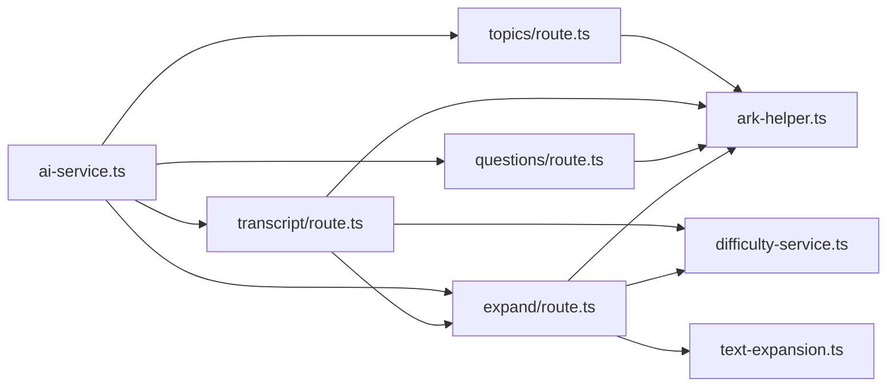

# AI内容生成

<cite>
**本文档引用的文件**
- [ai-service.ts](file://lib/ai-service.ts)
- [topics/route.ts](file://app/api/ai/topics/route.ts)
- [transcript/route.ts](file://app/api/ai/transcript/route.ts)
- [questions/route.ts](file://app/api/ai/questions/route.ts)
- [expand/route.ts](file://app/api/ai/expand/route.ts)
- [ark-helper.ts](file://lib/ark-helper.ts)
- [text-expansion.ts](file://lib/text-expansion.ts)
- [difficulty-service.ts](file://lib/difficulty-service.ts)
- [types.ts](file://lib/types.ts)
- [main-app.tsx](file://components/main-app.tsx)
</cite>

## 目录
1. [简介](#简介)
2. [项目结构](#项目结构)
3. [核心组件](#核心组件)
4. [架构概述](#架构概述)
5. [详细组件分析](#详细组件分析)
6. [依赖分析](#依赖分析)
7. [性能考虑](#性能考虑)
8. [故障排除指南](#故障排除指南)
9. [结论](#结论)

## 简介
本系统是一个基于AI的英语听力训练平台，通过调用Cerebras云平台实现智能化内容生成。系统采用模块化设计，将话题生成、听力稿创作、问题设计和文本扩写等功能解耦为独立API路由，确保各功能单元的高内聚与低耦合。前端通过`ai-service.ts`封装统一的客户端接口，利用Next.js API路由作为中间层避免密钥暴露风险。整个系统实现了从主题选择到练习评估的完整闭环，支持多语言、多难度级别的个性化学习体验。

## 项目结构
系统采用分层架构设计，主要分为应用层（app）、组件层（components）、库函数层（lib）和钩子层（hooks）。AI相关功能集中于`app/api/ai`目录下，每个功能模块拥有独立的路由处理文件。核心业务逻辑分散在`lib`目录中，包括AI服务封装、难度控制、文本处理等关键模块。这种组织方式既保证了代码的可维护性，又便于功能扩展和团队协作开发。

**图示来源**
- [app/api/ai](file://app/api/ai)
- [components](file://components)
- [lib](file://lib)

**章节来源**
- [project_structure](file://project_structure)

## 核心组件
系统的核心组件包括四个主要的AI生成模块：话题生成、听力稿生成、问题生成和文本扩写。这些组件通过标准化的JSON Schema进行数据交换，确保接口的一致性和可靠性。每个组件都实现了完善的错误处理机制和重试策略，能够应对网络波动和API调用失败等异常情况。此外，系统还集成了上下文长度管理和结果缓存策略，有效提升了用户体验和系统性能。

**章节来源**
- [ai-service.ts](file://lib/ai-service.ts#L1-L113)
- [types.ts](file://lib/types.ts#L0-L215)

## 架构概述
系统采用前后端分离架构，前端通过`ai-service.ts`提供的高级API与后端交互，所有敏感操作均在服务器端完成。当用户发起请求时，前端首先验证输入参数的有效性，然后通过fetch API调用对应的Next.js路由。后端路由接收到请求后，根据预设的提示工程模板构造AI调用参数，并通过`ark-helper.ts`中的`callArkAPI`函数与Cerebras云平台通信。整个过程采用流式传输设计，能够在保持连接的同时逐步返回生成结果。

**图示来源**
- [ai-service.ts](file://lib/ai-service.ts#L1-L113)
- [topics/route.ts](file://app/api/ai/topics/route.ts#L1-L76)

## 详细组件分析

### 话题生成分析
该模块负责为用户提供符合指定难度和语言要求的话题建议。它接收难度级别、目标词数和语言类型作为输入参数，通过精心设计的提示词引导AI生成五个合适的练习主题。系统会自动映射语言名称并构造专业化的提示工程模板，确保输出内容的质量和一致性。

#### 对象导向组件：

**图示来源**
- [topics/route.ts](file://app/api/ai/topics/route.ts#L5-L76)
- [types.ts](file://lib/types.ts#L67-L67)

**章节来源**
- [topics/route.ts](file://app/api/ai/topics/route.ts#L1-L76)

### 听力稿生成分析
这是系统中最复杂的模块之一，采用了两阶段生成策略。第一阶段生成初始稿件，第二阶段调用扩写服务进行优化。系统设置了严格的质量控制标准，要求最终稿件至少达到目标词数的95%。如果多次尝试仍无法满足要求，则返回最佳可用结果，并附带详细的警告信息。

#### 服务组件：

**图示来源**
- [transcript/route.ts](file://app/api/ai/transcript/route.ts#L6-L188)
- [expand/route.ts](file://app/api/ai/expand/route.ts#L1-L113)

**章节来源**
- [transcript/route.ts](file://app/api/ai/transcript/route.ts#L1-L188)

### 问题生成分析
该模块基于已生成的听力稿创建配套的理解题。系统会根据音频时长智能计算建议题目数量，并按照特定分布规则生成不同类型的问题。前九道为单选题，最后一道为简答题，涵盖主旨大意、细节理解、推理判断等多个考察维度。每道题都配有准确的标签和简明的解释。

#### 复杂逻辑组件：

**图示来源**
- [questions/route.ts](file://app/api/ai/questions/route.ts#L14-L127)
- [types.ts](file://lib/types.ts#L68-L68)

**章节来源**
- [questions/route.ts](file://app/api/ai/questions/route.ts#L1-L127)

### 文本扩写分析
该模块专门用于提升听力稿的长度和丰富度。它采用迭代式扩写策略，在每次尝试中动态调整提示词，引导AI添加相关内容而不改变原意。系统内置了防无限循环机制，当扩写长度超过目标值的150%时会自动终止，避免资源浪费。同时记录详细的扩写统计信息，便于后续分析和优化。

#### 服务组件：

**图示来源**
- [expand/route.ts](file://app/api/ai/expand/route.ts#L1-L113)
- [text-expansion.ts](file://lib/text-expansion.ts#L62-L108)

**章节来源**
- [expand/route.ts](file://app/api/ai/expand/route.ts#L1-L113)

## 依赖分析
系统内部各组件之间存在明确的依赖关系。`ai-service.ts`作为客户端入口，依赖所有API路由；而各个路由文件又共同依赖`ark-helper.ts`提供的基础AI调用能力。`difficulty-service.ts`被多个生成模块引用，用于提供精确的难度描述。`text-expansion.ts`则专门服务于听力稿和文本扩写两个模块，形成垂直领域的功能复用。

**图示来源**
- [ai-service.ts](file://lib/ai-service.ts#L1-L113)
- [ark-helper.ts](file://lib/ark-helper.ts#L113-L200)

**章节来源**
- [ai-service.ts](file://lib/ai-service.ts#L1-L113)
- [ark-helper.ts](file://lib/ark-helper.ts#L1-L200)

## 性能考虑
系统在性能方面采取了多项优化措施。首先，通过`performance-middleware.ts`实现了API响应缓存，显著减少了重复请求的处理开销。其次，使用`requestDebouncer`防止短时间内重复提交相同请求。对于耗时较长的AI生成任务，系统提供了加载状态指示和进度反馈，改善用户体验。此外，内存管理模块定期清理过期缓存，防止内存泄漏。

**章节来源**
- [performance-middleware.ts](file://lib/performance-middleware.ts#L32-L77)
- [performance-optimizer.ts](file://lib/performance-optimizer.ts#L55-L76)

## 故障排除指南
常见问题主要包括超时错误、token限制和格式异常。对于超时问题，建议检查网络连接或调整重试策略；遇到token限制时，需要优化提示词长度或拆分长文本；若出现格式异常，应验证JSON Schema定义是否正确。调试时可启用详细日志记录，重点关注`callArkAPI`的调用过程和响应解析环节。生产环境中建议设置适当的监控告警，及时发现和解决潜在问题。

**章节来源**
- [enhanced-error-handler.ts](file://lib/enhanced-error-handler.ts)
- [error-handler.ts](file://lib/error-handler.ts)

## 结论
本系统成功构建了一个高效、可靠的AI内容生成子系统，通过合理的架构设计和严谨的工程实践，实现了高质量的听力练习材料自动化生产。各模块协同工作流畅，具备良好的扩展性和维护性。未来可进一步优化提示工程策略，引入更多评估指标来提升生成内容的质量稳定性。