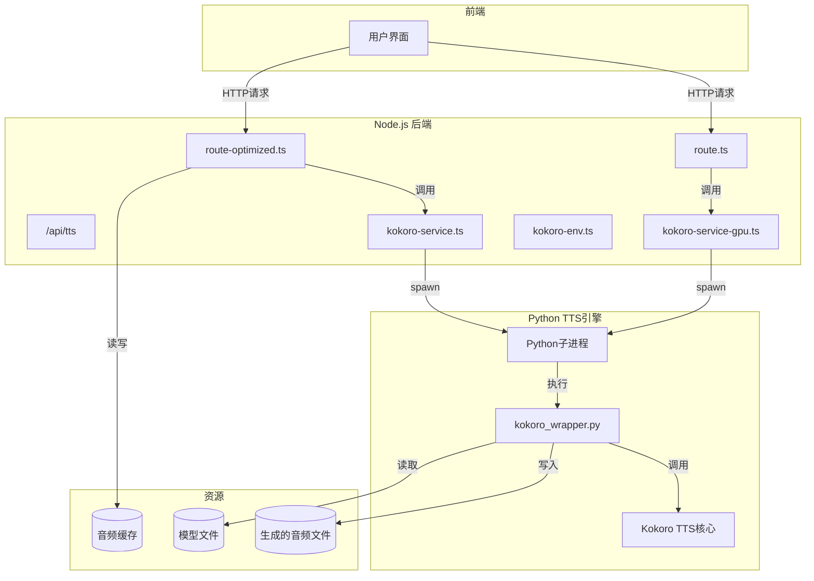
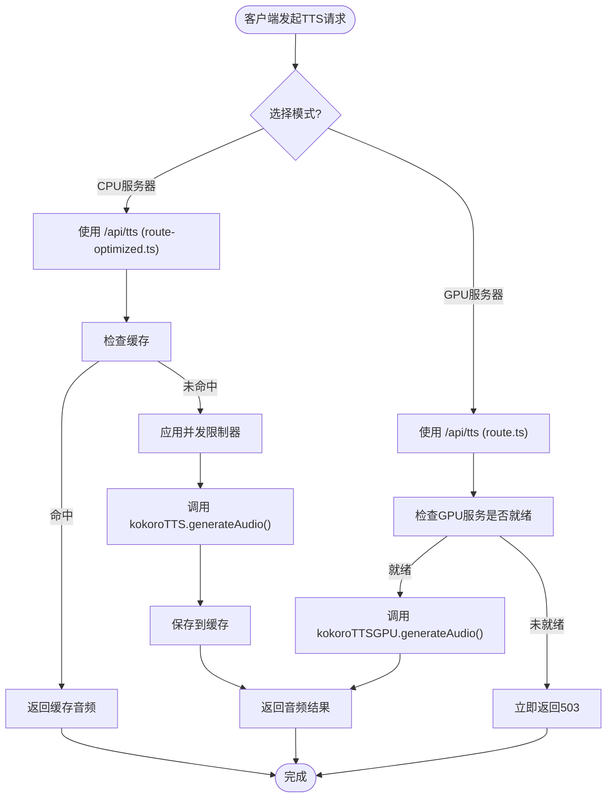

# TTS语音合成

<cite>
**本文档引用的文件**
- [route.ts](file://app/api/tts/route.ts)
- [route-optimized.ts](file://app/api/tts/route-optimized.ts)
- [kokoro_wrapper.py](file://kokoro_local/kokoro_wrapper.py)
- [kokoro-service.ts](file://lib/kokoro-service.ts)
- [kokoro-service-gpu.ts](file://lib/kokoro-service-gpu.ts)
- [kokoro-env.ts](file://lib/kokoro-env.ts)
- [audio-utils.ts](file://lib/audio-utils.ts)
- [device-detection.ts](file://lib/device-detection.ts)
- [language-config.ts](file://lib/language-config.ts)
- [performance-optimizer.ts](file://lib/performance-optimizer.ts)
- [performance-middleware.ts](file://lib/performance-middleware.ts)
- [DEPLOYMENT-GPU.md](file://documents/DEPLOYMENT-GPU.md)
- [KOKORO_SETUP_GUIDE.md](file://documents/KOKORO_SETUP_GUIDE.md)
</cite>

## 目录
1. [引言](#引言)
2. [API路径设计差异与适用场景](#api路径设计差异与适用场景)
3. [Node.js后端与Python引擎的进程间通信](#nodejs后端与python引擎的进程间通信)
4. [kokoro-service中的容错与并发控制机制](#kokoro-service中的容错与并发控制机制)
5. [GPU环境部署与性能监控](#gpu环境部署与性能监控)
6. [结论](#结论)

## 引言
本项目实现了一个基于Kokoro TTS引擎的语音合成系统，通过Node.js后端调用本地Python脚本，为用户提供高质量的文本转语音服务。系统设计了两种API路径以适应不同的硬件环境，并集成了复杂的容错、缓存和性能优化机制。

**TTS语音合成模块的核心架构如下：**

**Diagram sources**
- [route.ts](file://app/api/tts/route.ts)
- [route-optimized.ts](file://app/api/tts/route-optimized.ts)
- [kokoro-service.ts](file://lib/kokoro-service.ts)
- [kokoro-service-gpu.ts](file://lib/kokoro-service-gpu.ts)
- [kokoro_wrapper.py](file://kokoro_local/kokoro_wrapper.py)

## API路径设计差异与适用场景
系统提供了`route.ts`和`route-optimized.ts`两个API入口，分别针对GPU和CPU模式进行了优化。

### CPU模式 (route-optimized.ts)
`route-optimized.ts`是为CPU服务器设计的优化路径，其主要特点包括：

*   **请求缓存**: 使用MD5哈希对文本和语速参数生成缓存键，将已生成的音频结果存储在内存中（默认30分钟TTL），显著减少重复请求的处理时间。
*   **并发限制**: 通过`concurrencyLimiter`确保同一时间只有一个TTS请求在处理，防止CPU过载。
*   **性能中间件**: 集成`createTTSApiHandler`，提供防抖、错误处理和性能监控功能。
*   **健康检查**: 提供GET端点，返回服务状态和缓存统计信息。

该路径适用于没有GPU加速的普通服务器，通过缓存和并发控制来保证服务的稳定性和响应速度。

### GPU模式 (route.ts)
`route.ts`是为GPU服务器设计的高性能路径，其主要特点包括：

*   **无缓存**: 不使用应用层缓存，每次请求都直接调用GPU进行实时生成，确保能处理最长文本并利用GPU的全部算力。
*   **专用服务实例**: 调用`kokoroTTSGPU`服务，该服务配置了更长的初始化超时（3分钟）以适应GPU驱动加载。
*   **设备感知**: 通过`detectKokoroDevicePreference`自动检测NVIDIA GPU并优先使用CUDA加速。
*   **快速失败**: 当GPU服务未就绪时，立即返回503状态码，避免长时间等待。

该路径适用于配备NVIDIA GPU的高性能服务器，旨在最大化音频生成速度和吞吐量。

**两种API路径的设计对比:**

**Diagram sources**
- [route.ts](file://app/api/tts/route.ts)
- [route-optimized.ts](file://app/api/tts/route-optimized.ts)
- [kokoro-service.ts](file://lib/kokoro-service.ts)
- [kokoro-service-gpu.ts](file://lib/kokoro-service-gpu.ts)

**Section sources**
- [route.ts](file://app/api/tts/route.ts)
- [route-optimized.ts](file://app/api/tts/route-optimized.ts)

## Node.js后端与Python引擎的进程间通信
Node.js后端通过创建子进程的方式与Python编写的`kokoro_wrapper.py`脚本进行通信，整个流程高效且健壮。

### 进程启动与环境配置
当`kokoroTTS`或`kokoroTTSGPU`服务实例化时，会调用`startPythonProcess()`方法：
1.  **解析路径**: 确定`kokoro_wrapper.py`脚本的绝对路径。
2.  **构建环境**: `buildKokoroPythonEnv`函数根据`KOKORO_DEVICE`等环境变量，构建一个包含`PYTHONPATH`、`PATH`和库路径的完整环境对象，确保Python进程能找到所有依赖。
3.  **启动子进程**: 使用`child_process.spawn`创建Python子进程，标准输入(stdin)、输出(stdout)和错误(stderr)均被重定向，以便Node.js主进程可以读写。

### 双向通信机制
*   **发送请求 (Node.js -> Python)**:
    *   Node.js将包含`text`, `speed`, `lang_code`, `voice`等字段的JSON对象序列化。
    *   在JSON字符串末尾添加换行符`\n`作为分隔符。
    *   通过`process.stdin.write()`将数据写入Python进程的标准输入流。
*   **接收响应 (Python -> Node.js)**:
    *   Python脚本处理完请求后，将包含`success`, `audio_data`(十六进制字符串), `device`等信息的JSON响应打印到标准输出。
    *   Node.js监听`stdout`事件，收集输出数据。
    *   由于JSON可能因网络传输而分块到达，代码实现了缓冲区(`jsonBuffer`)机制，尝试拼接完整的JSON字符串。
    *   解析成功后，调用`handleResponse()`处理响应，完成Promise。

### 音频流返回方式
音频数据并非以二进制流的形式直接返回，而是采用以下方式：
1.  **编码**: Python端将生成的WAV音频数据转换为十六进制字符串。
2.  **传输**: 将十六进制字符串嵌入JSON响应体中，通过标准输出发送给Node.js。
3.  **解码与保存**: Node.js收到响应后，使用`Buffer.from(response.audio_data, 'hex')`将其还原为二进制缓冲区，并写入`public/`目录下的临时文件。
4.  **返回URL**: 最终API返回的是音频文件的相对URL（如`/tts_audio_1712345678.wav`），由Next.js静态文件服务提供下载。

### 元数据计算
元数据（如时长、字节大小）的计算在Node.js端完成：
*   **字节长度**: 直接获取`fs.writeFileSync`后文件的`audioBuffer.length`。
*   **时长估算**: 调用`getWavAudioMetadata(audioBuffer)`函数。该函数解析WAV文件头，提取采样率、声道数和位深度，然后根据音频数据的总字节数精确计算出播放时长，避免了在前端播放前无法预知时长的问题。

**Section sources**
- [kokoro-service.ts](file://lib/kokoro-service.ts)
- [kokoro-service-gpu.ts](file://lib/kokoro-service-gpu.ts)
- [kokoro_wrapper.py](file://kokoro_local/kokoro_wrapper.py)
- [audio-utils.ts](file://lib/audio-utils.ts)
- [kokoro-env.ts](file://lib/kokoro-env.ts)

## kokoro-service中的容错与并发控制机制
`kokoro-service.ts`和`kokoro-service-gpu.ts`是TTS服务的核心，它们实现了高级的容错和并发控制机制。

### 电路断路器模式
为了防止级联故障，服务内置了电路断路器(Circuit Breaker)：
*   **状态机**: 包含`CLOSED`(闭合)、`OPEN`(打开)和`HALF_OPEN`(半开)三种状态。
*   **熔断逻辑**: 当连续失败次数达到阈值（默认5次）时，状态从`CLOSED`变为`OPEN`，此时所有新请求都会被快速拒绝，避免持续消耗资源。
*   **恢复试探**: 在`OPEN`状态经过一定超时（默认60秒）后，状态变为`HALF_OPEN`。在此状态下允许少量请求通过，如果成功次数达到阈值（默认3次），则认为服务已恢复，回到`CLOSED`状态；否则再次进入`OPEN`状态。
*   **指数退避**: 重启尝试的延迟时间随失败次数指数增长，避免对故障服务造成过大压力。

### 并发控制
*   **单例模式**: `kokoroTTS`和`kokoroTTSGPU`都是全局单例，确保整个应用只有一个与Python引擎的连接。
*   **请求队列**: 所有生成音频的请求都被放入一个`pendingRequests`映射中，每个请求都有唯一的ID。
*   **串行处理**: 由于底层TTS引擎可能不支持高并发，服务通过管理请求队列，确保在同一时刻只处理一个请求，避免竞争条件。

### 异常捕获与降级策略
*   **全面异常捕获**: 从API路由到服务内部，每一层都使用`try-catch`捕获异步错误。
*   **精细化错误处理**: 在`route.ts`中，根据错误信息的关键词（如`timeout`, `cuda`, `not ready`）进行归类，并返回更具指导性的用户提示和相应的HTTP状态码。
*   **降级策略**: 当GPU服务不可用时，系统不会自动切换到CPU模式，但清晰的错误信息（如“GPU加速服务异常”）引导管理员进行排查或手动降级部署。

### 日志追踪方案
*   **结构化日志**: 大量使用`console.log`和`console.error`输出关键信息，如服务启动、请求处理、错误详情等。
*   **上下文关联**: 日志中包含时间戳、操作类型（如`🎵 开始生成TTS音频`）、以及相关参数（如文本长度），便于追踪问题。
*   **状态报告**: `getServiceStatus()`方法提供了服务当前的状态、失败次数、重启尝试次数等信息，可用于健康检查和监控。

**Section sources**
- [kokoro-service.ts](file://lib/kokoro-service.ts)
- [kokoro-service-gpu.ts](file://lib/kokoro-service-gpu.ts)
- [route.ts](file://app/api/tts/route.ts)
- [route-optimized.ts](file://app/api/tts/route-optimized.ts)

## GPU环境部署与性能监控
部署GPU支持的环境需要特定的配置和工具链。

### 部署配置要点
根据`DEPLOYMENT-GPU.md`文档，关键配置包括：
*   **基础镜像**: Dockerfile基于`nvidia/cuda:12.1.1-cudnn-runtime-