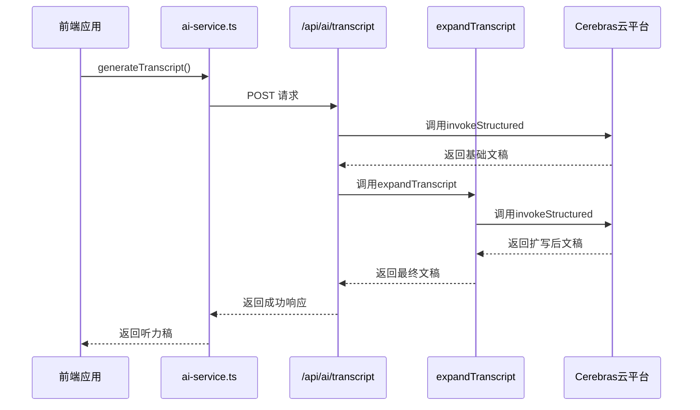
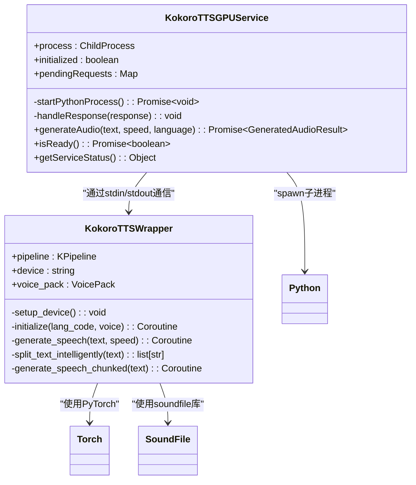
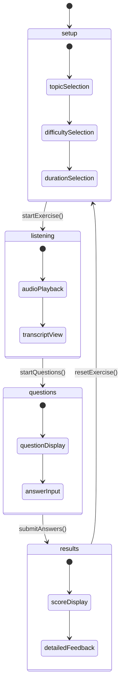
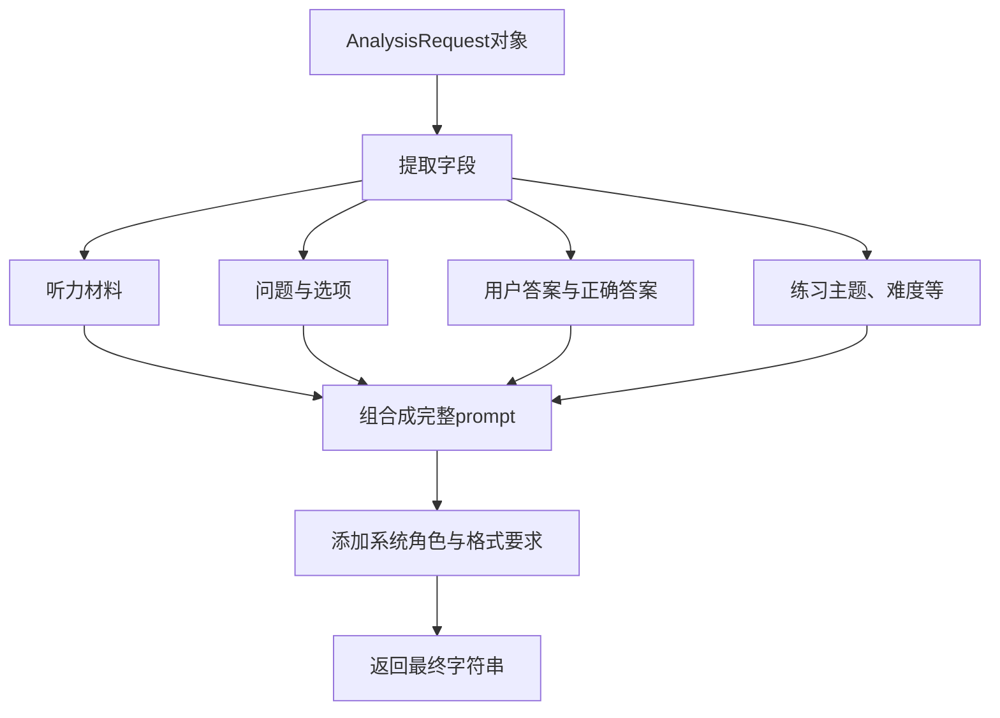
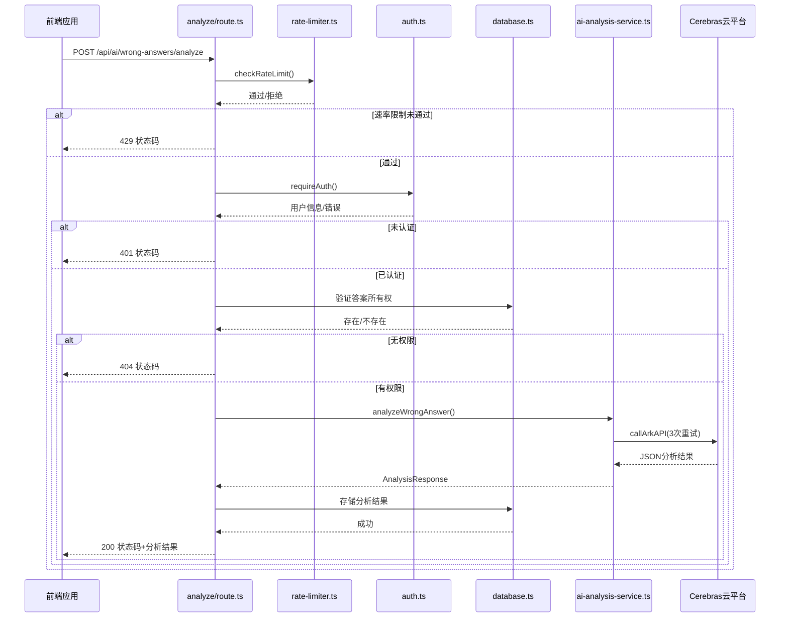

# 核心功能模块

<cite>
**本文档引用的文件**
- [ai-service.ts](file://lib/ai-service.ts)
- [kokoro-service-gpu.ts](file://lib/kokoro-service-gpu.ts)
- [enhanced-tts-service.ts](file://lib/enhanced-tts-service.ts)
- [use-exercise-workflow.ts](file://hooks/use-exercise-workflow.ts)
- [ai-analysis-service.ts](file://lib/ai-analysis-service.ts)
- [transcript/route.ts](file://app/api/ai/transcript/route.ts)
- [tts/route-optimized.ts](file://app/api/tts/route-optimized.ts)
- [analyze/route.ts](file://app/api/ai/wrong-answers/analyze/route.ts)
- [kokoro_wrapper.py](file://kokoro_local/kokoro_wrapper.py)
- [ark-helper.ts](file://lib/ark-helper.ts)
- [rate-limiter.ts](file://lib/rate-limiter.ts)
- [text-expansion.ts](file://lib/text-expansion.ts)
- [audio-utils.ts](file://lib/audio-utils.ts)
- [cerebras-client-manager.ts](file://lib/ai/cerebras-client-manager.ts) - *新增的AI客户端管理核心*
- [cerebras-service.ts](file://lib/ai/cerebras-service.ts) - *重构的AI服务调用层*
- [retry-strategy.ts](file://lib/ai/retry-strategy.ts) - *新增的重试策略实现*
- [request-preprocessor.ts](file://lib/ai/request-preprocessor.ts) - *新增的请求预处理逻辑*
- [prompt-templates.ts](file://lib/ai/prompt-templates.ts) - *重构的提示词模板*
- [schemas.ts](file://lib/ai/schemas.ts) - *重构的结构化响应模式*
- [transcript-expansion.ts](file://lib/ai/transcript-expansion.ts) - *重构的文本扩写逻辑*
- [route-utils.ts](file://lib/ai/route-utils.ts) - *重构的API路由工具*
</cite>

## 更新摘要
- **TTS服务架构更新**：已移除CPU版本的TTS服务，全面迁移至GPU专用服务
- **API路由优化**：`tts/route.ts`已更新为`route-optimized.ts`，采用GPU加速路径
- **服务可靠性增强**：GPU TTS服务集成电路断路器模式，提升容错能力
- **性能优化**：通过`route-optimized.ts`实现缓存机制和并发限制，提高响应效率

## 目录
1. [AI内容生成服务](#ai内容生成服务)
2. [TTS语音合成模块](#tts语音合成模块)
3. [听力练习界面状态流转](#听力练习界面状态流转)
4. [错题AI分析系统](#错题ai分析系统)
5. [性能优化与异常处理](#性能优化与异常处理)
6. [使用场景与最佳实践](#使用场景与最佳实践)

## AI内容生成服务

本系统通过调用Cerebras云平台实现高质量的AI内容生成，包括听力稿、问题和文本扩写等功能。核心逻辑已重构为分层架构，新增了`cerebras-client-manager.ts`和`cerebras-service.ts`作为新的核心组件。

AI内容生成服务采用统一的结构化调用管道，从前端`ai-service.ts`中的函数发起请求，这些请求被路由到`app/api/ai/`目录下的相应API端点。生成听力稿的流程始于`generateTranscript`函数，它向`/api/ai/transcript`发送POST请求。

在服务器端，`transcript/route.ts`是生成听力稿的核心实现。该文件利用`invokeStructured`函数与Cerebras大模型进行通信。生成过程包含两个关键阶段：首先生成基础文稿，然后通过`expandTranscript`函数进行智能扩写以确保达到目标字数要求。此过程实现了动态重试机制，最多尝试3次完整生成循环，并在每次循环中先生成初始文稿，再调用扩写服务。

**图示来源**
- [ai-service.ts](file://lib/ai-service.ts)
- [transcript/route.ts](file://app/api/ai/transcript/route.ts)
- [cerebras-service.ts](file://lib/ai/cerebras-service.ts)

**本节来源**
- [ai-service.ts](file://lib/ai-service.ts#L0-L113)
- [transcript/route.ts](file://app/api/ai/transcript/route.ts#L0-L150)
- [cerebras-service.ts](file://lib/ai/cerebras-service.ts#L0-L65)
- [cerebras-client-manager.ts](file://lib/ai/cerebras-client-manager.ts#L0-L196)
- [transcript-expansion.ts](file://lib/ai/transcript-expansion.ts#L0-L131)
- [request-preprocessor.ts](file://lib/ai/request-preprocessor.ts#L0-L52)
- [prompt-templates.ts](file://lib/ai/prompt-templates.ts#L0-L225)
- [schemas.ts](file://lib/ai/schemas.ts#L0-L263)

## TTS语音合成模块

TTS语音合成模块现已全面迁移至GPU专用服务，通过Python脚本与Kokoro引擎通信，实现从文本到音频流的高效转换。系统采用`KokoroTTSGPUService`作为核心服务，专为GPU服务器优化，支持CUDA加速和真实Kokoro模型。

核心通信机制位于`kokoro-service-gpu.ts`和`kokoro_wrapper.py`之间。Node.js服务通过`spawn`创建子进程启动Python脚本，并建立标准输入输出管道进行双向通信。当收到音频生成请求时，Node.js服务将JSON格式的请求写入Python进程的标准输入，Python脚本处理完成后将包含十六进制编码音频数据的JSON响应写回标准输出。

Python端的`kokoro_wrapper.py`实现了完整的TTS工作流。它首先初始化Kokoro管道，根据环境变量自动选择计算设备（CUDA、Metal或CPU）。对于长文本，脚本会智能分割为不超过100字符的块，并支持并行处理以提高效率。生成的音频数据经过WAV格式封装后，以十六进制字符串形式返回给Node.js服务。

**图示来源**
- [kokoro-service-gpu.ts](file://lib/kokoro-service-gpu.ts)
- [kokoro_wrapper.py](file://kokoro_local/kokoro_wrapper.py)

**本节来源**
- [kokoro-service-gpu.ts](file://lib/kokoro-service-gpu.ts#L131-L518)
- [kokoro_wrapper.py](file://kokoro_local/kokoro_wrapper.py#L0-L587)
- [audio-utils.ts](file://lib/audio-utils.ts#L0-L265)
- [tts/route-optimized.ts](file://app/api/tts/route-optimized.ts#L0-L122)

## 听力练习界面状态流转

听力练习界面的状态流转由`use-exercise-workflow.ts`自定义Hook管理，实现了清晰的有限状态机模式。整个练习流程分为四个主要阶段：设置(`setup`)、听音频(`listening`)、答题(`questions`)和查看结果(`results`)。

状态管理采用Redux风格的reducer模式，通过`exerciseReducer`函数处理各种动作类型。初始状态根据用户的评估结果预设推荐难度级别。用户交互触发异步操作，如`startExercise`函数会依次调用AI服务生成文稿、TTS服务生成音频、以及问题生成服务，每一步都更新相应的状态。

进度控制通过`progress`计算属性实现，根据当前步骤返回0-100的百分比值。可继续性检查则通过`canProceed`计算属性完成，确保用户在进入下一阶段前已完成必要操作。例如，在设置阶段，必须选择或输入有效话题才能继续；在答题阶段，所有问题都必须作答才能提交。

**图示来源**
- [use-exercise-workflow.ts](file://hooks/use-exercise-workflow.ts)

**本节来源**
- [use-exercise-workflow.ts](file://hooks/use-exercise-workflow.ts#L0-L358)
- [ai-service.ts](file://lib/ai-service.ts#L0-L113)
- [tts-service.ts](file://lib/tts-service.ts)

## 错题AI分析系统

错题AI分析系统收集用户答题数据并生成中文解析建议，其核心实现在`ai-analysis-service.ts`和`app/api/ai/wrong-answers/analyze/route.ts`中。该系统通过结构化API调用，结合Cerebras大模型的强大能力，为用户提供精准的错误分析和学习建议。

### AI分析服务 (`ai-analysis-service.ts`) 工作机制
该服务是整个系统的智能核心，负责整合原始答案、正确答案、用户录音转录和AI评分结果，构建符合Cerebras API要求的请求体。其关键函数`analyzeWrongAnswer`根据预设模板生成提示词（prompt），并通过`callArkAPI`发起调用。

#### 提示词构造逻辑

**图示来源**
- [ai-analysis-service.ts](file://lib/ai-analysis-service.ts)

**章节来源**
- [ai-analysis-service.ts](file://lib/ai-analysis-service.ts)

### API端点安全与可靠性设计
`analyze/route.ts`实现了多层防护机制，确保服务的稳定性和安全性：

1. **速率限制控制**：使用`RateLimitConfigs.AI_ANALYSIS`配置，限制用户每分钟最多10次分析请求，防止滥用。
2. **身份验证**：通过`requireAuth`中间件验证用户登录状态，并确保用户只能访问自己的答题记录。
3. **数据权限校验**：在数据库层面验证答案记录是否属于当前用户，防止越权访问。
4. **断路器模式**：集成`aiServiceCircuitBreaker`，当AI服务连续失败5次后自动进入熔断状态，避免雪崩效应。
5. **重试与回退机制**：`callArkAPI`函数内置指数退避重试逻辑，最多尝试3次，并支持代理故障时自动切换至备用客户端。

**图示来源**
- [analyze/route.ts](file://app/api/ai/wrong-answers/analyze/route.ts)
- [rate-limiter.ts](file://lib/rate-limiter.ts)
- [auth.ts](file://lib/auth.ts)
- [database.ts](file://lib/database.ts)
- [ai-analysis-service.ts](file://lib/ai-analysis-service.ts)

**本节来源**
- [ai-analysis-service.ts](file://lib/ai-analysis-service.ts#L0-L323)
- [analyze/route.ts](file://app/api/ai/wrong-answers/analyze/route.ts#L0-L251)
- [rate-limiter.ts](file://lib/rate-limiter.ts#L0-L276)
- [auth.ts](file://lib/auth.ts#L0-L379)
- [database.ts](file://lib/database.ts#L0-L236)

## 性能优化与异常处理

系统在多个层面实现了性能优化和异常处理机制，确保高可用性和用户体验。

### 异常处理策略
1. **AI服务调用**：`callArkAPI`函数实现了代理健康检查、自动回退和指数退避重试，确保在网络波动时仍能成功调用。
2. **数据库操作**：`withDatabase`函数对可重试错误（如连接拒绝、超时）进行最多3次重试，提高数据操作的可靠性。
3. **用户缓存**：`findUserById`函数结合内存缓存和刷新机制，减少数据库查询压力，同时保证数据新鲜度。

### 性能优化措施
1. **批量分析**：`batchAnalyzeWrongAnswers`函数支持并发处理，每次处理5个请求，避免API过载。
2. **连接复用**：Prisma客户端通过`getPrismaClient`全局单例模式实现连接复用，减少资源消耗。
3. **代理优化**：Cerebras客户端支持本地和远程代理配置，可根据环境自动选择最优连接路径。
4. **结构化调用**：通过`invokeStructured`函数实现结构化API调用，确保响应格式一致性。
5. **客户端管理**：`CerebrasClientManager`类统一管理直接和代理客户端，实现连接复用和健康检查。

**本节来源**
- [ark-helper.ts](file://lib/ark-helper.ts#L118-L210)
- [database.ts](file://lib/database.ts#L149-L179)
- [ai-analysis-service.ts](file://lib/ai-analysis-service.ts#L283-L323)
- [rate-limiter.ts](file://lib/rate-limiter.ts#L272-L276)
- [cerebras-client-manager.ts](file://lib/ai/cerebras-client-manager.ts#L0-L196)
- [cerebras-service.ts](file://lib/ai/cerebras-service.ts#L0-L65)
- [retry-strategy.ts](file://lib/ai/retry-strategy.ts#L0-L102)

## 使用场景与最佳实践

### 使用场景示例
1. **学生错题复盘**：用户提交错误答案后，系统自动生成包含错误原因、知识点解释和改进建议的详细中文分析。
2. **教师教学辅助**：教师可批量分析班级学生的错题数据，识别共性问题并调整教学重点。
3. **自适应学习**：系统根据错题分析结果动态调整后续练习的难度和主题，实现个性化学习路径。

### 最佳实践建议
1. **合理使用分析功能**：建议用户在完成练习后集中分析错题，避免频繁调用影响系统性能。
2. **监控API状态**：管理员应定期检查Cerebras API的调用成功率和响应时间，及时发现潜在问题。
3. **缓存策略优化**：对于高并发场景，建议将用户缓存和速率限制存储迁移至Redis等分布式缓存系统。
4. **代理配置管理**：合理配置AI代理，利用`CerebrasClientManager`的健康检查功能确保服务稳定性。
5. **结构化调用实践**：在开发新AI功能时，优先使用`invokeStructured`函数确保响应格式一致性。

**本节来源**
- [ai-analysis-service.ts](file://lib/ai-analysis-service.ts)
- [analyze/route.ts](file://app/api/ai/wrong-answers/analyze/route.ts)
- [rate-limiter.ts](file://lib/rate-limiter.ts)
- [auth.ts](file://lib/auth.ts)
- [database.ts](file://lib/database.ts)
- [cerebras-client-manager.ts](file://lib/ai/cerebras-client-manager.ts)
- [cerebras-service.ts](file://lib/ai/cerebras-service.ts)