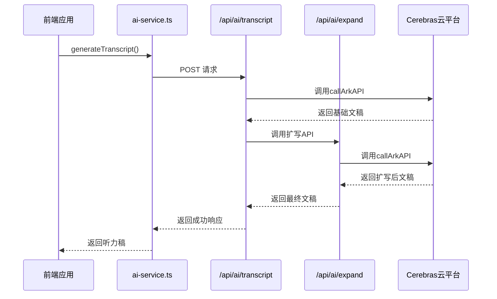
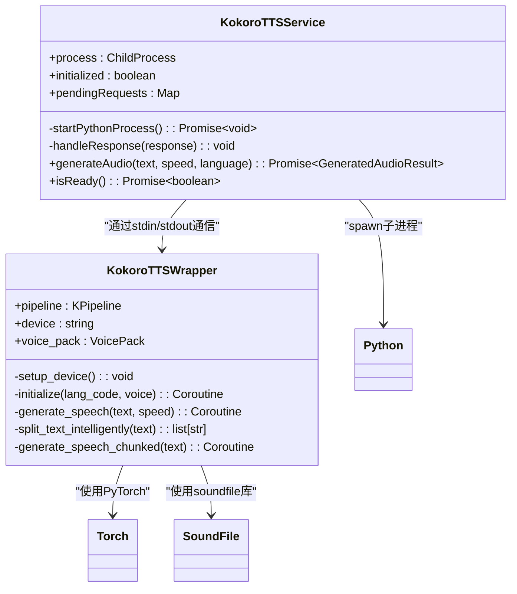
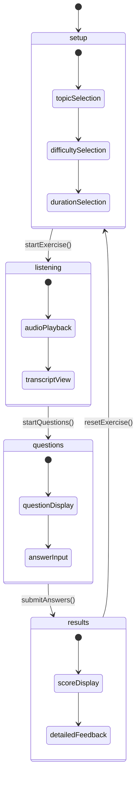

# 核心功能模块

<cite>
**本文档引用的文件**
- [ai-service.ts](file://lib/ai-service.ts)
- [kokoro-service.ts](file://lib/kokoro-service.ts)
- [enhanced-tts-service.ts](file://lib/enhanced-tts-service.ts)
- [use-exercise-workflow.ts](file://hooks/use-exercise-workflow.ts)
- [ai-analysis-service.ts](file://lib/ai-analysis-service.ts)
- [transcript/route.ts](file://app/api/ai/transcript/route.ts)
- [tts/route.ts](file://app/api/tts/route.ts)
- [analyze/route.ts](file://app/api/ai/wrong-answers/analyze/route.ts)
- [kokoro_wrapper.py](file://kokoro-local/kokoro_wrapper.py)
- [ark-helper.ts](file://lib/ark-helper.ts)
- [rate-limiter.ts](file://lib/rate-limiter.ts)
- [text-expansion.ts](file://lib/text-expansion.ts)
- [audio-utils.ts](file://lib/audio-utils.ts)
</cite>

## 目录
1. [AI内容生成服务](#ai内容生成服务)
2. [TTS语音合成模块](#tts语音合成模块)
3. [听力练习界面状态流转](#听力练习界面状态流转)
4. [错题AI分析系统](#错题ai分析系统)
5. [性能优化与异常处理](#性能优化与异常处理)
6. [使用场景与最佳实践](#使用场景与最佳实践)

## AI内容生成服务

本系统通过调用Cerebras云平台实现高质量的AI内容生成，包括听力稿、问题和文本扩写等功能。核心逻辑位于`ai-service.ts`中，该文件定义了客户端与后端API的交互接口。

AI内容生成服务采用分层架构：前端通过`ai-service.ts`中的函数发起请求，这些请求被路由到`app/api/ai/`目录下的相应API端点。例如，生成听力稿的流程始于`generateTranscript`函数，它向`/api/ai/transcript`发送POST请求。

在服务器端，`transcript/route.ts`是生成听力稿的核心实现。该文件利用`callArkAPI`函数与Cerebras大模型进行通信。生成过程包含两个关键阶段：首先生成基础文稿，然后通过`/api/ai/expand`接口进行智能扩写以确保达到目标字数要求。此过程实现了动态重试机制，最多尝试3次完整生成循环，并在每次循环中先生成初始文稿，再调用扩写服务。

**图示来源**
- [ai-service.ts](file://lib/ai-service.ts)
- [transcript/route.ts](file://app/api/ai/transcript/route.ts)
- [ark-helper.ts](file://lib/ark-helper.ts)

**本节来源**
- [ai-service.ts](file://lib/ai-service.ts#L0-L113)
- [transcript/route.ts](file://app/api/ai/transcript/route.ts#L0-L188)
- [ark-helper.ts](file://lib/ark-helper.ts#L0-L233)

## TTS语音合成模块

TTS语音合成模块通过Python脚本与Kokoro引擎通信，实现从文本到音频流的转换。系统提供了两种实现方式：基于CPU的`kokoroTTSGPU`服务和增强版的`enhancedKokoroTTS`服务，分别适用于不同硬件环境。

核心通信机制位于`kokoro-service.ts`和`kokoro_wrapper.py`之间。Node.js服务通过`spawn`创建子进程启动Python脚本，并建立标准输入输出管道进行双向通信。当收到音频生成请求时，Node.js服务将JSON格式的请求写入Python进程的标准输入，Python脚本处理完成后将包含十六进制编码音频数据的JSON响应写回标准输出。

Python端的`kokoro_wrapper.py`实现了完整的TTS工作流。它首先初始化Kokoro管道，根据环境变量自动选择计算设备（CUDA、Metal或CPU）。对于长文本，脚本会智能分割为不超过100字符的块，并支持并行处理以提高效率。生成的音频数据经过WAV格式封装后，以十六进制字符串形式返回给Node.js服务。

**图示来源**
- [kokoro-service.ts](file://lib/kokoro-service.ts)
- [kokoro_wrapper.py](file://kokoro-local/kokoro_wrapper.py)

**本节来源**
- [kokoro-service.ts](file://lib/kokoro-service.ts#L0-L583)
- [kokoro_wrapper.py](file://kokoro-local/kokoro_wrapper.py#L0-L587)
- [audio-utils.ts](file://lib/audio-utils.ts#L0-L265)

## 听力练习界面状态流转

听力练习界面的状态流转由`use-exercise-workflow.ts`自定义Hook管理，实现了清晰的有限状态机模式。整个练习流程分为四个主要阶段：设置(`setup`)、听音频(`listening`)、答题(`questions`)和查看结果(`results`)。

状态管理采用Redux风格的reducer模式，通过`exerciseReducer`函数处理各种动作类型。初始状态根据用户的评估结果预设推荐难度级别。用户交互触发异步操作，如`startExercise`函数会依次调用AI服务生成文稿、TTS服务生成音频、以及问题生成服务，每一步都更新相应的状态。

进度控制通过`progress`计算属性实现，根据当前步骤返回0-100的百分比值。可继续性检查则通过`canProceed`计算属性完成，确保用户在进入下一阶段前已完成必要操作。例如，在设置阶段，必须选择或输入有效话题才能继续；在答题阶段，所有问题都必须作答才能提交。

**图示来源**
- [use-exercise-workflow.ts](file://hooks/use-exercise-workflow.ts)

**本节来源**
- [use-exercise-workflow.ts](file://hooks/use-exercise-workflow.ts#L0-L358)
- [ai-service.ts](file://lib/ai-service.ts#L0-L113)
- [tts-service.ts](file://lib/tts-service.ts)

## 错题AI分析系统

错题AI分析系统收集用户答题数据并生成中文解析建议，其核心实现在`ai-analysis-service.ts`