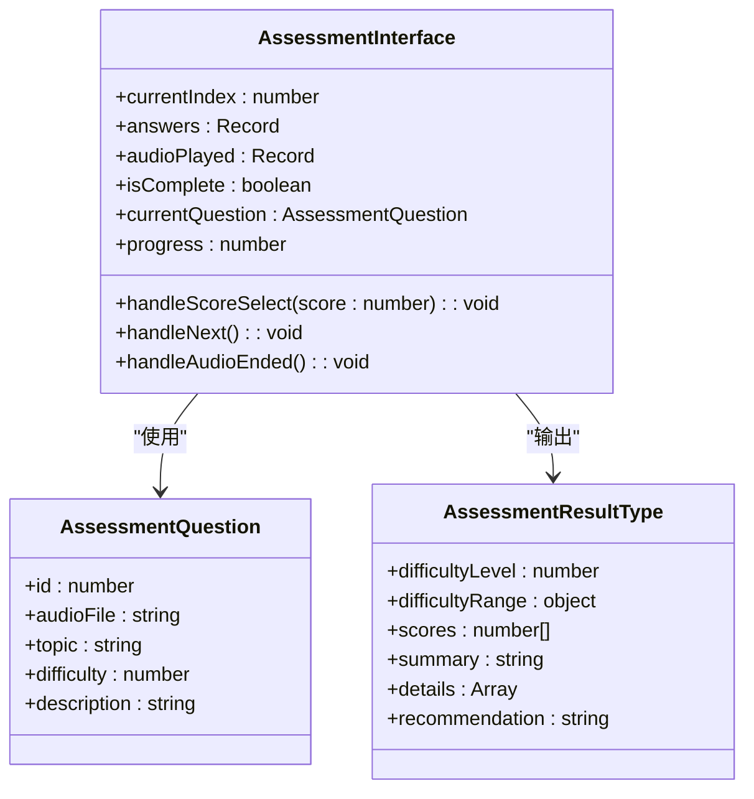
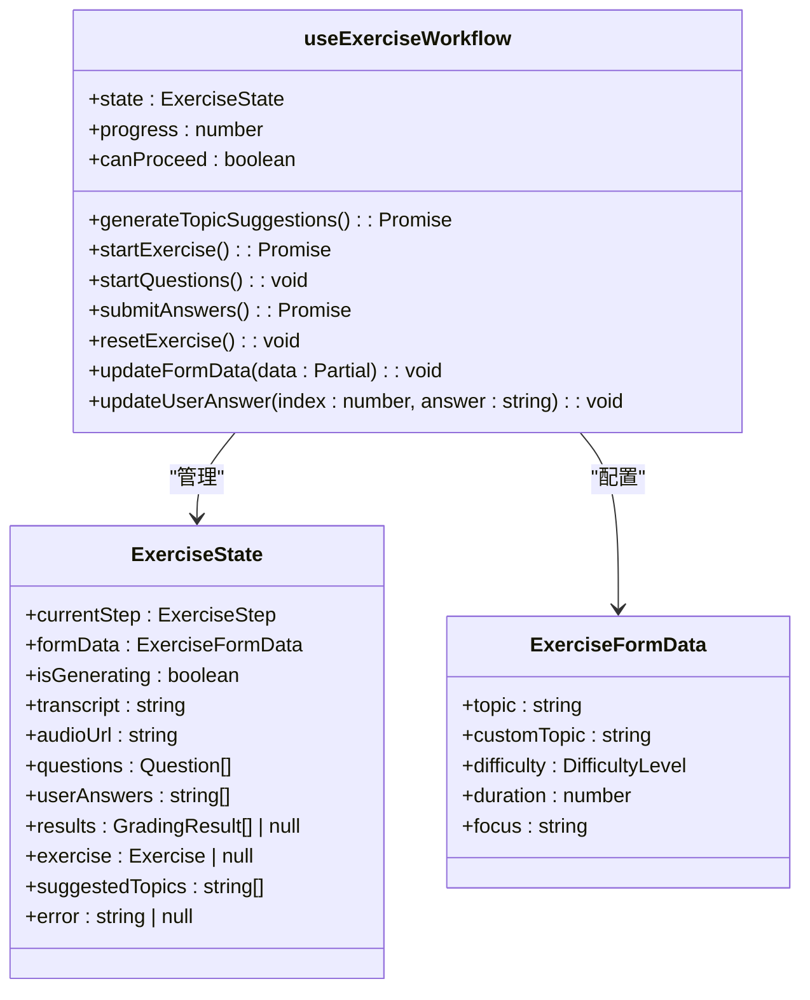
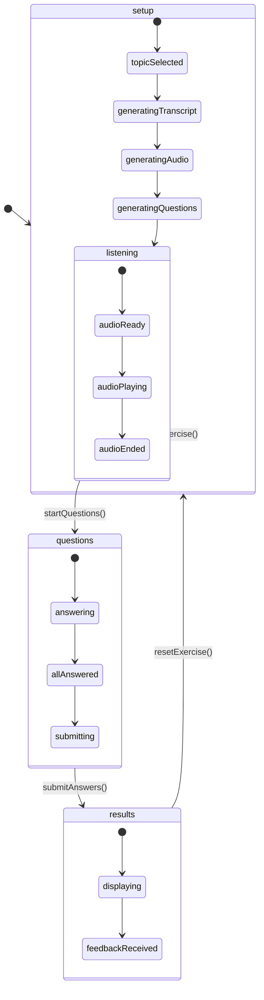
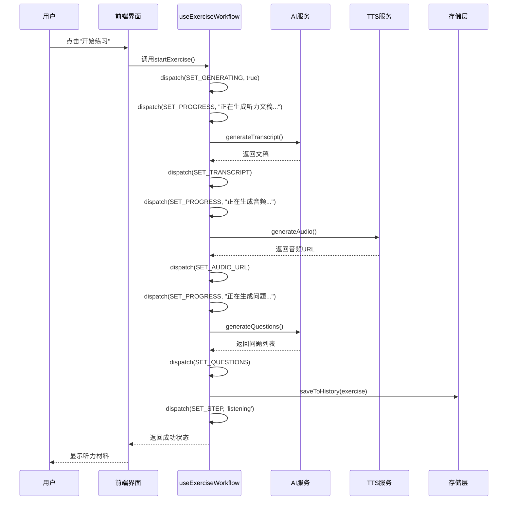
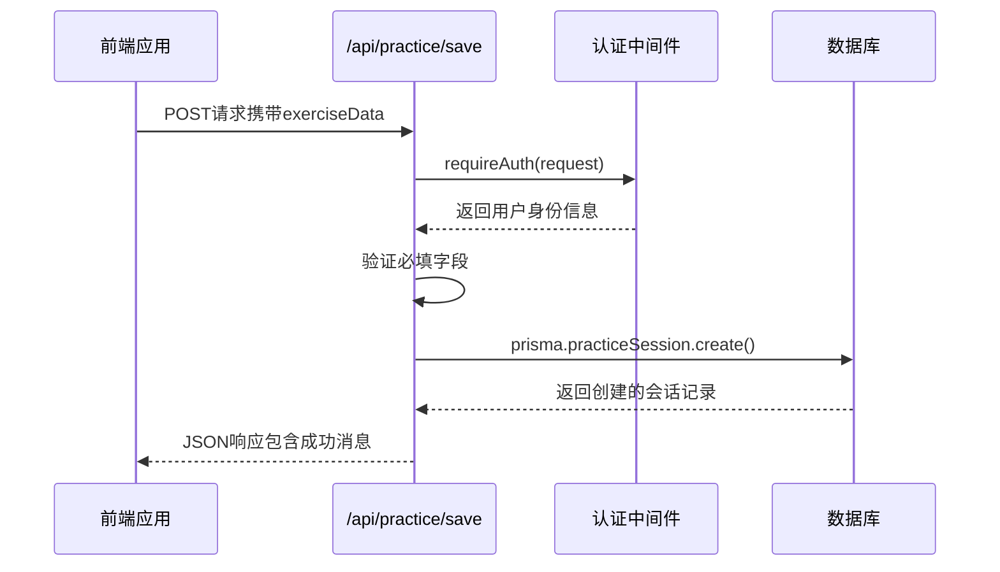
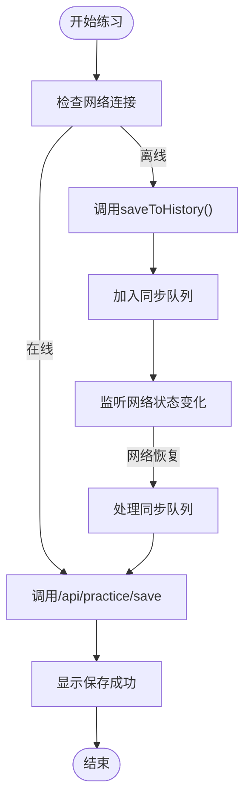
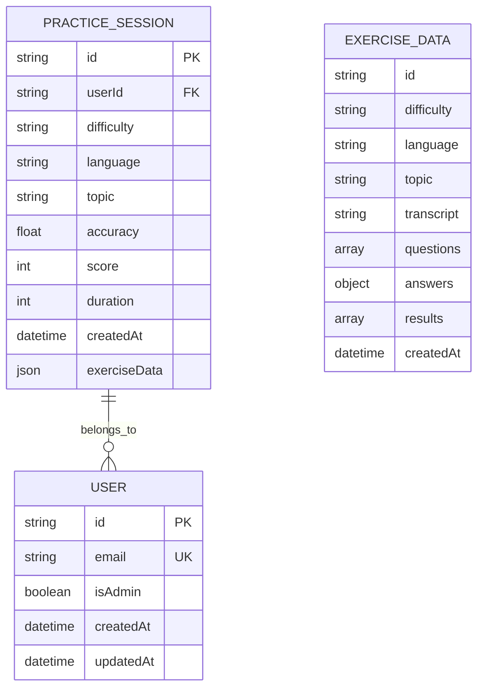
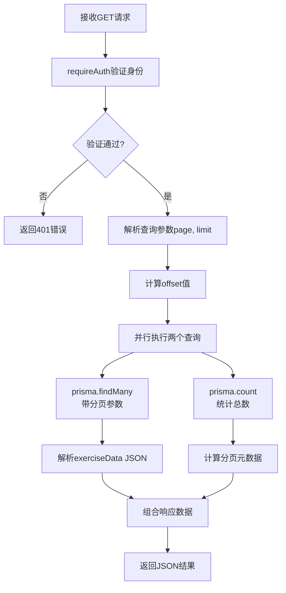

# 练习流程管理

<cite>
**本文档中引用的文件**
- [assessment-interface.tsx](file://components/assessment-interface.tsx)
- [use-exercise-workflow.ts](file://hooks/use-exercise-workflow.ts)
- [storage.ts](file://lib/storage.ts)
- [ai-service.ts](file://lib/ai-service.ts)
- [types.ts](file://lib/types.ts)
- [history/route.ts](file://app/api/practice/history/route.ts)
- [save/route.ts](file://app/api/practice/save/route.ts)
- [auth.ts](file://lib/auth.ts)
</cite>

## 目录
1. [简介](#简介)
2. [核心组件分析](#核心组件分析)
3. [状态机设计与生命周期管理](#状态机设计与生命周期管理)
4. [前端状态与后端同步机制](#前端状态与后端同步机制)
5. [练习历史记录存储结构](#练习历史记录存储结构)
6. [API接口实现细节](#api接口实现细节)
7. [关键交互流程图](#关键交互流程图)
8. [高并发下的状态一致性保障](#高并发下的状态一致性保障)
9. [用户体验优化建议](#用户体验优化建议)
10. [结论](#结论)

## 简介
本系统为英语听力训练平台，提供完整的练习流程管理功能。系统通过`assessment-interface.tsx`组件实现评估界面的状态机控制，并利用`use-exercise-workflow` Hook协调前后端数据同步。支持离线操作、防重复提交及练习历史查询等功能，确保用户在各种网络环境下均能获得流畅体验。

## 核心组件分析

### 评估界面组件（AssessmentInterface）
该组件负责听力水平评估的完整交互流程，包含音频播放、用户评分和结果计算三大核心环节。采用受控组件模式管理当前题目索引、用户答案和播放状态等关键状态。

**图表来源**
- [assessment-interface.tsx](file://components/assessment-interface.tsx#L84-L341)

**本节来源**
- [assessment-interface.tsx](file://components/assessment-interface.tsx#L84-L341)

### 练习工作流Hook（useExerciseWorkflow）
此自定义Hook实现了练习流程的状态管理，采用Redux风格的reducer模式处理复杂状态转换。涵盖从设置参数到生成内容、答题评分的全生命周期管理。

**图表来源**
- [use-exercise-workflow.ts](file://hooks/use-exercise-workflow.ts#L126-L357)

**本节来源**
- [use-exercise-workflow.ts](file://hooks/use-exercise-workflow.ts#L126-L357)

## 状态机设计与生命周期管理

### 状态机架构
系统采用有限状态机模式管理练习流程，定义了四个主要状态：setup（准备）、listening（听音频）、questions（回答问题）和results（查看结果）。每个状态对应不同的UI展示和用户交互逻辑。

**图表来源**
- [use-exercise-workflow.ts](file://hooks/use-exercise-workflow.ts#L126-L357)

**本节来源**
- [use-exercise-workflow.ts](file://hooks/use-exercise-workflow.ts#L126-L357)

### 生命周期事件链
当用户启动一次新练习时，触发以下事件序列：
1. 调用`startExercise()`方法
2. 更新状态为"正在生成听力文稿..."
3. 调用AI服务生成文稿
4. 更新状态为"正在生成音频..."
5. 调用TTS服务生成音频
6. 更新状态为"正在生成问题..."
7. 调用AI服务生成问题
8. 创建练习对象并保存至历史记录
9. 设置当前步骤为"listening"

**图表来源**
- [use-exercise-workflow.ts](file://hooks/use-exercise-workflow.ts#L126-L357)
- [ai-service.ts](file://lib/ai-service.ts#L62-L73)
- [storage.ts](file://lib/storage.ts#L5-L19)

**本节来源**
- [use-exercise-workflow.ts](file://hooks/use-exercise-workflow.ts#L126-L357)

## 前端状态与后端同步机制

### 数据同步流程
系统通过`/api/practice/save`接口实现前端状态与后端数据库的同步。每次练习完成后，将练习数据持久化存储，确保跨设备访问的一致性。

**图表来源**
- [save/route.ts](file://app/api/practice/save/route.ts#L4-L57)
- [auth.ts](file://lib/auth.ts#L365-L379)

**本节来源**
- [save/route.ts](file://app/api/practice/save/route.ts#L4-L57)

### 离线可用性设计
为支持离线使用场景，系统采用localStorage作为本地缓存机制。练习数据首先保存在本地，待网络恢复后再同步至服务器。

**图表来源**
- [storage.ts](file://lib/storage.ts#L5-L19)
- [save/route.ts](file://app/api/practice/save/route.ts#L4-L57)

**本节来源**
- [storage.ts](file://lib/storage.ts#L5-L19)

## 练习历史记录存储结构

### 数据模型设计
练习历史记录采用分层存储结构，既保留原始练习数据又提供摘要信息以便快速检索。

**图表来源**
- [types.ts](file://lib/types.ts#L62-L72)
- [save/route.ts](file://app/api/practice/save/route.ts#L4-L57)

**本节来源**
- [types.ts](file://lib/types.ts#L62-L72)

## API接口实现细节

### 历史记录查询接口
`/api/practice/history`接口支持分页、排序和计数功能，确保大量数据下的性能表现。

**图表来源**
- [history/route.ts](file://app/api/practice/history/route.ts#L4-L71)

**本节来源**
- [history/route.ts](file://app/api/practice/history/route.ts#