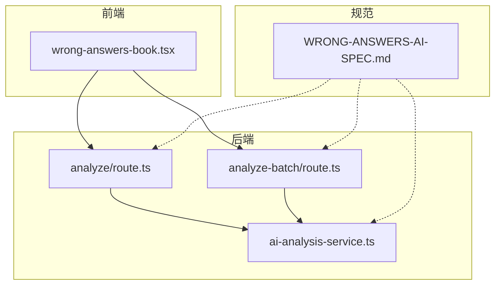
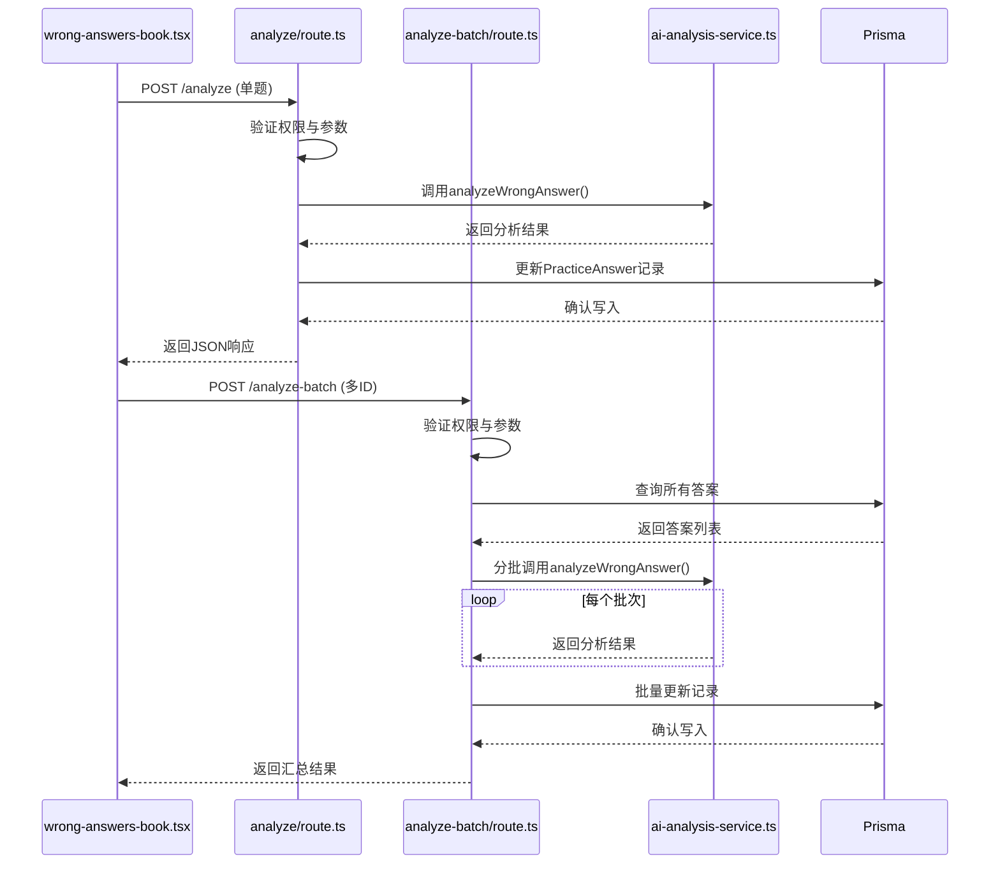
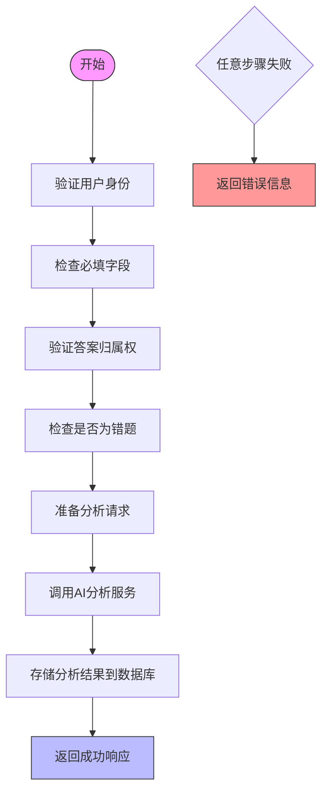
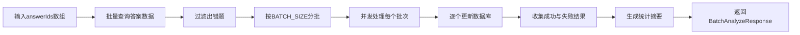
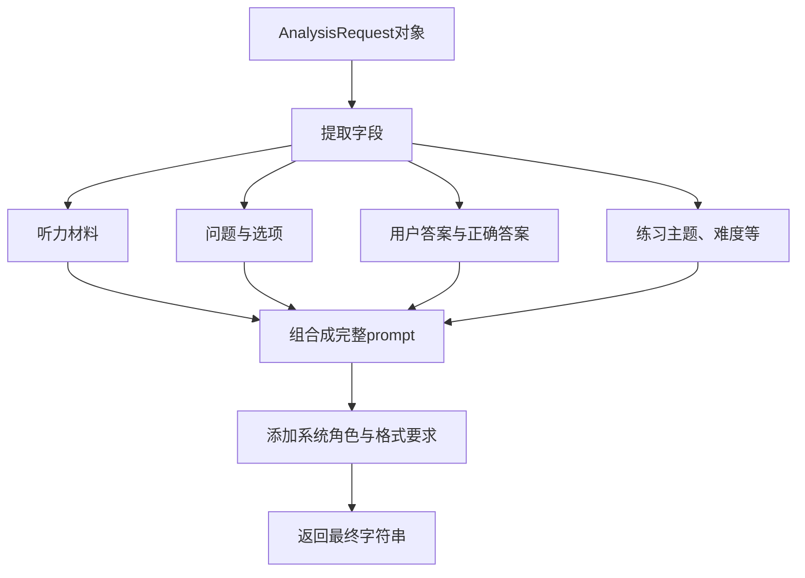
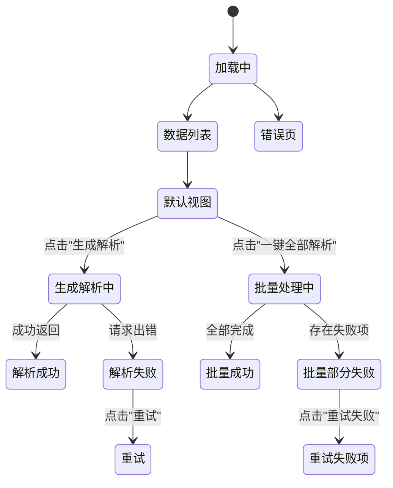
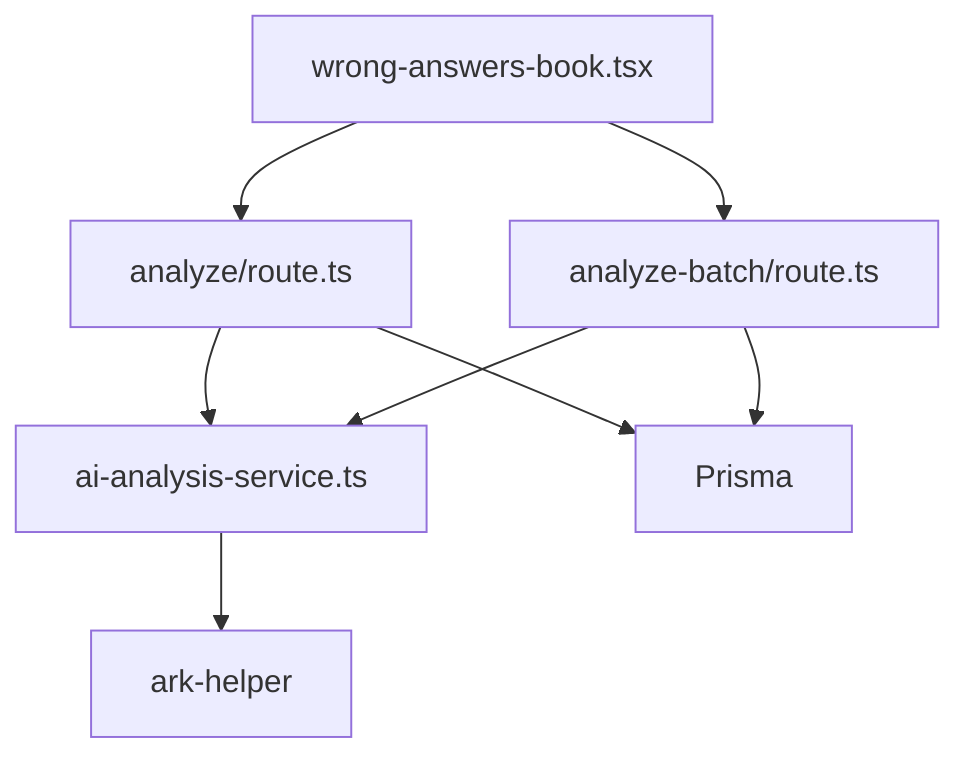

# 错题AI分析

<cite>
**本文档引用文件**  
- [ai-analysis-service.ts](file://lib/ai-analysis-service.ts)
- [WRONG-ANSWERS-AI-SPEC.md](file://documents/WRONG-ANSWERS-AI-SPEC.md)
- [wrong-answers-book.tsx](file://components/wrong-answers-book.tsx)
- [analyze/route.ts](file://app/api/ai/wrong-answers/analyze/route.ts)
- [analyze-batch/route.ts](file://app/api/ai/wrong-answers/analyze-batch/route.ts)
</cite>

## 目录
1. [引言](#引言)
2. [项目结构](#项目结构)
3. [核心组件](#核心组件)
4. [架构概述](#架构概述)
5. [详细组件分析](#详细组件分析)
6. [依赖分析](#依赖分析)
7. [性能考量](#性能考量)
8. [故障排查指南](#故障排查指南)
9. [结论](#结论)

## 引言
本系统旨在为英语听力训练平台提供智能化的错题分析功能，通过AI技术深入解析用户在练习中的错误答案。系统支持单题与批量两种分析模式，结合用户答题数据、录音转录文本及正确答案，生成结构化的中文诊断反馈。该文档详细阐述了`/analyze`和`/analyze-batch`两个API端点的实现逻辑，以及前端渲染机制与优化策略。

## 项目结构
系统采用分层架构设计，主要包含API路由、业务逻辑服务、数据模型定义与前端交互组件四大模块。API接口集中于`app/api/ai/wrong-answers/`目录下，核心分析逻辑封装在`lib/ai-analysis-service.ts`中，前端展示由`components/wrong-answers-book.tsx`负责，规范说明则存于`documents/WRONG-ANSWERS-AI-SPEC.md`。

**图示来源**
- [wrong-answers-book.tsx](file://components/wrong-answers-book.tsx)
- [analyze/route.ts](file://app/api/ai/wrong-answers/analyze/route.ts)
- [analyze-batch/route.ts](file://app/api/ai/wrong-answers/analyze-batch/route.ts)
- [ai-analysis-service.ts](file://lib/ai-analysis-service.ts)
- [WRONG-ANSWERS-AI-SPEC.md](file://documents/WRONG-ANSWERS-AI-SPEC.md)

**章节来源**
- [app/api/ai/wrong-answers/analyze/route.ts](file://app/api/ai/wrong-answers/analyze/route.ts)
- [app/api/ai/wrong-answers/analyze-batch/route.ts](file://app/api/ai/wrong-answers/analyze-batch/route.ts)
- [lib/ai-analysis-service.ts](file://lib/ai-analysis-service.ts)
- [documents/WRONG-ANSWERS-AI-SPEC.md](file://documents/WRONG-ANSWERS-AI-SPEC.md)

## 核心组件
系统核心由AI分析服务、单题分析API、批量分析API及前端错题本组件构成。`ai-analysis-service.ts`提供统一的分析接口，`analyze/route.ts`和`analyze-batch/route.ts`分别处理单个与多个错题请求，`wrong-answers-book.tsx`实现用户界面交互与状态管理。

**章节来源**
- [lib/ai-analysis-service.ts](file://lib/ai-analysis-service.ts)
- [app/api/ai/wrong-answers/analyze/route.ts](file://app/api/ai/wrong-answers/analyze/route.ts)
- [app/api/ai/wrong-answers/analyze-batch/route.ts](file://app/api/ai/wrong-answers/analyze-batch/route.ts)
- [components/wrong-answers-book.tsx](file://components/wrong-answers-book.tsx)

## 架构概述
系统采用前后端分离架构，前端通过RESTful API调用后端服务。当用户触发分析操作时，前端将相关数据发送至对应的API端点，后端验证权限与参数后，调用AI服务生成分析结果并持久化存储，最终返回结构化响应供前端渲染。

**图示来源**
- [wrong-answers-book.tsx](file://components/wrong-answers-book.tsx)
- [analyze/route.ts](file://app/api/ai/wrong-answers/analyze/route.ts)
- [analyze-batch/route.ts](file://app/api/ai/wrong-answers/analyze-batch/route.ts)
- [ai-analysis-service.ts](file://lib/ai-analysis-service.ts)

## 详细组件分析
### 单题分析API (`/analyze`) 实现逻辑
该端点接收包含题目信息、用户作答及上下文的数据对象，执行身份认证、权限校验与字段验证。确认为错误答案后，构造符合`AnalysisRequest`类型的请求体，调用`analyzeWrongAnswer`函数，并将返回结果存入数据库。

#### 请求流程

**图示来源**
- [analyze/route.ts](file://app/api/ai/wrong-answers/analyze/route.ts)

**章节来源**
- [analyze/route.ts](file://app/api/ai/wrong-answers/analyze/route.ts)

### 批量分析API (`/analyze-batch`) 实现逻辑
此端点接收一个答案ID数组，首先进行速率限制检查与用户认证。随后从数据库批量获取对应记录，过滤出真正的错题，并以小批次（默认每批10个）并发调用单题分析服务，确保系统稳定性。

#### 并发处理策略

**图示来源**
- [analyze-batch/route.ts](file://app/api/ai/wrong-answers/analyze-batch/route.ts)

**章节来源**
- [analyze-batch/route.ts](file://app/api/ai/wrong-answers/analyze-batch/route.ts)

### AI分析服务 (`ai-analysis-service.ts`) 工作机制
该服务是整个系统的智能核心，负责整合原始答案、正确答案、用户录音转录和AI评分结果，构建符合Cerebras API要求的请求体。其关键函数`analyzeWrongAnswer`根据预设模板生成提示词（prompt），并通过`callArkAPI`发起调用。

#### 提示词构造逻辑

**图示来源**
- [ai-analysis-service.ts](file://lib/ai-analysis-service.ts)

**章节来源**
- [ai-analysis-service.ts](file://lib/ai-analysis-service.ts)

### 前端渲染逻辑 (`wrong-answers-book.tsx`)
前端组件通过调用`GET /api/wrong-answers/list`加载所有错题数据，并依据`needsAnalysis`标志位和`aiAnalysis`字段的状态，动态渲染“展开AI解析”按钮或加载中的提示。点击“一键全部解析”会触发批量API，利用`useBatchProcessing`钩子管理并发状态。

#### 状态转换逻辑

**图示来源**
- [wrong-answers-book.tsx](file://components/wrong-answers-book.tsx)

**章节来源**
- [wrong-answers-book.tsx](file://components/wrong-answers-book.tsx)

## 依赖分析
系统各组件间存在明确的依赖关系。前端组件直接依赖两个API端点；两个API端点共同依赖`ai-analysis-service.ts`提供的分析能力；而该服务又依赖底层的`ark-helper`进行实际的AI调用。数据库通过Prisma客户端被API端点访问，用于数据持久化。

**图示来源**
- [wrong-answers-book.tsx](file://components/wrong-answers-book.tsx)
- [analyze/route.ts](file://app/api/ai/wrong-answers/analyze/route.ts)
- [analyze-batch/route.ts](file://app/api/ai/wrong-answers/analyze-batch/route.ts)
- [ai-analysis-service.ts](file://lib/ai-analysis-service.ts)

## 性能考量
系统在设计时充分考虑了性能与稳定性。单题分析采用电路断路器模式（circuit breaker）防止AI服务故障导致雪崩效应，并集成速率限制机制。批量分析通过`BATCH_SIZE=10`的分批处理和并发控制，避免对AI服务造成过大压力。前端使用`useBatchProcessing`钩子实现进度追踪与取消功能，提升用户体验。

**章节来源**
- [analyze/route.ts](file://app/api/ai/wrong-answers/analyze/route.ts)
- [analyze-batch/route.ts](file://app/api/ai/wrong-answers/analyze-batch/route.ts)
- [ai-analysis-service.ts](file://lib/ai-analysis-service.ts)
- [wrong-answers-book.tsx](file://components/wrong-answers-book.tsx)

## 故障排查指南
### 常见问题
1. **空响应或500错误**：检查AI服务是否正常运行，确认`CEREBRAS_PROXY_URL`配置正确。
2. **格式错误**：验证返回的JSON是否符合`ANALYSIS_SCHEMA`定义，特别是`analysis`字段长度需大于50字。
3. **权限错误**：确保用户已登录且请求的错题属于该用户。
4. **速率限制**：检查`X-RateLimit-*`响应头，避免超过`AI_ANALYSIS`和`BATCH_PROCESSING`配额。

### 调试步骤
1. 查看服务日志中的`AI analysis failed`错误信息。
2. 验证数据库中`PracticeAnswer`记录的`isCorrect`字段值。
3. 检查`aiAnalysis`字段是否已正确存储JSON字符串。
4. 使用Postman测试API端点，确认请求体结构符合要求。

**章节来源**
- [analyze/route.ts](file://app/api/ai/wrong-answers/analyze/route.ts)
- [analyze-batch/route.ts](file://app/api/ai/wrong-answers/analyze-batch/route.ts)
- [ai-analysis-service.ts](file://lib/ai-analysis-service.ts)

## 结论
错题AI分析系统通过模块化设计实现了高内聚、低耦合的架构。从用户交互到AI调用再到数据存储，各组件职责清晰，便于维护与扩展。未来可引入缓存机制优化重复分析场景，并增加多语言支持以服务更广泛的用户群体。