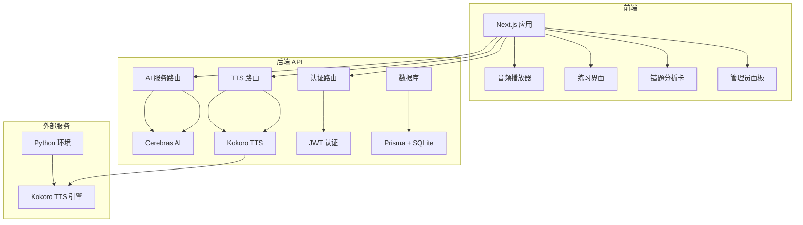
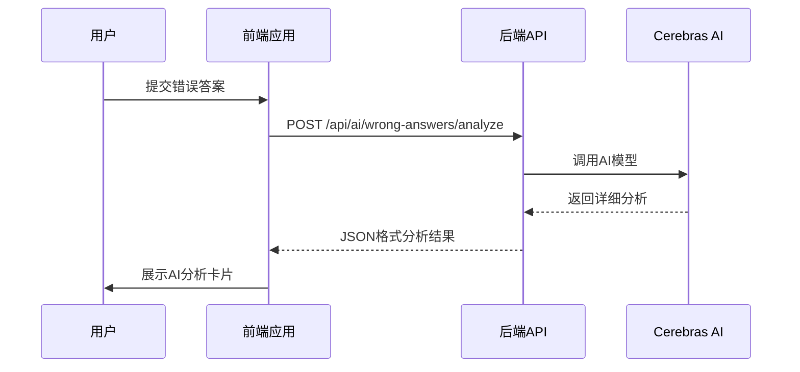
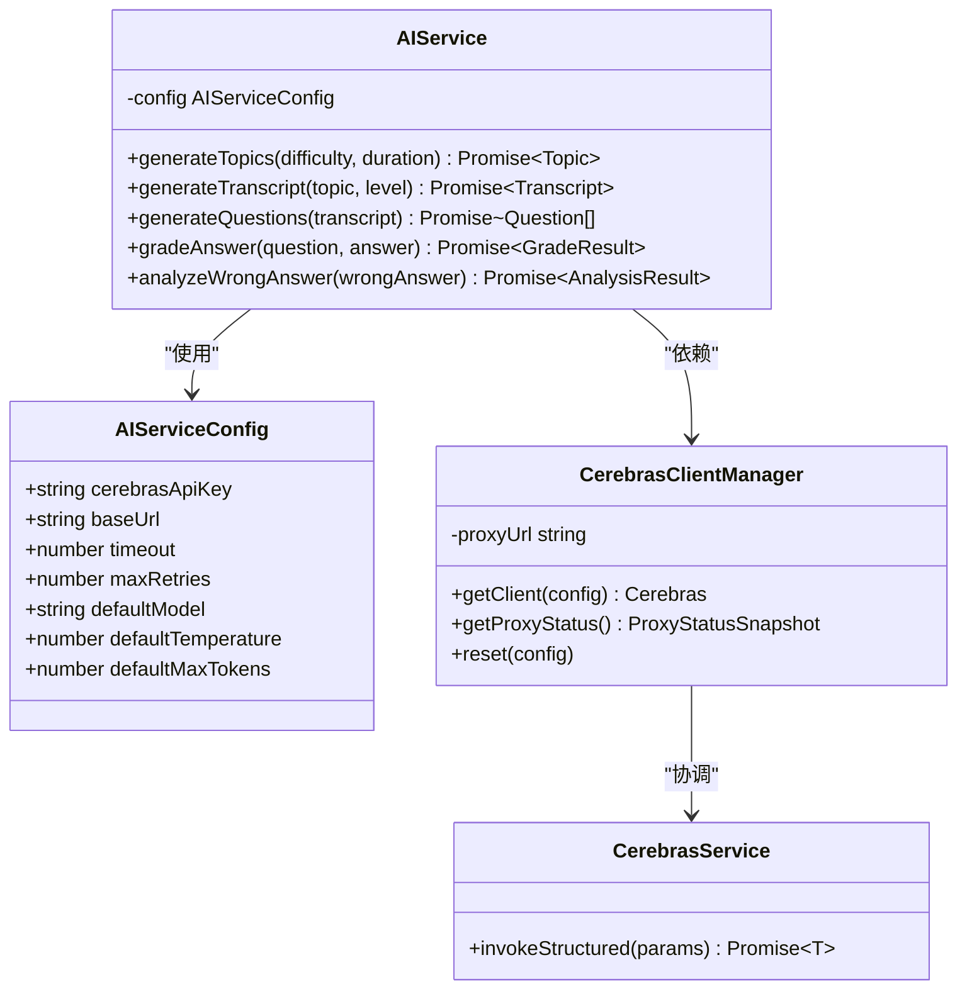
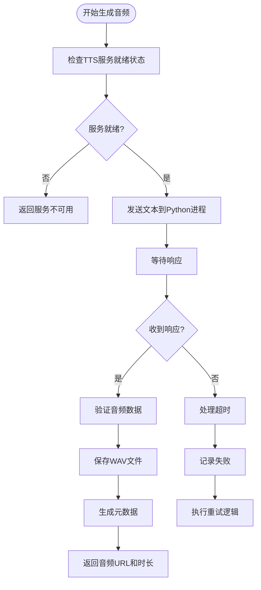
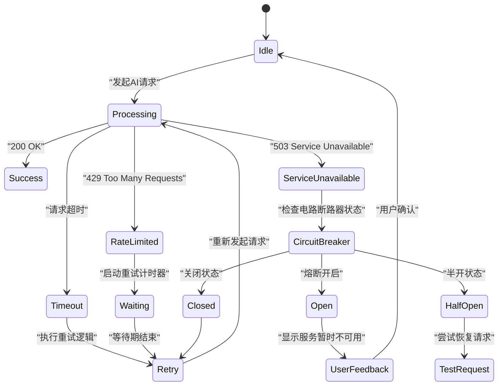

# 系统概述

<cite>
**本文档引用文件**  
- [README.md](file://README.md)
- [AGENTS.md](file://AGENTS.md)
- [CLAUDE.md](file://CLAUDE.md)
- [app/api/tts/route-optimized.ts](file://app/api/tts/route-optimized.ts)
- [lib/kokoro-service.ts](file://lib/kokoro-service.ts)
- [lib/config-manager.ts](file://lib/config-manager.ts)
- [lib/ai-service.ts](file://lib/ai-service.ts)
- [lib/error-handler.ts](file://lib/error-handler.ts)
- [components/audio-player.tsx](file://components/audio-player.tsx)
- [components/ai-analysis-card.tsx](file://components/ai-analysis-card.tsx)
- [lib/ai/cerebras-client-manager.ts](file://lib/ai/cerebras-client-manager.ts) - *更新于提交 0c0327e7*
- [lib/ai/cerebras-service.ts](file://lib/ai/cerebras-service.ts) - *更新于提交 0c0327e7*
</cite>

## 更新摘要
**已更新内容**  
- 根据提交 `0c0327e7` 更新了AI服务调用管道说明，明确移除了动态代理支持，改为硬编码使用生产代理地址
- 更新了AI服务架构图和类图，反映硬编码代理和结构化调用的最新实现
- 修正了`CerebrasClientManager`和`invokeStructured`函数的实现细节描述
- 更新了相关章节的来源引用，添加了`cerebras-client-manager.ts`和`cerebras-service.ts`文件

## 目录
1. [引言](#引言)  
2. [系统架构](#系统架构)  
3. [核心功能详解](#核心功能详解)  
4. [AI服务与智能体协作](#ai服务与智能体协作)  
5. [技术实现细节](#技术实现细节)  
6. [错误处理与容错机制](#错误处理与容错机制)  
7. [部署与运维](#部署与运维)  
8. [总结](#总结)

## 引言

英语听力训练系统是一个基于Next.js 15的K12教育平台，专为提升学生英语听力能力而设计。该系统采用AI驱动的内容生成技术，结合本地TTS引擎和智能化学习分析，提供个性化的听力练习体验。系统支持双语界面，具备管理员面板，并通过先进的架构设计确保高性能与可扩展性。

本系统的核心目标是利用人工智能技术革新传统听力训练模式，通过自动生成符合CEFR标准的听力材料、智能题目生成与自动评分，以及深度错题分析，帮助学生精准定位薄弱环节并制定个性化学习路径。同时，系统注重用户体验与开发者友好性，采用现代化前端框架与模块化后端设计，便于维护与迭代。

**Section sources**  
- [README.md](file://README.md#L1-L103)

## 系统架构

英语听力训练系统采用分层微服务架构，主要由四个核心组件构成：前端应用（Next.js）、后端API服务、本地TTS引擎（Kokoro）和AI服务（Cerebras）。这些组件通过清晰的接口定义进行通信，形成一个高效协同的工作流。

**Diagram sources**  
- [README.md](file://README.md#L1-L103)  
- [AGENTS.md](file://AGENTS.md#L1-L177)

**Section sources**  
- [README.md](file://README.md#L1-L103)  
- [AGENTS.md](file://AGENTS.md#L1-L177)

## 核心功能详解

### 听力练习流程

系统提供完整的听力练习闭环，从内容生成到结果反馈。用户启动练习后，系统首先调用AI服务生成适合其当前水平的话题和听力文稿，随后通过本地TTS引擎将文本转换为语音。用户完成听力后回答系统生成的问题，答案提交后由AI服务进行自动评分并提供即时反馈。

该流程的关键在于个性化难度推荐机制，系统根据用户的CEFR等级和历史表现动态调整听力材料的复杂度，确保学习挑战适中且有效。整个过程无缝集成在Next.js前端界面中，通过`use-exercise-workflow`等自定义Hook管理状态流转。

### 错题AI分析

错题AI分析是本系统的核心创新功能。当用户答错题目时，系统会调用`POST /api/ai/wrong-answers/analyze`接口，将错题信息发送至Cerebras AI服务。AI服务返回详细的中文解析，包括错误原因、知识点回顾和学习建议。

**Diagram sources**  
- [AGENTS.md](file://AGENTS.md#L1-L177)  
- [components/ai-analysis-card.tsx](file://components/ai-analysis-card.tsx#L1-L50)

**Section sources**  
- [AGENTS.md](file://AGENTS.md#L1-L177)  
- [CLAUDE.md](file://CLAUDE.md#L1-L275)

### 双语界面支持

系统内置完善的双语支持机制，通过`lib/i18n`模块实现多语言切换。所有用户界面文本均从JSON翻译文件加载，支持实时切换中英文显示。这一特性特别有利于K12学生在母语辅助下理解复杂的操作指引和学习反馈。

双语功能不仅限于静态文本，还包括动态生成的AI反馈内容。系统能够确保AI生成的解析和建议以用户选择的语言呈现，提升了非母语用户的使用体验。

### 管理员面板

管理员面板提供用户管理和系统监控功能。管理员可以查看用户练习统计数据、监控TTS服务状态、管理用户账户等。该面板通过`/admin`路由访问，仅对具有管理员权限的用户开放。

面板集成了性能监控接口，可实时展示系统健康状况，包括数据库连接状态、认证缓存命中率等关键指标，帮助管理员及时发现并解决潜在问题。

**Section sources**  
- [AGENTS.md](file://AGENTS.md#L1-L177)  
- [CLAUDE.md](file://CLAUDE.md#L1-L275)  
- [app/api/admin/users/route.ts](file://app/api/admin/users/route.ts#L1-L20)  
- [app/api/performance/metrics/route.ts](file://app/api/performance/metrics/route.ts#L1-L15)

## AI服务与智能体协作

系统中的AI服务扮演着"智能大脑"的角色，负责内容生成、评分和分析等认知密集型任务。根据`AGENTS.md`和`CLAUDE.md`文档描述，系统采用了智能体协作机制，不同AI代理各司其职，共同完成复杂的教育任务。

AI服务配置由`AIServiceConfig`接口定义，包含API密钥、基础URL、超时设置等参数。系统通过`lib/ai-service.ts`封装了与Cerebras API的交互逻辑，实现了请求重试、超时控制和错误处理等健壮性机制。根据提交 `0c0327e7` 的变更，系统已移除动态代理支持，改为硬编码使用生产代理地址 `http://81.71.93.183:10811`，简化了代理配置并提高了连接稳定性。

**Diagram sources**  
- [lib/config-manager.ts](file://lib/config-manager.ts#L7-L13)  
- [lib/ai-service.ts](file://lib/ai-service.ts#L1-L100)  
- [lib/ai/cerebras-client-manager.ts](file://lib/ai/cerebras-client-manager.ts#L1-L85) - *更新于提交 0c0327e7*
- [lib/ai/cerebras-service.ts](file://lib/ai/cerebras-service.ts#L1-L61) - *更新于提交 0c0327e7*

**Section sources**  
- [AGENTS.md](file://AGENTS.md#L1-L177)  
- [CLAUDE.md](file://CLAUDE.md#L1-L275)  
- [lib/config-manager.ts](file://lib/config-manager.ts#L7-L13)  
- [lib/ai/cerebras-client-manager.ts](file://lib/ai/cerebras-client-manager.ts) - *更新于提交 0c0327e7*  
- [lib/ai/cerebras-service.ts](file://lib/ai/cerebras-service.ts) - *更新于提交 0c0327e7*

## 技术实现细节

### 本地TTS引擎集成

系统采用Kokoro作为本地TTS引擎，通过Node.js子进程与Python环境通信。`KokoroTTSService`类封装了与Python包装器的交互逻辑，实现了进程管理、请求调度和错误恢复。

该服务实现了电路断路器模式，当连续失败达到阈值时自动进入熔断状态，防止雪崩效应。同时采用指数退避策略进行重试，提高了系统的稳定性。服务启动时会自动检测设备配置，优先使用Apple Silicon的Metal加速或CUDA GPU加速。

**Diagram sources**  
- [lib/kokoro-service.ts](file://lib/kokoro-service.ts#L145-L568)  
- [app/api/tts/route-optimized.ts](file://app/api/tts/route-optimized.ts#L55-L61)

**Section sources**  
- [lib/kokoro-service.ts](file://lib/kokoro-service.ts#L145-L568)  
- [app/api/tts/route-optimized.ts](file://app/api/tts/route-optimized.ts#L1-L120)

### 数据持久化与管理

系统使用Prisma ORM与SQLite数据库进行数据持久化，存储用户信息、练习记录、错题分析结果等。数据库设计遵循规范化原则，主要包含users、practice_sessions、practice_questions和practice_answers四张表。

通过`lib/database.ts`提供的封装，系统实现了高效的数据库操作。开发环境中默认启用WAL模式和busy_timeout，提高了并发性能。管理员可通过`scripts/database-migration.ts`脚本执行数据库迁移，确保架构演进的平滑性。

**Section sources**  
- [README.md](file://README.md#L1-L103)  
- [AGENTS.md](file://AGENTS.md#L1-L177)  
- [prisma/migrations](file://prisma/migrations)

## 错误处理与容错机制

系统建立了多层次的错误处理体系，确保在各种异常情况下仍能提供稳定的服务。错误类型通过枚举定义，如`ErrorCode.AI_SERVICE_ERROR`，并在`error-handler.ts`中配置相应的用户友好消息。

对于AI服务调用，系统实现了全面的容错机制：
- **超时控制**：每个API请求都有明确的超时限制
- **重试机制**：失败请求会按指数退避策略自动重试
- **降级策略**：当AI服务不可用时，提供备用方案或缓存数据
- **用户反馈**：向用户展示清晰的错误信息和恢复建议

**Diagram sources**  
- [lib/error-handler.ts](file://lib/error-handler.ts#L15-L15)  
- [lib/enhanced-error-handler.ts](file://lib/enhanced-error-handler.ts#L13-L13)

**Section sources**  
- [lib/error-handler.ts](file://lib/error-handler.ts#L1-L150)  
- [__tests__/e2e/README.md](file://__tests__/e2e/README.md#L108-L119)

## 部署与运维

系统提供了灵活的部署选项，支持本地开发、Docker容器化和GPU加速部署。`docker-compose.yml`和`docker-compose.gpu.yml`文件定义了不同的部署拓扑，可根据硬件条件选择合适的方案。

生产环境部署建议：
1. 使用Nginx作为反向代理，提供HTTPS加密
2. 配置定期备份策略，保护用户数据安全
3. 设置监控告警，及时发现性能瓶颈
4. 优化数据库连接池配置，提升并发处理能力
5. 启用TTS音频缓存机制，减少重复生成开销