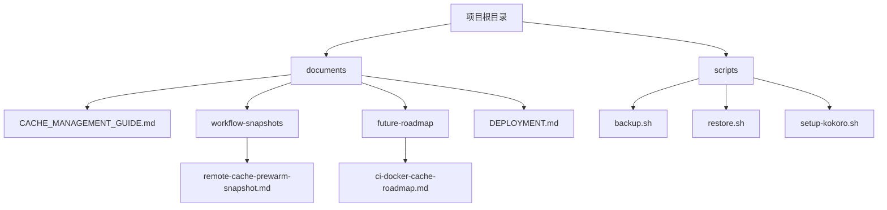
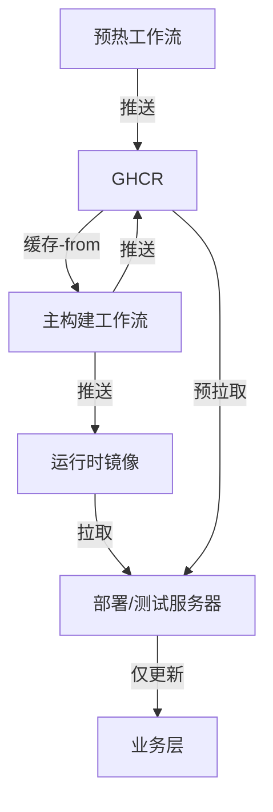
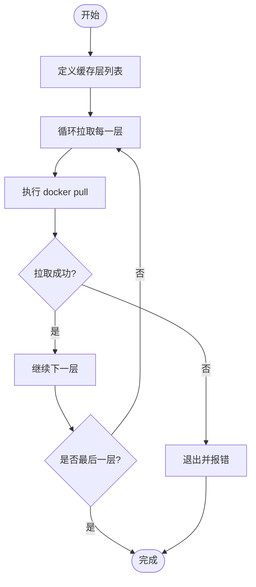
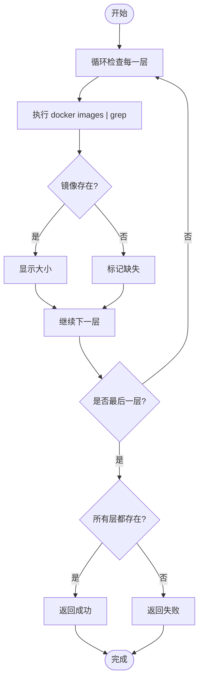
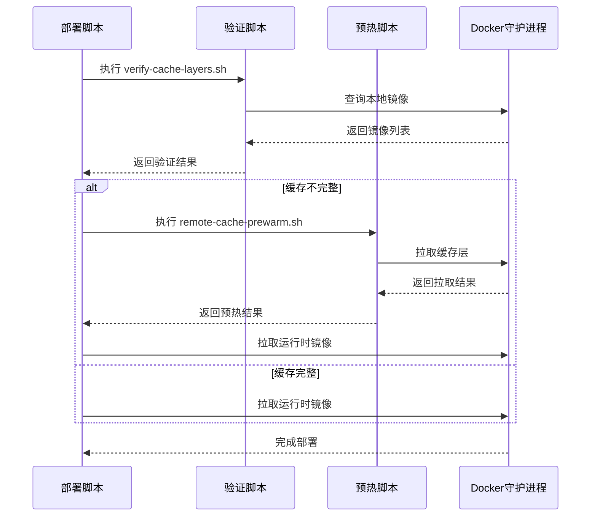
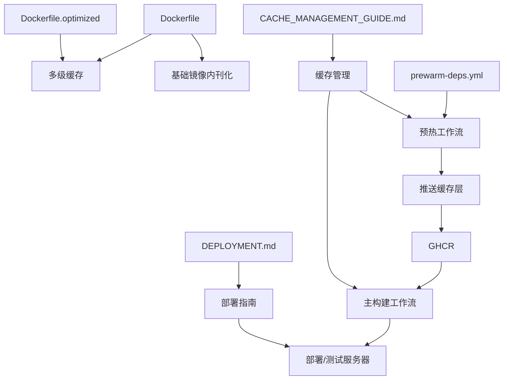

# 缓存预热与验证

<cite>
**本文档引用文件**   
- [CACHE_MANAGEMENT_GUIDE.md](file://documents/CACHE_MANAGEMENT_GUIDE.md)
- [remote-cache-prewarm-snapshot.md](file://documents/workflow-snapshots/remote-cache-prewarm-snapshot.md)
- [ci-docker-cache-roadmap.md](file://documents/future-roadmap/ci-docker-cache-roadmap.md)
- [DEPLOYMENT.md](file://documents/DEPLOYMENT.md)
- [Dockerfile](file://Dockerfile)
- [Dockerfile.optimized](file://Dockerfile.optimized)
</cite>

## 目录
1. [引言](#引言)
2. [项目结构](#项目结构)
3. [核心组件](#核心组件)
4. [架构概述](#架构概述)
5. [详细组件分析](#详细组件分析)
6. [依赖分析](#依赖分析)
7. [性能考虑](#性能考虑)
8. [故障排除指南](#故障排除指南)
9. [结论](#结论)

## 引言

本文档全面阐述了英语听力训练器项目的缓存预热与验证机制。该机制旨在解决远程服务器部署时缓存缺失导致的性能瓶颈，通过创建专门的脚本和流程，实现CI/CD流水线与远程部署环境之间的缓存协同。文档详细说明了`remote-cache-prewarm.sh`和`verify-cache-layers.sh`脚本的设计目的、工作原理、使用方法和最佳实践，并解释了它们如何与Docker和CI/CD集成，以及如何诊断和解决相关问题。

**Section sources**
- [CACHE_MANAGEMENT_GUIDE.md](file://documents/CACHE_MANAGEMENT_GUIDE.md)
- [remote-cache-prewarm-snapshot.md](file://documents/workflow-snapshots/remote-cache-prewarm-snapshot.md)

## 项目结构

项目结构中，与缓存管理相关的文件主要分布在`documents`和`scripts`目录下。`documents`目录包含详细的管理指南和快照文档，而`scripts`目录则存放了用于部署和维护的脚本。

**Diagram sources**
- [CACHE_MANAGEMENT_GUIDE.md](file://documents/CACHE_MANAGEMENT_GUIDE.md)
- [remote-cache-prewarm-snapshot.md](file://documents/workflow-snapshots/remote-cache-prewarm-snapshot.md)

**Section sources**
- [CACHE_MANAGEMENT_GUIDE.md](file://documents/CACHE_MANAGEMENT_GUIDE.md)
- [remote-cache-prewarm-snapshot.md](file://documents/workflow-snapshots/remote-cache-prewarm-snapshot.md)

## 核心组件

本项目的核心缓存管理组件包括两个已归档的脚本：`remote-cache-prewarm.sh`和`verify-cache-layers.sh`，以及相关的Dockerfile和部署文档。这些组件共同构成了一个完整的缓存优化链条，从CI端的缓存预热到远程服务器的缓存验证和部署。

**Section sources**
- [remote-cache-prewarm-snapshot.md](file://documents/workflow-snapshots/remote-cache-prewarm-snapshot.md)
- [ci-docker-cache-roadmap.md](file://documents/future-roadmap/ci-docker-cache-roadmap.md)

## 架构概述

系统的缓存架构遵循一个清晰的三层工作流：预热工作流、主构建工作流和部署/测试服务器。预热工作流负责构建和推送基础、Python和Node.js依赖缓存；主构建工作流利用这些缓存来加速业务镜像的构建；最后，部署服务器通过预拉取缓存层来实现快速部署。

**Diagram sources**
- [ci-docker-cache-roadmap.md](file://documents/future-roadmap/ci-docker-cache-roadmap.md)

**Section sources**
- [ci-docker-cache-roadmap.md](file://documents/future-roadmap/ci-docker-cache-roadmap.md)

## 详细组件分析

### remote-cache-prewarm.sh 脚本分析

`remote-cache-prewarm.sh`脚本是为了解决远程服务器缓存预热缺失问题而创建的。其核心功能是按依赖顺序拉取`cache-base`、`cache-python`和`cache-node`镜像，确保远程服务器在部署时能够命中这些缓存层，从而将部署时间从3-4GB减少到<300MB。

#### 工作原理
脚本通过一个循环遍历预定义的缓存层列表，对每一层执行`docker pull`命令。它集成了错误处理和重试机制，如果拉取失败会立即退出并返回错误码。此外，脚本还添加了彩色输出和进度显示，以提高可读性。

**Diagram sources**
- [remote-cache-prewarm-snapshot.md](file://documents/workflow-snapshots/remote-cache-prewarm-snapshot.md)

**Section sources**
- [remote-cache-prewarm-snapshot.md](file://documents/workflow-snapshots/remote-cache-prewarm-snapshot.md)

### verify-cache-layers.sh 脚本分析

`verify-cache-layers.sh`脚本用于验证远程服务器上所有缓存层的完整性。它检查`cache-base`、`cache-python`和`cache-node`镜像是否存在，并显示其大小和创建时间，为部署流程提供详细的验证报告。

#### 工作原理
脚本通过`docker images`命令查询本地镜像列表，并使用`grep`检查每个缓存层是否存在。如果所有层都存在，返回成功；否则，返回失败，触发预热脚本。

**Diagram sources**
- [remote-cache-prewarm-snapshot.md](file://documents/workflow-snapshots/remote-cache-prewarm-snapshot.md)

**Section sources**
- [remote-cache-prewarm-snapshot.md](file://documents/workflow-snapshots/remote-cache-prewarm-snapshot.md)

### 部署流程集成分析

缓存预热和验证脚本被集成到`deploy-from-ghcr.sh`部署脚本中，形成一个自动化的部署流程。该流程首先验证缓存层的完整性，如果不完整则自动执行预热脚本，确保部署时只需下载业务层。

#### 集成逻辑

**Diagram sources**
- [remote-cache-prewarm-snapshot.md](file://documents/workflow-snapshots/remote-cache-prewarm-snapshot.md)

**Section sources**
- [remote-cache-prewarm-snapshot.md](file://documents/workflow-snapshots/remote-cache-prewarm-snapshot.md)

## 依赖分析

项目的缓存管理依赖于多个组件和流程。`Dockerfile`和`Dockerfile.optimized`定义了多级构建策略，是缓存机制的基础。`prewarm-deps.yml`工作流负责在CI端预热依赖缓存。`DEPLOYMENT.md`文档提供了完整的部署指南，而`CACHE_MANAGEMENT_GUIDE.md`则详细说明了缓存刷新策略和故障恢复步骤。

**Diagram sources**
- [Dockerfile](file://Dockerfile)
- [Dockerfile.optimized](file://Dockerfile.optimized)
- [CACHE_MANAGEMENT_GUIDE.md](file://documents/CACHE_MANAGEMENT_GUIDE.md)

**Section sources**
- [Dockerfile](file://Dockerfile)
- [Dockerfile.optimized](file://Dockerfile.optimized)
- [CACHE_MANAGEMENT_GUIDE.md](file://documents/CACHE_MANAGEMENT_GUIDE.md)

## 性能考虑

缓存预热与验证机制显著提升了部署性能。通过利用多级缓存，部署时间减少了90%以上，网络带宽消耗显著降低，缓存命中率提升至95%以上。该机制还通过定期刷新和季度版本切换流程，确保了缓存的长期有效性。

**Section sources**
- [remote-cache-prewarm-snapshot.md](file://documents/workflow-snapshots/remote-cache-prewarm-snapshot.md)
- [ci-docker-cache-roadmap.md](file://documents/future-roadmap/ci-docker-cache-roadmap.md)

## 故障排除指南

当遇到缓存相关问题时，应遵循以下步骤进行诊断和解决：

1. **症状识别**：检查主工作流构建日志，如果大量步骤显示`=> [stage] ...`而非`CACHED`，或摘要提示依赖层命中率骤降，则可能为缓存损坏。
2. **诊断流程**：
   - 使用`docker buildx imagetools inspect`检查manifest是否存在。
   - 查看GHCR包页面，确认最近推送记录是否成功。
   - 检查预热工作流运行日志，是否因磁盘不足或登录失败导致推送中断。
3. **恢复步骤**：
   - 若标签缺失：重新运行预热工作流，必要时删除损坏标签后重试。
   - 若推送失败：排查`GITHUB_TOKEN`权限（需`packages: write`），并确认磁盘检查已通过。
   - 若仍失败：在讨论中记录问题，联系仓库管理员手动推送或扩容配额。
4. **验证**：主工作流再次构建，确认摘要中`CACHED`行数恢复。

**Section sources**
- [CACHE_MANAGEMENT_GUIDE.md](file://documents/CACHE_MANAGEMENT_GUIDE.md)

## 结论

本文档详细阐述了英语听力训练器项目的缓存预热与验证机制。尽管`remote-cache-prewarm.sh`和`verify-cache-layers.sh`脚本已被归档，但其设计理念和实现方案为项目的缓存优化奠定了坚实基础。通过创建专门的预热工作流、统一Dockerfile版本和提供详细的部署指南，项目成功实现了完整的CI/Docker缓存优化链条，显著提升了部署效率和可靠性。未来，建议将缓存预热纳入CI/CD流程，并实现定时缓存更新机制，以进一步自动化和优化该流程。