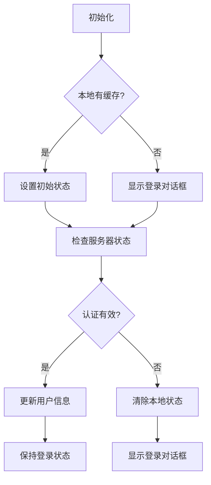
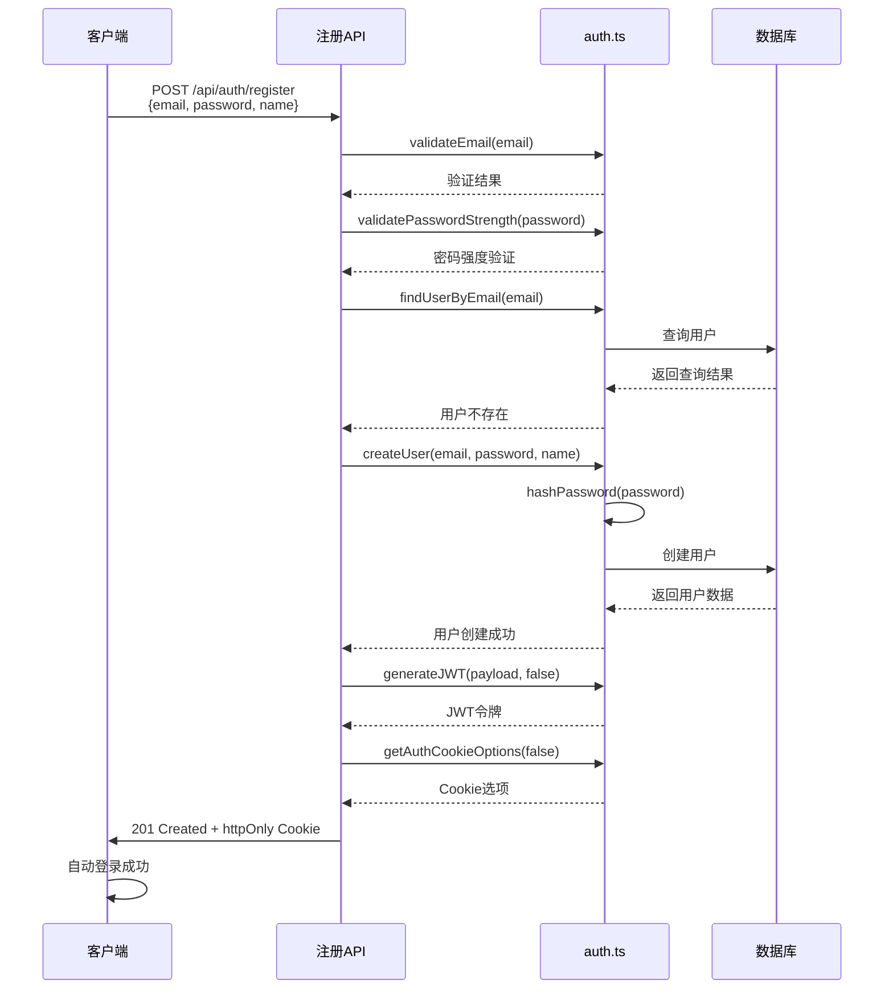
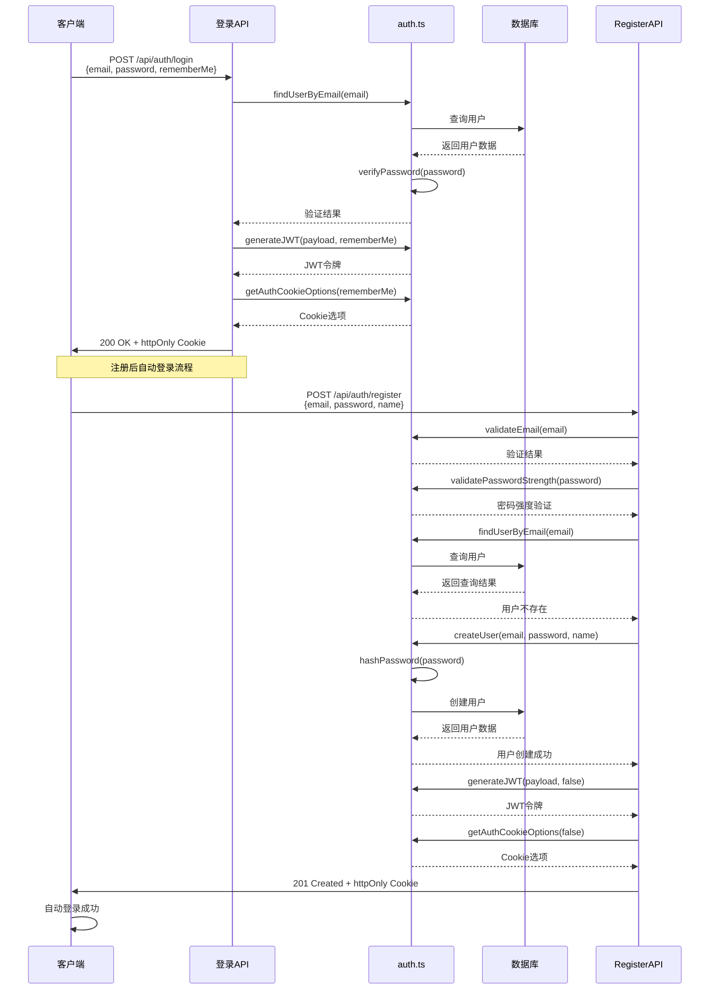
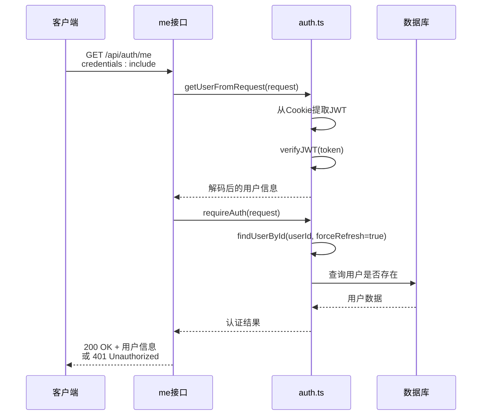
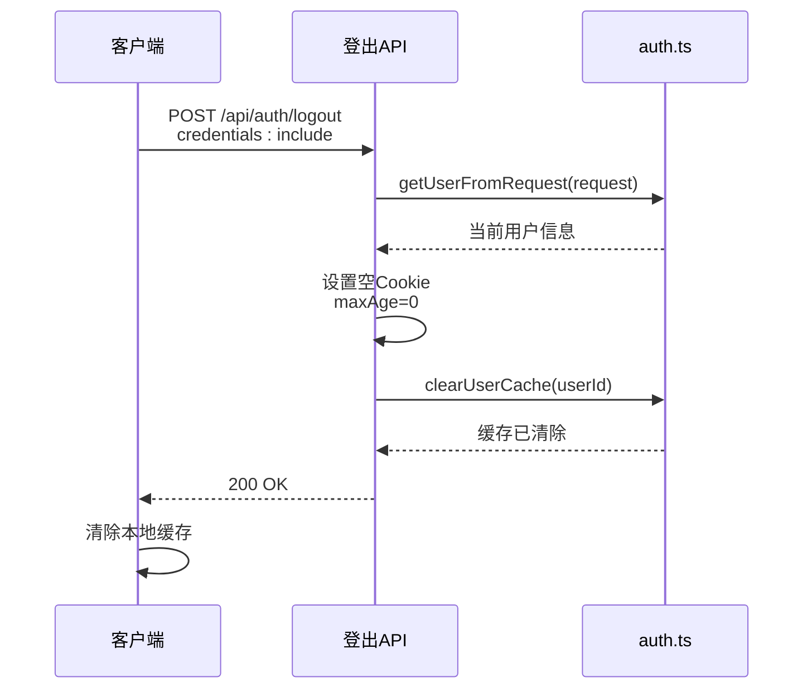
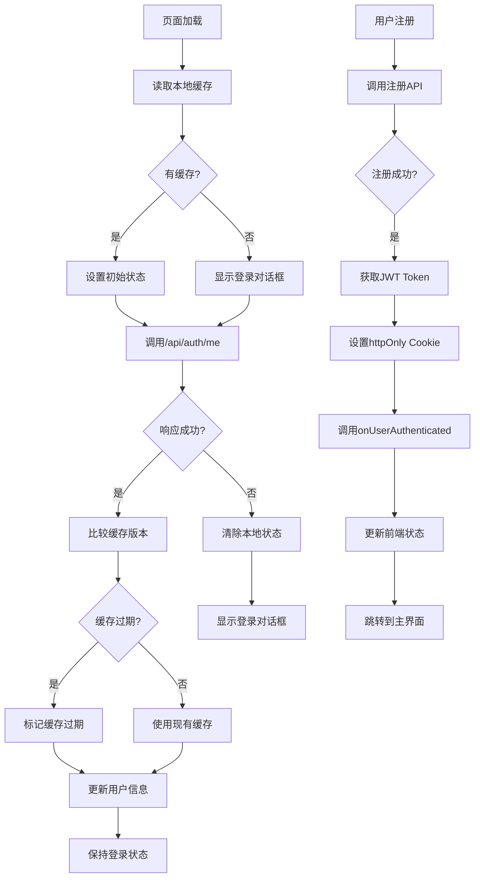
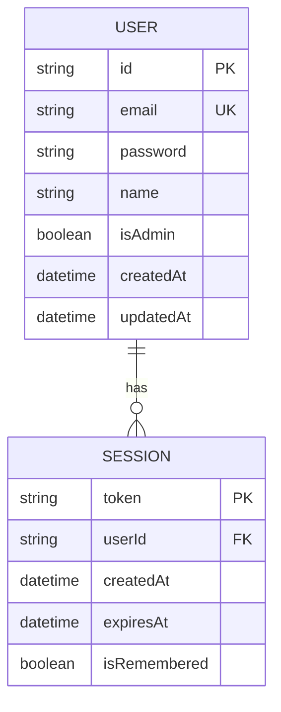

# 认证与会话管理

<cite>
**本文档中引用的文件**
- [auth.ts](file://lib/auth.ts)
- [README-AUTH.md](file://documents/README-AUTH.md)
- [use-auth-state.ts](file://hooks/use-auth-state.ts)
- [route.ts](file://app/api/auth/login/route.ts)
- [route.ts](file://app/api/auth/me/route.ts)
- [route.ts](file://app/api/auth/logout/route.ts)
- [route.ts](file://app/api/auth/register/route.ts) - *注册后自动登录功能更新*
- [auth-dialog.tsx](file://components/auth-dialog.tsx) - *前端注册流程更新*
</cite>

## 更新摘要
**主要变更**
- 新增注册后自动登录功能的详细说明
- 更新核心组件分析，增加注册流程相关内容
- 扩展登录流程详解，包含注册后自动登录的完整序列图
- 更新前端状态同步机制，说明注册后状态处理
- 修订安全性实践，补充注册流程相关安全措施

## 目录
1. [简介](#简介)
2. [认证机制概述](#认证机制概述)
3. [核心组件分析](#核心组件分析)
4. [登录流程详解](#登录流程详解)
5. [用户信息获取（me接口）](#用户信息获取me接口)
6. [登出与Cookie清除策略](#登出与cookie清除策略)
7. [前端状态同步机制](#前端状态同步机制)
8. [安全性实践](#安全性实践)
9. [设计决策依据](#设计决策依据)

## 简介
本系统实现了一套基于JWT和httpOnly Cookie的安全身份认证机制，支持用户注册、登录、会话管理和权限控制。通过后端API与前端Hook的协同工作，确保了用户体验与安全性的平衡。最新版本增加了注册后自动登录功能，优化了新用户注册体验。

## 认证机制概述
系统采用邮箱密码认证方式，结合JWT令牌和httpOnly Cookie进行会话管理。用户登录后，服务端签发JWT令牌并存储于httpOnly Cookie中，防止XSS攻击。同时支持"记住我"功能，可选择长期或短期会话。新增的注册后自动登录功能在用户成功注册后立即建立会话，无需二次登录。

**Section sources**
- [README-AUTH.md](file://documents/README-AUTH.md#L1-L20)

## 核心组件分析

### 后端认证工具函数
`lib/auth.ts` 文件封装了完整的认证辅助函数和中间件逻辑，包括密码哈希、JWT生成与验证、用户查找等功能。

```mermaid
classDiagram
class AuthUtils {
+hashPassword(password) Promise~string~
+verifyPassword(password, hashed) Promise~boolean~
+validatePasswordStrength(password) {isValid, errors}
+generateJWT(payload, rememberMe) string
+verifyJWT(token) JWTPayload | null
+getUserFromRequest(request) JWTPayload | null
+findUserByEmail(email) Promise~UserWithPassword | null~
+findUserById(id, options) Promise~User | null~
+requireAuth(request) Promise~{user, error}~
+getAuthCookieOptions(rememberMe) CookieOptions
+createUser(email, password, name, isAdmin) Promise~User | null~
}
class User {
+id : string
+email : string
+name? : string | null
+isAdmin : boolean
+createdAt : Date
+updatedAt : Date
}
class JWTPayload {
+userId : string
+email : string
+isAdmin : boolean
+iat? : number
+exp? : number
}
AuthUtils --> User : "操作"
AuthUtils --> JWTPayload : "生成/验证"
```

**Diagram sources**
- [auth.ts](file://lib/auth.ts#L1-L417)

**Section sources**
- [auth.ts](file://lib/auth.ts#L1-L417)

### 前端认证状态管理
`use-auth-state.ts` Hook实现了前端认证状态的统一管理，包含用户信息缓存、自动刷新、登出处理等逻辑。



**Diagram sources**
- [use-auth-state.ts](file://hooks/use-auth-state.ts#L1-L259)

**Section sources**
- [use-auth-state.ts](file://hooks/use-auth-state.ts#L1-L259)

### 注册流程组件
`auth-dialog.tsx` 组件实现了用户注册界面和逻辑，包含表单验证、密码强度检测和自动登录功能。



**Diagram sources**
- [route.ts](file://app/api/auth/register/route.ts#L1-L88)
- [auth-dialog.tsx](file://components/auth-dialog.tsx#L154-L192)

**Section sources**
- [route.ts](file://app/api/auth/register/route.ts#L1-L88)
- [auth-dialog.tsx](file://components/auth-dialog.tsx#L154-L192)

## 登录流程详解
登录接口首先验证用户凭证，然后签发安全令牌并通过httpOnly Cookie返回给客户端。同时，注册接口也实现了自动登录功能，为新用户提供无缝体验。



**Diagram sources**
- [route.ts](file://app/api/auth/login/route.ts#L1-L75)
- [auth.ts](file://lib/auth.ts#L201-L245)
- [route.ts](file://app/api/auth/register/route.ts#L1-L88)
- [auth-dialog.tsx](file://components/auth-dialog.tsx#L154-L192)

**Section sources**
- [route.ts](file://app/api/auth/login/route.ts#L1-L75)
- [auth.ts](file://lib/auth.ts#L201-L245)
- [route.ts](file://app/api/auth/register/route.ts#L1-L88)
- [auth-dialog.tsx](file://components/auth-dialog.tsx#L154-L192)

## 用户信息获取（me接口）
`/api/auth/me` 接口负责解析Token并返回当前用户信息，同时验证用户是否存在。



**Diagram sources**
- [route.ts](file://app/api/auth/me/route.ts#L1-L50)
- [auth.ts](file://lib/auth.ts#L225-L278)

**Section sources**
- [route.ts](file://app/api/auth/me/route.ts#L1-L50)
- [auth.ts](file://lib/auth.ts#L225-L278)

## 登出与Cookie清除策略
登出时需要清除客户端Cookie和服务器端缓存，确保会话完全终止。



**Diagram sources**
- [route.ts](file://app/api/auth/logout/route.ts#L1-L37)
- [auth.ts](file://lib/auth.ts#L131-L141)

**Section sources**
- [route.ts](file://app/api/auth/logout/route.ts#L1-L37)
- [auth.ts](file://lib/auth.ts#L131-L141)

## 前端状态同步机制
`use-auth-state` Hook通过定期检查认证状态，实现前后端状态的同步。在注册后自动登录场景下，前端通过`onUserAuthenticated`回调立即更新状态。



**Diagram sources**
- [use-auth-state.ts](file://hooks/use-auth-state.ts#L85-L257)
- [auth-dialog.tsx](file://components/auth-dialog.tsx#L154-L192)

**Section sources**
- [use-auth-state.ts](file://hooks/use-auth-state.ts#L85-L257)
- [auth-dialog.tsx](file://components/auth-dialog.tsx#L154-L192)

## 安全性实践

### Token过期处理
系统实现了两种会话有效期策略：
- 普通登录：24小时过期
- 记住我：无固定过期时间
- 注册后登录：24小时过期（默认不勾选"记住我"）

当Token过期时，前端会自动检测并引导用户重新登录。

### CSRF攻击防护
通过以下措施防止CSRF攻击：
- 使用httpOnly Cookie存储Token，防止JavaScript访问
- 设置SameSite=Lax属性
- 敏感操作要求重新认证
- 注册流程包含邮箱格式验证和密码强度检查

### 敏感信息保护
- 密码使用bcryptjs进行哈希加密（salt rounds=12）
- JWT密钥通过环境变量配置
- 用户敏感信息在传输过程中加密
- 注册时对密码进行强度验证，确保账户安全

**Section sources**
- [README-AUTH.md](file://documents/README-AUTH.md#L145-L173)
- [auth.ts](file://lib/auth.ts#L1-L417)
- [route.ts](file://app/api/auth/register/route.ts#L1-L88)

## 设计决策依据
根据`README-AUTH.md`中的设计说明，本认证系统的设计考虑了安全性、可用性和维护性的平衡。新增的注册后自动登录功能旨在提升新用户注册体验，减少操作步骤。



**Diagram sources**
- [README-AUTH.md](file://documents/README-AUTH.md#L60-L75)

**Section sources**
- [README-AUTH.md](file://documents/README-AUTH.md#L1-L174)