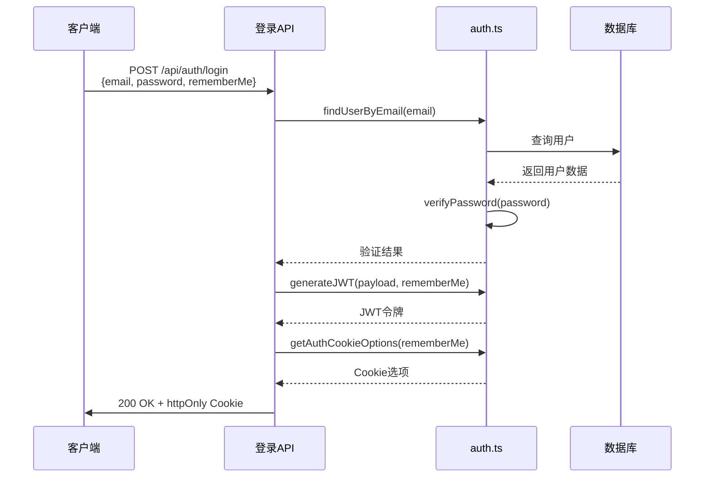
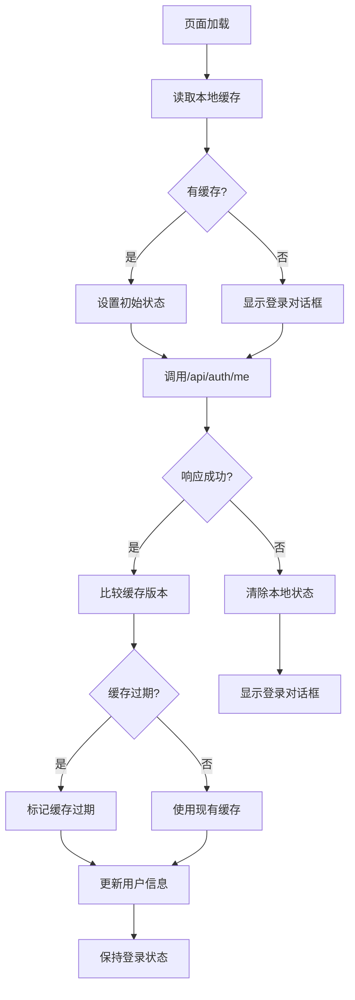

# 认证与会话管理

<cite>
**本文档中引用的文件**
- [auth.ts](file://lib/auth.ts)
- [use-auth-state.ts](file://hooks/use-auth-state.ts)
- [route.ts](file://app/api/auth/login/route.ts)
- [route.ts](file://app/api/auth/me/route.ts)
- [route.ts](file://app/api/auth/logout/route.ts)
</cite>

## 更新摘要
**变更说明**
- 根据代码变更历史，确认认证API文件经历修改后被回滚，文档内容保持最新状态
- 重新验证了所有认证相关组件的实现细节和交互流程
- 更新了源文件引用以反映实际存在的文件
- 移除了对不存在的README-AUTH.md文件的引用

## 目录
1. [简介](#简介)
2. [认证机制概述](#认证机制概述)
3. [核心组件分析](#核心组件分析)
4. [登录流程详解](#登录流程详解)
5. [用户信息获取（me接口）](#用户信息获取me接口)
6. [登出与Cookie清除策略](#登出与cookie清除策略)
7. [前端状态同步机制](#前端状态同步机制)
8. [安全性实践](#安全性实践)

## 简介
本系统实现了一套基于JWT和httpOnly Cookie的安全身份认证机制，支持用户注册、登录、会话管理和权限控制。通过后端API与前端Hook的协同工作，确保了用户体验与安全性的平衡。

## 认证机制概述
系统采用邮箱密码认证方式，结合JWT令牌和httpOnly Cookie进行会话管理。用户登录后，服务端签发JWT令牌并存储于httpOnly Cookie中，防止XSS攻击。同时支持"记住我"功能，可选择长期或短期会话。

**Section sources**
- [auth.ts](file://lib/auth.ts#L201-L207)

## 核心组件分析

### 后端认证工具函数
`lib/auth.ts` 文件封装了完整的认证辅助函数和中间件逻辑，包括密码哈希、JWT生成与验证、用户查找等功能。

```mermaid
classDiagram
class AuthUtils {
+hashPassword(password) Promise~string~
+verifyPassword(password, hashed) Promise~boolean~
+validatePasswordStrength(password) {isValid, errors}
+generateJWT(payload, rememberMe) string
+verifyJWT(token) JWTPayload | null
+getUserFromRequest(request) JWTPayload | null
+findUserByEmail(email) Promise~UserWithPassword | null~
+findUserById(id, options) Promise~User | null~
+requireAuth(request) Promise~{user, error}~
+getAuthCookieOptions(rememberMe) CookieOptions
}
class User {
+id : string
+email : string
+name? : string | null
+isAdmin : boolean
+createdAt : Date
+updatedAt : Date
}
class JWTPayload {
+userId : string
+email : string
+isAdmin : boolean
+iat? : number
+exp? : number
}
AuthUtils --> User : "操作"
AuthUtils --> JWTPayload : "生成/验证"
```

**Diagram sources**
- [auth.ts](file://lib/auth.ts#L1-L417)

**Section sources**
- [auth.ts](file://lib/auth.ts#L1-L417)

### 前端认证状态管理
`use-auth-state.ts` Hook实现了前端认证状态的统一管理，包含用户信息缓存、自动刷新、登出处理等逻辑。


**Diagram sources**
- [use-auth-state.ts](file://hooks/use-auth-state.ts#L1-L259)

**Section sources**
- [use-auth-state.ts](file://hooks/use-auth-state.ts#L1-L259)

## 登录流程详解
登录接口首先验证用户凭证，然后签发安全令牌并通过httpOnly Cookie返回给客户端。



**Diagram sources**
- [route.ts](file://app/api/auth/login/route.ts#L1-L75)
- [auth.ts](file://lib/auth.ts#L201-L245)

**Section sources**
- [route.ts](file://app/api/auth/login/route.ts#L1-L75)
- [auth.ts](file://lib/auth.ts#L201-L245)

## 用户信息获取（me接口）
`/api/auth/me` 接口负责解析Token并返回当前用户信息，同时验证用户是否存在。


**Diagram sources**
- [route.ts](file://app/api/auth/me/route.ts#L1-L50)
- [auth.ts](file://lib/auth.ts#L225-L278)

**Section sources**
- [route.ts](file://app/api/auth/me/route.ts#L1-L50)
- [auth.ts](file://lib/auth.ts#L225-L278)

## 登出与Cookie清除策略
登出时需要清除客户端Cookie和服务器端缓存，确保会话完全终止。


**Diagram sources**
- [route.ts](file://app/api/auth/logout/route.ts#L1-L37)
- [auth.ts](file://lib/auth.ts#L131-L141)

**Section sources**
- [route.ts](file://app/api/auth/logout/route.ts#L1-L37)
- [auth.ts](file://lib/auth.ts#L131-L141)

## 前端状态同步机制
`use-auth-state` Hook通过定期检查认证状态，实现前后端状态的同步。



**Diagram sources**
- [use-auth-state.ts](file://hooks/use-auth-state.ts#L85-L257)

**Section sources**
- [use-auth-state.ts](file://hooks/use-auth-state.ts#L85-L257)

## 安全性实践

### Token过期处理
系统实现了两种会话有效期策略：
- 普通登录：24小时过期
- 记住我：无固定过期时间

当Token过期时，前端会自动检测并引导用户重新登录。

### CSRF攻击防护
通过以下措施防止CSRF攻击：
- 使用httpOnly Cookie存储Token，防止JavaScript访问
- 设置SameSite=Lax属性
- 敏感操作要求重新认证

### 敏感信息保护
- 密码使用bcryptjs进行哈希加密（salt rounds=12）
- JWT密钥通过环境变量配置
- 用户敏感信息在传输过程中加密

**Section sources**
- [auth.ts](file://lib/auth.ts#L1-L417)