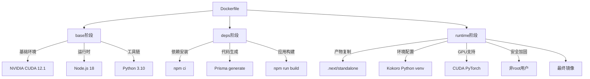
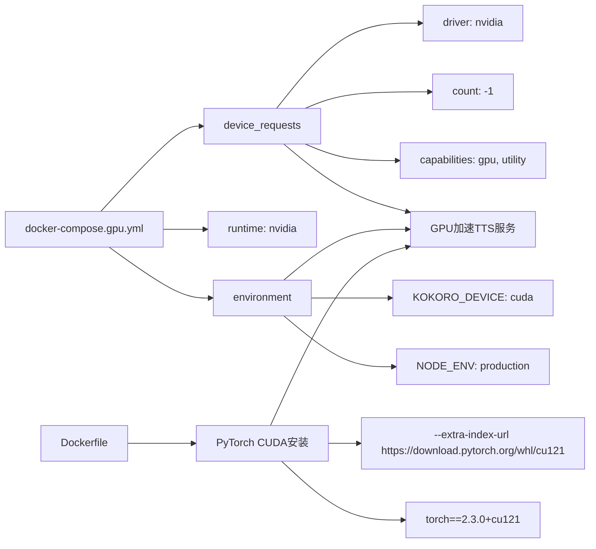

# 部署与运维

<cite>
**本文档引用文件**  
- [deploy.sh](file://scripts/deploy.sh)
- [health-check.sh](file://scripts/health-check.sh)
- [admin-server.mjs](file://admin-server.mjs)
- [restore.sh](file://scripts/restore.sh)
- [docker-compose.gpu.yml](file://docker-compose.gpu.yml)
- [Dockerfile](file://Dockerfile)
- [docker-compose.production.yml](file://docker-compose.production.yml)
</cite>

## 目录
1. [生产环境部署全流程](#生产环境部署全流程)
2. [Docker容器化打包与多阶段构建](#docker容器化打包与多阶段构建)
3. [GPU加速支持配置](#gpu加速支持配置)
4. [反向代理与Nginx集成](#反向代理与nginx集成)
5. [自动化部署脚本详解](#自动化部署脚本详解)
6. [服务健康监测机制](#服务健康监测机制)
7. [管理员服务器独立运行模式](#管理员服务器独立运行模式)
8. [容量规划建议](#容量规划建议)
9. [日志收集策略](#日志收集策略)
10. [备份恢复流程](#备份恢复流程)
11. [监控告警设置](#监控告警设置)

## 生产环境部署全流程

本节概述英语听力训练应用的完整生产环境部署流程，涵盖从代码准备到服务上线的各个关键步骤。部署采用Docker容器化方案，结合docker-compose进行服务编排，确保环境一致性与可重复性。

部署流程包括：代码检出、依赖安装、多阶段构建、数据库迁移、服务启动、健康检查和反向代理配置。整个过程可通过`deploy.sh`脚本实现自动化，支持初始部署、更新部署和回滚操作。

**Section sources**
- [deploy.sh](file://scripts/deploy.sh#L1-L704)
- [docker-compose.production.yml](file://docker-compose.production.yml#L1-L432)

## Docker容器化打包与多阶段构建

系统采用多阶段Docker构建策略优化镜像大小和安全性。Dockerfile定义了三个主要构建阶段：

1. **base阶段**：基于NVIDIA CUDA 12.1基础镜像，预装Node.js 18、Python 3.10工具链及系统依赖，为GPU支持奠定基础。
2. **deps阶段**：安装Node.js依赖包，生成Prisma客户端，并执行Next.js应用构建。
3. **runtime阶段**：复制构建产物，配置Kokoro TTS的Python虚拟环境，安装CUDA版本的PyTorch，并设置非特权用户运行时安全。

最终生成的运行时镜像仅包含必要组件，显著减小体积并提升安全性。通过`--chown=nextjs:nodejs`确保文件权限正确，使用`dumb-init`作为PID 1进程处理信号转发。



**Diagram sources**
- [Dockerfile](file://Dockerfile#L1-L137)

**Section sources**
- [Dockerfile](file://Dockerfile#L1-L137)

## GPU加速支持配置

为支持Kokoro TTS的GPU加速推理，系统提供了专用的GPU部署配置。`docker-compose.gpu.yml`文件定义了GPU资源的声明式配置。

在app服务中，通过`device_requests`字段请求所有可用的NVIDIA GPU设备，并指定`capabilities`为`gpu`和`utility`。同时设置`runtime: nvidia`确保容器使用NVIDIA运行时。环境变量`KOKORO_DEVICE: cuda`指示TTS服务使用CUDA后端。

构建过程中，runtime阶段会从PyTorch官方CUDA仓库安装`torch==2.3.0+cu121`等GPU版本的深度学习框架，确保与NVIDIA驱动兼容。健康检查机制确保服务在GPU初始化完成后才被视为就绪。



**Diagram sources**
- [docker-compose.gpu.yml](file://docker-compose.gpu.yml#L1-L126)
- [Dockerfile](file://Dockerfile#L1-L137)

**Section sources**
- [docker-compose.gpu.yml](file://docker-compose.gpu.yml#L1-L126)

## 反向代理与Nginx集成

生产环境采用Nginx作为反向代理和SSL终止点，提供HTTPS访问、负载均衡和静态文件服务。`docker-compose.production.yml`中定义了完整的Nginx服务配置。

Nginx服务监听80和443端口，将外部请求转发到内部app服务的3000端口。通过`nginx.conf`和`conf.d`目录下的配置文件实现虚拟主机、HTTP重定向到HTTPS、缓存策略和安全头设置。

SSL证书由Let's Encrypt提供，通过certbot容器自动申请和续期。证书存储在`nginx-certs`数据卷中，确保跨容器重启持久化。Nginx还充当静态文件服务器，直接提供音频等大文件，减轻应用服务器压力。

```mermaid
flowchart TD
Client[客户端浏览器] --> |HTTPS 443| Nginx[Nginx反向代理]
Client --> |HTTP 80| Nginx
Nginx --> |证书验证| Certbot[Certbot容器]
Certbot --> |证书存储| VolumeCerts[nginx-certs卷]
Nginx --> |反向代理| App[App容器:3000]
Nginx --> |静态文件服务| Audio[音频文件目录]
App --> |数据库访问| Redis[(Redis缓存)]
App --> |持久化存储| DB[(数据库文件)]
Backup[Backup容器] --> |定期备份| VolumeData[app-data卷]
Backup --> |压缩归档| VolumeBackup[backup-data卷]
Healthcheck[Healthcheck容器] --> |定时检测| App
subgraph "网络隔离"
App_Net[app-network]
Nginx_Net[nginx-network]
end
Nginx < --> App_Net
Nginx < --> Nginx_Net
```

**Diagram sources**
- [docker-compose.production.yml](file://docker-compose.production.yml#L1-L432)

**Section sources**
- [docker-compose.production.yml](file://docker-compose.production.yml#L1-L432)

## 自动化部署脚本详解

`deploy.sh`脚本实现了完整的自动化部署流程，支持三种部署模式：初始部署（--init）、更新部署（--update）和回滚部署（--rollback）。脚本具备完善的错误处理和事务性操作特性。

部署流程包括：环境检查、Git状态验证、应用停止、代码拉取、依赖安装、测试执行、应用构建、数据库迁移、TTS环境设置、应用启动和健康验证。每个步骤都有明确的成功/失败反馈，并记录到部署日志中。

脚本支持多种选项：`--no-backup`跳过备份，`--force`强制部署，`--skip-tests`跳过测试，`--skip-build`跳过构建。部署前会创建快照，部署失败时可自动回滚到之前状态。所有操作均有颜色编码的输出，便于运维人员监控。

**Section sources**
- [deploy.sh](file://scripts/deploy.sh#L1-L704)

## 服务健康监测机制

`health-check.sh`脚本提供了全面的系统健康检查功能，可用于日常巡检或CI/CD流水线中的质量门禁。脚本检查多个维度的系统状态并返回标准化结果。

健康检查包括：应用服务状态（端口监听、HTTP响应）、数据库完整性、TTS服务可用性、音频文件状态、系统资源使用率（CPU、内存、磁盘）、日志文件分析和网络连接。检查结果分为HEALTHY、WARNING和UNHEALTHY三种状态，对应不同的退出码。

脚本支持`--json`输出格式，便于与其他监控系统集成。`--alert`选项可在发现严重问题时触发告警通知。详细的检查项设计确保能及时发现潜在问题，如数据库WAL文件过大、磁盘空间不足或外部API连接异常。

**Section sources**
- [health-check.sh](file://scripts/health-check.sh#L1-L567)

## 管理员服务器独立运行模式

`admin-server.mjs`文件定义了管理员接口的独立服务器，允许将管理功能与主应用分离部署。该服务器使用Next.js的自定义服务器功能，仅暴露/admin及相关API路径。

服务器绑定到3005端口（可通过PORT环境变量配置），通过路由过滤确保只有管理员相关路径可访问。根路径请求会被重定向到/admin。这种设计增强了安全性，可对管理接口实施更严格的访问控制和监控。

独立运行模式便于实施差异化的安全策略，如IP白名单、额外的身份验证层或独立的资源配额。管理员服务器与主应用共享相同的代码库和数据存储，确保功能一致性，但可以独立伸缩和维护。

**Section sources**
- [admin-server.mjs](file://admin-server.mjs#L1-L55)

## 容量规划建议

根据应用特性和预期负载，提出以下容量规划建议：

- **计算资源**：推荐至少2核CPU和2GB内存的基础配置。若启用GPU加速，需配备支持CUDA的NVIDIA显卡（如Tesla P40）及相应驱动。
- **存储空间**：除操作系统和应用本身外，需预留充足空间存储用户练习数据和音频文件。建议SSD存储以保证I/O性能，特别是数据库读写密集场景。
- **网络带宽**：考虑音频文件传输需求，确保足够的上行带宽。对于高并发场景，建议100Mbps以上专线连接。
- **数据库扩展**：当前使用SQLite适合中小规模部署。用户量超过1万或并发超过100时，建议迁移到PostgreSQL等专业数据库，利用redis-profile启用Redis缓存。
- **备份策略**：每日增量备份，每周全量备份。备份数据保留至少4周，异地保存至少1份副本。

**Section sources**
- [docker-compose.production.yml](file://docker-compose.production.yml#L1-L432)

## 日志收集策略

系统采用分层日志收集策略，确保问题可追溯且不影响性能：

- **应用日志**：通过标准输出和`logs/app.log`文件记录，包含请求日志、业务逻辑和错误堆栈。使用PM2或Docker的日志驱动进行轮转和归档。
- **错误日志**：专门的`error.log`文件捕获严重错误，便于快速定位问题。健康检查脚本会监控此文件的近期错误数量。
- **访问日志**：Nginx记录所有HTTP请求，包括客户端IP、请求路径、响应码和处理时间，用于流量分析和安全审计。
- **操作日志**：`deployments.log`记录每次部署的详细信息，`health.log`存储周期性健康检查结果。
- **日志轮转**：通过logrotate容器每天检查日志大小，超过100MB的文件会被截断，防止磁盘耗尽。

所有日志均挂载到持久化数据卷，可通过`docker logs`命令或直接文件访问进行分析。

**Section sources**
- [docker-compose.production.yml](file://docker-compose.production.yml#L1-L432)

## 备份恢复流程

`restore.sh`脚本实现了安全的数据恢复流程，