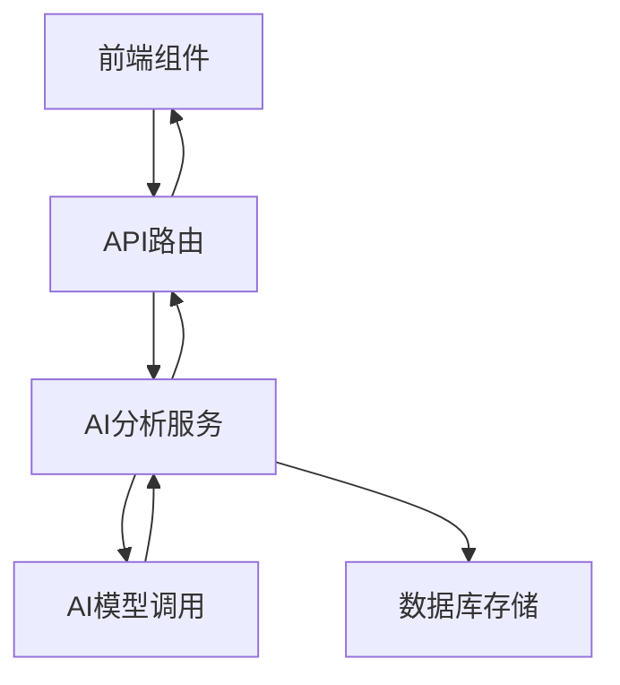
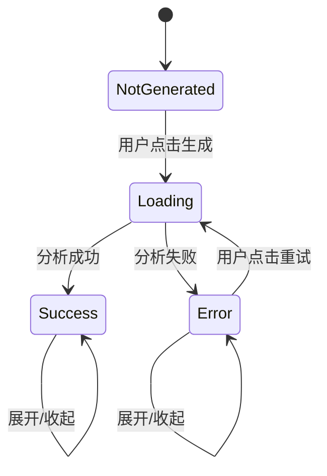
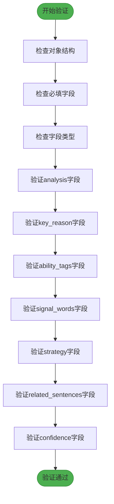
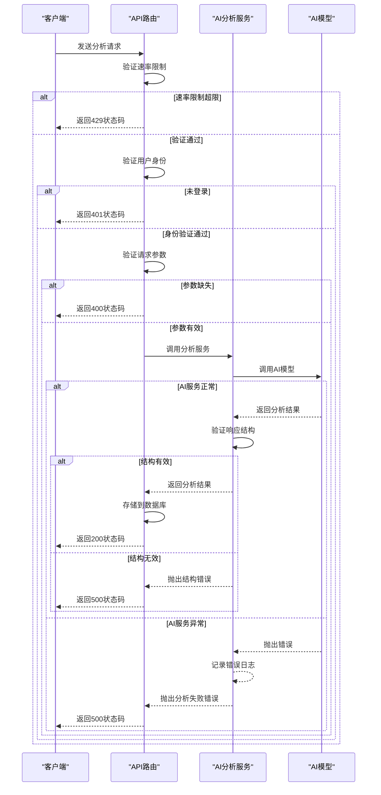
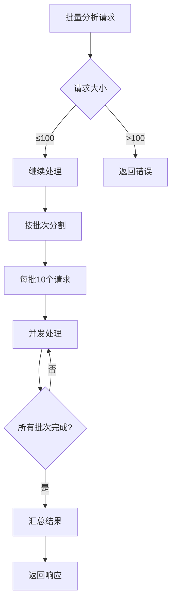

# 错题AI分析功能

<cite>
**本文档引用文件**  
- [ai-analysis-service.ts](file://lib/ai-analysis-service.ts)
- [WRONG-ANSWERS-AI-SPEC.md](file://documents/WRONG-ANSWERS-AI-SPEC.md)
- [analyze/route.ts](file://app/api/ai/wrong-answers/analyze/route.ts)
- [analyze-batch/route.ts](file://app/api/ai/wrong-answers/analyze-batch/route.ts)
- [ai-analysis-card.tsx](file://components/ai-analysis-card.tsx)
- [ai-analysis-example.ts](file://lib/ai-analysis-example.ts)
</cite>

## 目录
1. [功能概述](#功能概述)
2. [核心架构与实现](#核心架构与实现)
3. [API接口说明](#api接口说明)
4. [前端组件与用户交互](#前端组件与用户交互)
5. [数据结构与JSON Schema](#数据结构与json-schema)
6. [错误处理与容错机制](#错误处理与容错机制)
7. [性能优化与并发控制](#性能优化与并发控制)
8. [实际应用示例](#实际应用示例)
9. [故障排查指南](#故障排查指南)
10. [总结与最佳实践](#总结与最佳实践)

## 功能概述

错题AI分析功能旨在为用户提供针对听力练习中错误答案的深度中文解析。系统通过AI模型分析学生答题情况，识别错误原因，并提供改进建议，帮助用户提升听力理解能力。

该功能支持单题分析与批量分析两种模式，具备完整的错误处理、速率限制和电路断路器机制，确保服务稳定可靠。分析结果包含详细解析、核心错误原因、能力标签、关键信号词、答题策略等多维度信息，全面支持学习反馈。

**Section sources**
- [WRONG-ANSWERS-AI-SPEC.md](file://documents/WRONG-ANSWERS-AI-SPEC.md#L1-L20)

## 核心架构与实现

错题AI分析功能采用分层架构设计，包含前端组件、API路由、业务服务和AI调用四层。整体流程如下：



**Diagram sources**
- [ai-analysis-service.ts](file://lib/ai-analysis-service.ts#L5-L323)
- [analyze/route.ts](file://app/api/ai/wrong-answers/analyze/route.ts#L1-L251)

**Section sources**
- [ai-analysis-service.ts](file://lib/ai-analysis-service.ts#L5-L323)
- [analyze/route.ts](file://app/api/ai/wrong-answers/analyze/route.ts#L1-L251)

## API接口说明

### 单题分析接口

**端点**: `POST /api/ai/wrong-answers/analyze`

**请求体结构**:
```json
{
  "questionId": "题目ID",
  "answerId": "答案ID",
  "questionType": "题型",
  "question": "题干",
  "options": ["选项A", "选项B"],
  "userAnswer": "用户答案",
  "correctAnswer": "正确答案",
  "transcript": "听力原文",
  "exerciseTopic": "练习主题",
  "exerciseDifficulty": "难度等级",
  "language": "语言",
  "attemptedAt": "答题时间"
}
```

**响应结构**:
```json
{
  "success": true,
  "analysis": {
    "analysis": "详细解析",
    "key_reason": "核心错误原因",
    "ability_tags": ["能力标签"],
    "signal_words": ["关键信号词"],
    "strategy": "答题策略",
    "related_sentences": [
      {
        "quote": "相关句子",
        "comment": "解释说明"
      }
    ],
    "confidence": "high"
  }
}
```

**状态码**:
- `200`: 分析成功
- `400`: 请求参数缺失
- `401`: 未登录
- `404`: 答案不存在
- `429`: 超出速率限制
- `500`: 服务器错误
- `503`: AI服务不可用

### 批量分析接口

**端点**: `POST /api/ai/wrong-answers/analyze-batch`

**请求体结构**:
```json
{
  "answerIds": ["答案ID1", "答案ID2"]
}
```

**响应结构**:
```json
{
  "success": [
    {
      "answerId": "答案ID",
      "analysis": "分析结果"
    }
  ],
  "failed": [
    {
      "answerId": "答案ID",
      "error": "错误信息"
    }
  ],
  "summary": {
    "total": 2,
    "successful": 1,
    "failed": 1
  }
}
```

**并发限制**: 最多同时处理100个答案，每批处理10个以避免AI服务过载。

**Section sources**
- [analyze/route.ts](file://app/api/ai/wrong-answers/analyze/route.ts#L1-L251)
- [analyze-batch/route.ts](file://app/api/ai/wrong-answers/analyze-batch/route.ts#L1-L341)

## 前端组件与用户交互

### AI分析卡片组件

`AIAnalysisCard` 组件负责展示错题的AI分析结果，支持多种状态显示：



**状态说明**:
- **未生成**: 显示"生成解析"按钮
- **加载中**: 显示旋转加载动画
- **成功**: 显示分析结果，可展开/收起
- **失败**: 显示错误信息和重试按钮

**交互功能**:
- 生成解析: 触发单题分析API
- 重试: 重新调用分析API
- 展开/收起: 切换分析内容显示状态

**Section sources**
- [ai-analysis-card.tsx](file://components/ai-analysis-card.tsx#L1-L307)

## 数据结构与JSON Schema

### 分析请求接口

```typescript
interface AnalysisRequest {
  questionType: string
  question: string
  options?: string[]
  userAnswer: string
  correctAnswer: string
  transcript: string
  exerciseTopic: string
  exerciseDifficulty: string
  language: string
  attemptedAt: string
}
```

### 分析响应接口

```typescript
interface AnalysisResponse {
  analysis: string
  key_reason: string
  ability_tags: string[]
  signal_words: string[]
  strategy: string
  related_sentences: RelatedSentence[]
  confidence: 'high' | 'medium' | 'low'
}

interface RelatedSentence {
  quote: string
  comment: string
}
```

### JSON Schema验证规则



**验证要求**:
- `analysis`: 字符串，长度至少50字符
- `key_reason`: 非空字符串
- `ability_tags`: 字符串数组
- `signal_words`: 字符串数组
- `strategy`: 非空字符串
- `related_sentences`: 对象数组，每个对象包含`quote`和`comment`
- `confidence`: 枚举值 `high`、`medium`、`low`

**Section sources**
- [ai-analysis-service.ts](file://lib/ai-analysis-service.ts#L5-L31)
- [ai-analysis-service.ts](file://lib/ai-analysis-service.ts#L218-L278)

## 错误处理与容错机制

### 错误处理流程



### 容错机制

1. **电路断路器**: 当AI服务连续失败达到阈值时，自动进入断开状态，避免雪崩效应
2. **重试机制**: 分析请求最多重试3次
3. **速率限制**: 基于用户ID的速率限制，防止滥用
4. **输入验证**: 严格验证请求参数和响应结构
5. **错误日志**: 记录所有错误信息用于排查

**Section sources**
- [analyze/route.ts](file://app/api/ai/wrong-answers/analyze/route.ts#L1-L251)
- [ai-analysis-service.ts](file://lib/ai-analysis-service.ts#L181-L213)

## 性能优化与并发控制

### 并发控制策略



### 性能优化措施

1. **批量处理**: 支持批量分析，减少网络开销
2. **并发限制**: 限制最大并发请求数，保护AI服务
3. **缓存机制**: 分析结果存储在数据库，避免重复计算
4. **连接池**: 数据库操作使用连接池
5. **流式处理**: 大数据量时采用流式处理

**Section sources**
- [ai-analysis-service.ts](file://lib/ai-analysis-service.ts#L283-L323)
- [analyze-batch/route.ts](file://app/api/ai/wrong-answers/analyze-batch/route.ts#L1-L341)

## 实际应用示例

### 单题分析示例

```typescript
import { analyzeWrongAnswer } from '@/lib/ai-analysis-service'

const request = {
  questionType: 'single',
  question: 'What is the main topic of the conversation?',
  options: [
    'Travel plans',
    'Work schedule', 
    'Weather forecast',
    'Restaurant review'
  ],
  userAnswer: 'Weather forecast',
  correctAnswer: 'Travel plans',
  transcript: `A: Are you ready for our trip to Paris next week? ...`,
  exerciseTopic: 'Travel and Tourism',
  exerciseDifficulty: 'B1',
  language: 'en-US',
  attemptedAt: '2024-01-15T10:30:00Z'
}

try {
  const result = await analyzeWrongAnswer(request)
  console.log('分析结果:', result)
} catch (error) {
  console.error('分析失败:', error)
}
```

### 批量分析示例

```typescript
import { batchAnalyzeWrongAnswers } from '@/lib/ai-analysis-service'

const requests = [
  // 多个分析请求
]

const result = await batchAnalyzeWrongAnswers(requests)
console.log('成功:', result.success.length)
console.log('失败:', result.failed.length)
```

**Section sources**
- [ai-analysis-example.ts](file://lib/ai-analysis-example.ts#L8-L83)

## 故障排查指南

### 常见问题及解决方案

| 问题现象 | 可能原因 | 解决方案 |
|---------|---------|---------|
| 分析请求返回429状态码 | 超出速率限制 | 等待一段时间后重试 |
| 分析请求返回503状态码 | AI服务暂时不可用 | 检查电路断路器状态，稍后重试 |
| 分析结果为空 | 响应结构验证失败 | 检查AI模型输出是否符合JSON Schema |
| 数据库存储失败 | 数据库连接问题 | 检查数据库状态和连接配置 |
| 批量分析部分失败 | 个别请求处理失败 | 检查失败项的具体错误信息 |

### 调试步骤

1. **检查请求参数**: 确保所有必填字段都已提供
2. **验证用户身份**: 确保请求包含有效的认证信息
3. **查看日志**: 检查服务器端错误日志
4. **测试AI连接**: 验证AI服务是否正常响应
5. **检查数据库**: 确认数据库连接和表结构正常

**Section sources**
- [WRONG-ANSWERS-AI-SPEC.md](file://documents/WRONG-ANSWERS-AI-SPEC.md#L1-L182)
- [analyze/route.ts](file://app/api/ai/wrong-answers/analyze/route.ts#L1-L251)

## 总结与最佳实践

错题AI分析功能通过系统化的架构设计和严谨的实现，为用户提供高质量的错题解析服务。该功能不仅提升了学习体验，还通过多种容错机制确保了系统的稳定性。

### 最佳实践建议

1. **合理使用批量分析**: 避免一次性发送过多请求
2. **处理速率限制**: 在客户端实现速率限制的友好提示
3. **错误重试策略**: 对临时性错误实现指数退避重试
4. **结果缓存**: 充分利用已有的分析结果，避免重复计算
5. **用户反馈**: 收集用户对分析结果的反馈，持续优化AI模型

该功能的设计充分考虑了可扩展性、可靠性和用户体验，为听力练习提供了有力的支持。

**Section sources**
- [WRONG-ANSWERS-AI-SPEC.md](file://documents/WRONG-ANSWERS-AI-SPEC.md#L1-L182)
- [ai-analysis-service.ts](file://lib/ai-analysis-service.ts#L5-L323)