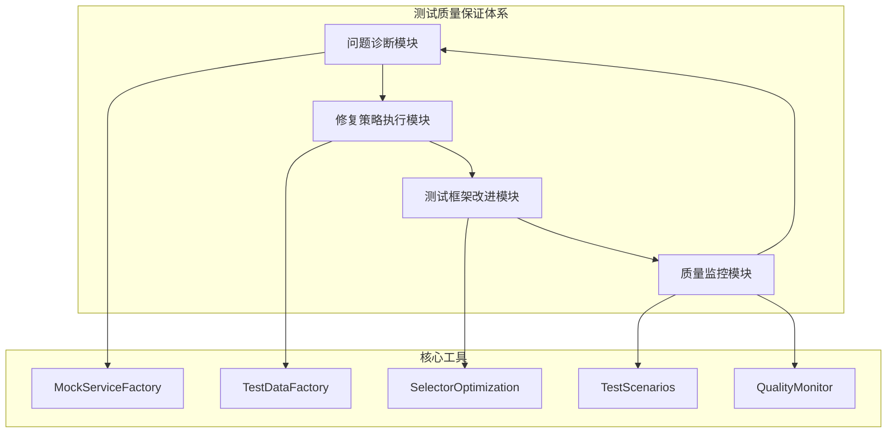

# 英语听力训练应用测试质量保证体系

## 概述

本测试体系基于项目设计文档实施，提供了系统性的测试解决方案，包含测试问题诊断、修复策略执行、测试框架改进和质量监控四个核心模块。

## 架构概述



## 目录结构

```
__tests__/
├── components/                    # 组件测试
│   ├── wrong-answers-book-refactored.test.tsx
│   ├── export-functionality.test.tsx
│   └── batch-analysis.test.tsx
├── utils/                        # 测试工具
│   ├── mock-service-factory.ts   # Mock服务工厂
│   ├── test-data-factory.ts      # 测试数据工厂
│   ├── test-scenarios.ts         # 测试场景模板
│   ├── selector-optimization.ts  # 选择器优化
│   └── test-quality-monitor.ts   # 质量监控
└── README.md                     # 本文档
```

## 核心组件

### 1. Mock服务标准化框架

**位置**: `utils/mock-service-factory.ts`

**功能**: 统一管理所有测试Mock配置

**主要类**:
- `MockServiceFactory`: Mock服务工厂主类
- `ApiMockProvider`: API Mock提供者
- `HookMockProvider`: Hook Mock提供者
- `ServiceMockProvider`: 服务Mock提供者

**使用示例**:
```typescript
import { MockServiceFactory } from '@/__tests__/utils/mock-service-factory'

const mockServiceFactory = MockServiceFactory.getInstance()

// 配置错题本测试环境
mockServiceFactory.createWrongAnswersBookTestEnv({
  wrongAnswers: testData,
  exportConfig: { shouldFail: false },
  batchProcessingState: { isProcessing: false }
})
```

### 2. 测试数据工厂模式

**位置**: `utils/test-data-factory.ts`

**功能**: 提供可预测的测试数据生成

**主要工厂类**:
- `SessionFactory`: Session数据工厂
- `QuestionFactory`: Question数据工厂  
- `AIAnalysisFactory`: AI分析数据工厂
- `AnswerFactory`: Answer数据工厂
- `WrongAnswerItemFactory`: 错题数据工厂
- `TestScenarioFactory`: 测试场景工厂

**使用示例**:
```typescript
import { WrongAnswerItemFactory, createTestScenario } from '@/__tests__/utils/test-data-factory'

// 创建需要AI分析的错题
const needsAnalysis = WrongAnswerItemFactory.createNeedsAnalysis()

// 创建已有AI分析的错题
const withAnalysis = WrongAnswerItemFactory.createWithAnalysis()

// 创建标准显示场景
const testData = createTestScenario.createStandardDisplayScenario()
```

### 3. 元素选择器优化策略

**位置**: `utils/selector-optimization.ts`

**功能**: 解决元素查找歧义问题，实施data-testid标准

**选择器优先级**:
1. `data-testid` (最高优先级)
2. 语义角色 (role + accessible name)
3. 标签文本 (label关联)
4. 文本内容 (最低优先级)

**使用示例**:
```typescript
import { Selector, TestIds } from '@/__tests__/utils/selector-optimization'

// 查找导出按钮（解决歧义问题）
const exportButton = Selector.findExportButton()

// 查找答案比较区域
const { yourAnswer, correctAnswer } = Selector.findAnswerComparison(0)

// 使用标准化TestID
expect(screen.getByTestId(TestIds.BATCH_ANALYSIS_BUTTON)).toBeInTheDocument()
```

### 4. 测试场景模板库

**位置**: `utils/test-scenarios.ts`

**功能**: 提供标准化的测试场景模板

**场景类型**:
- `LoadingScenarioTemplate`: 加载状态场景
- `ErrorScenarioTemplate`: 错误处理场景  
- `DataDisplayScenarioTemplate`: 数据展示场景
- `InteractionScenarioTemplate`: 交互场景
- `PerformanceScenarioTemplate`: 性能测试场景

**使用示例**:
```typescript
import { loadingScenarios, errorScenarios } from '@/__tests__/utils/test-scenarios'

// 创建初始加载场景
const loadingScenario = loadingScenarios.createInitialLoading()

// 创建网络错误场景
const errorScenario = errorScenarios.createNetworkError()
```

### 5. 测试质量监控体系

**位置**: `utils/test-quality-monitor.ts`

**功能**: 覆盖率监控、质量门禁、性能优化

**主要功能**:
- 自动化测试执行
- 覆盖率报告生成
- 质量问题分析
- 改进建议生成
- 趋势分析

**使用示例**:
```typescript
import { createQualityMonitor } from '@/__tests__/utils/test-quality-monitor'

const monitor = createQualityMonitor({
  coverage: {
    lines: 85,
    branches: 80,
    functions: 90,
    statements: 85
  }
})

const report = await monitor.runQualityCheck()
```

## 测试执行指南

### 运行所有测试

```bash
# 运行所有测试
npm run test

# 运行测试并生成覆盖率报告
npm run test:coverage

# 运行质量检查
npm run quality-check
```

### 运行特定测试

```bash
# 运行组件测试
npm run test -- components/

# 运行特定测试文件
npm run test -- wrong-answers-book

# 监听模式运行测试
npm run test:watch
```

### 调试测试

```bash
# 详细输出模式
npm run test -- --reporter=verbose

# 仅运行失败的测试
npm run test -- --reporter=verbose --run

# 生成HTML报告
npm run test -- --reporter=html
```

## 质量标准

### 覆盖率要求

| 指标类型 | 目标值 | 最低要求 |
|----------|--------|----------|
| 行覆盖率 | >90% | >85% |
| 分支覆盖率 | >85% | >80% |
| 函数覆盖率 | >95% | >90% |
| 语句覆盖率 | >90% | >85% |

### 性能要求

- 单个测试文件执行时间 < 30秒
- 全部测试执行时间 < 5分钟
- 并行度: 最大4个线程

### 质量门禁

测试必须满足以下条件才能通过质量门禁:

1. ✅ 所有测试用例通过
2. ✅ 覆盖率达到要求阈值
3. ✅ 无关键质量问题
4. ✅ 执行时间在限制范围内

## 最佳实践

### 1. 测试用例编写

```typescript
describe('组件测试', () => {
  let mockServiceFactory: MockServiceFactory

  beforeEach(() => {
    mockServiceFactory = MockServiceFactory.getInstance()
    mockServiceFactory.resetAllMocks()
  })

  it('should handle specific scenario', async () => {
    // 1. 配置测试环境
    const testData = createTestScenario.createStandardDisplayScenario()
    mockServiceFactory.createWrongAnswersBookTestEnv({ wrongAnswers: testData })
    
    // 2. 渲染组件
    render(<Component />)
    
    // 3. 执行操作
    const button = Selector.findExportButton()
    await user.click(button)
    
    // 4. 验证结果
    await waitFor(() => {
      expect(screen.getByText('Expected Text')).toBeInTheDocument()
    })
  })
})
```

### 2. Mock配置

```typescript
// ✅ 推荐：使用标准化Mock工厂
mockServiceFactory.createWrongAnswersBookTestEnv({
  wrongAnswers: testData,
  exportConfig: { shouldFail: false },
  batchProcessingState: { isProcessing: false }
})

// ❌ 避免：分散的Mock配置
vi.mock('@/lib/export-service', () => ({ ... }))
vi.mock('@/hooks/use-batch-processing', () => ({ ... }))
```

### 3. 元素选择

```typescript
// ✅ 推荐：使用优化的选择器
const button = Selector.findExportButton()
const { yourAnswer } = Selector.findAnswerComparison(0)

// ❌ 避免：直接使用文本选择（可能有歧义）
const button = screen.getByText('Export as TXT') // 可能有多个
```

### 4. 数据准备

```typescript
// ✅ 推荐：使用数据工厂
const testData = WrongAnswerItemFactory.createBatch(10, {
  sessionConfig: { difficulty: 'A2' },
  answerConfig: { needsAnalysis: true }
})

// ❌ 避免：手动构造复杂数据
const testData = [{ answerId: '1', questionId: '1', ... }]
```

## 故障排查

### 常见问题及解决方案

#### 1. Mock配置问题

**问题**: `useBatchProcessing` is not a function

**解决方案**:
```typescript
// 确保正确配置Hook Mock
mockServiceFactory.getHookMockProvider().configureBatchProcessing()
```

#### 2. 元素查找失败

**问题**: Unable to find element with text "Export as TXT"

**解决方案**:
```typescript
// 使用优化的选择器
const button = Selector.findExportButton()
// 或者添加容器限定
const button = Selector.findExportButton(containerElement)
```

#### 3. 异步操作超时

**问题**: Timeout waiting for element

**解决方案**:
```typescript
// 增加超时时间并确保正确的等待条件
await waitFor(() => {
  expect(screen.getByText('Expected Text')).toBeInTheDocument()
}, { timeout: 10000 })
```

#### 4. 覆盖率不足

**问题**: Coverage below threshold

**解决方案**:
- 添加边界条件测试
- 测试错误处理路径
- 增加交互场景测试

## 持续改进

### 定期检查项目

- [ ] 每周检查测试覆盖率报告
- [ ] 每月分析测试性能趋势
- [ ] 每季度评估测试架构优化
- [ ] 持续更新测试场景模板

### 指标监控

使用质量监控器定期生成报告:

```bash
npm run quality-check
```

报告将包含:
- 覆盖率趋势分析
- 性能指标变化
- 质量问题识别
- 改进建议

## 相关文档

- [项目主文档](../README.md)
- [Vitest配置](../vitest.config.ts)
- [测试脚本](../scripts/run-quality-check.ts)
- [组件测试示例](./components/)

## 联系方式

如有测试相关问题，请参考本文档或查看具体的测试实现文件。